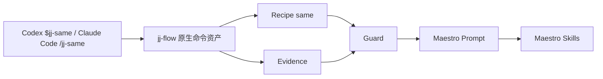
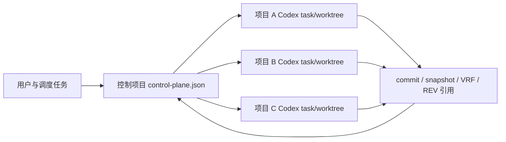

# 架构

## 一句话

`jj-flow` 是 Maestro 上层的项目族编排协议：它只负责把同源迁移与多项目调度需求翻译成 Maestro 能执行的 prompt、上下文包和调用链。`jj` 只是一个简单标识，不代表组织或业务品牌。

## 数据流

跨项目调度使用独立控制平面：

## 核心模块

- `.codex/skills/jj-same/`：Codex 跨同源项目迁移入口，包含项目族参考、handoff snapshot 契约、真实案例和只读证据脚本。
- `.codex/skills/jj-dispatch/`：Codex 控制项目调度入口，负责 `PREVIEW / DISPATCH / RECONCILE / BIND_THREAD`，不替代 `jj-same`，也不提供 Claude command。
- `.codex/skills/jj/SKILL.md`：兼容路由入口，默认转到 `jj-same`。
- `.codex/agents/*.toml`：项目族调度的角色期望配置；Reviewer 默认只读，Developer 默认使用 workspace-write。BIND_THREAD 必须核对 host 返回的 `effective_sandbox_mode` 与 `sandbox_evidence_ref`，缺失时保持 fail-closed。
- `.claude/commands/jj-same.md`：Claude Code 跨同源项目迁移入口。
- `.claude/commands/jj.md`：Claude 兼容路由入口。
- `bin/jj.mjs`：安装和维护调试入口，不是普通交付入口。
- `src/cli.mjs`：安装参数解析和内部调度，供入口和测试复用。
- `src/dispatch.mjs`：模式识别、prompt 生成、Markdown/JSON 输出。
- `src/recipes.mjs`：仅保留 `same` 流程定义；默认路由到 `same`。
- 全部流程禁止调用 `maestro explore`；定位代码使用定点读取与搜索工具，不经 explore 代理。
- 已移除 `jj-delivery` / `jj-validate` / `jj-evolve` / `jj-feat` / `jj-fix` / `jj-knowhow` / `jj-auto` / `jj-review`。
- `src/evidence.mjs`：证据结构。
- `src/evidenceProviders.mjs`：把 YApi、ARMS/SLS、禅道等工具输出转换成标准 evidence JSON。
- `src/guards.mjs`：判断证据是否足够，不足时保持 `PENDING`。
- `src/maestroCompatibility.mjs`：检查 Maestro CLI 是否可用、版本是否兼容，并把缺失或不兼容状态输出为 evidence。
- `src/maestroExecution.mjs`：基于 intent、evidence、guard 和 Maestro 兼容性生成可选执行决策。
- `src/knowledgeLoop.mjs`：把完成的迁移整理成 knowhow、spec 或 workflow recipe 捕获计划。
- `src/projectValidation.mjs`：仓库结构自检（供 `npm run check` / 测试使用），不是用户对话入口。
- `src/dispatchControlPlane.mjs`：纯控制平面状态协议；不直接调用 Codex App。
- `scripts/build-docs.mjs`：把 `docs/*.md` 生成 GitHub Pages 可部署的静态站点。
- `src/installSkill.mjs`：把包内 `.codex/skills` 与 `.codex/agents` 作为原子冲突检查的一组复制到本机或项目级 `.codex`，并独立支持 `.claude/commands`。

## 关键决策

### 保持薄入口

原因：`catlog22/maestro-flow` 已经提供 intent routing、workflow orchestration、knowledge system 和 multi-agent dispatch。`jj-flow` 不重复这些能力，只把项目族真实证据和迁移/调度边界注入进去。边界是明确的：不 fork Maestro core，不把 `/jj-*` 或 `$jj-*` 做成重型编排引擎。

### 入口收敛到 same + dispatch

实际使用以同源迁移与项目族调度为主。通用单仓交付入口与协议自检入口已移除，避免命令面膨胀。控制面 `delivery_id` 保留为任务身份，不恢复 `$jj-delivery` 对话入口。

### 控制项目与业务产物分离

控制项目只保存 `origin_project`、`requirement_owner`、`lead_project`、`reference_implementation`、`targets`、thread、状态和 artifact 引用；业务需求正文、源码、目标分析和验证仍归属实际项目。

Codex App 的 `create_thread`、project binding 和 worktree 是 host capability，不是 npm CLI 的稳定 API。`src/dispatchControlPlane.mjs` 只实现纯状态转换和内嵌审计事件。能力缺失时保持 `PREVIEW_ONLY/BLOCKED`。

状态回传采用单写者模型：业务子任务只生成结构化回执，主调度器是唯一允许推进 intent、target、Review、reference 和 checkpoint 的角色。

用户可见的控制任务与临时 subagent 必须分层：控制任务拥有稳定 `task_key`；subagent 不能自行创建控制任务、修改批准快照，也不能作为 checkpoint 的 thread identity。

Memory 仅用于回忆稳定决策索引、用户偏好和 artifact 引用，不是交付状态源。正式状态以 control-plane manifest、Git commit、Maestro artifact、verification/review evidence 和 runtime sandbox attestation 为准。

详细决策见 [ADR 0002](adr-0002-project-family-control-plane.html)。

## 兼容与自检

`jj-flow` 不假设 Maestro 一定可用。`projectValidation` 与 `maestroCompatibility` 会报告 CLI 缺失、不兼容或无法解析版本；它们服务于 `npm run verify`，不是 `$jj-validate` 对话入口。

## 少参数入口

`$jj-same` / `/jj-same` 是默认用户入口，不要求固定 CLI 参数。它先把会话、Git、handoff 与项目事实整理成可消费上下文；只有阻塞迁移边界或不可逆风险时才要求用户决策。
