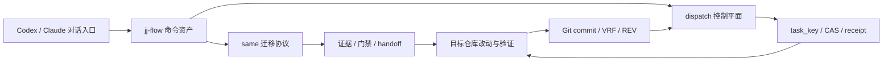
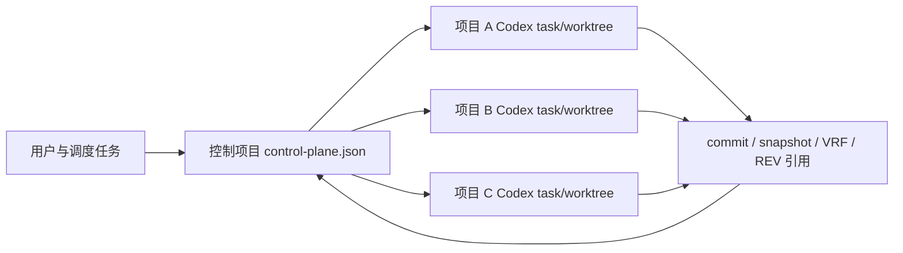

# 架构

## 一句话

`jj-flow` 是 **项目族编排工作流**：定义同源迁移、持续同步与多项目调度的控制协议、证据门禁和可恢复调度身份。`jj` 只是命令标识，不代表组织品牌。

Maestro 等外部 skill 可被调用做分析、计划、执行与审查，但 **jj-flow 的产品中心是项目编排，不是 Maestro 适配器**。不 fork Maestro core，也不把 jj 做成通用编排引擎。

## 数据流

跨项目调度使用独立控制平面：

## 核心模块

- `.codex/skills/jj-same/`：同源迁移与持续同步（handoff、项目族、证据脚本）。
- `.codex/skills/jj-dispatch/`：控制项目调度（PREVIEW / DISPATCH / RECONCILE / BIND_THREAD），Codex-only。
- `.codex/skills/jj/`、`.claude/commands/`：兼容路由与 Claude 入口。
- `.codex/agents/*.toml`：Reviewer（read-only）与 Developer 角色期望；运行时 sandbox 以 host attestation 为准。
- `bin/jj.mjs` / `src/cli.mjs`：安装与 `dispatch-tick` 调试，不是业务交付主入口。
- `src/dispatchControlPlane.mjs` / `src/dispatchRuntime.mjs`：控制面状态机与单次 tick/CAS/receipt。
- `src/recipes.mjs`：CLI 侧 `same` recipe（可选辅助，不是产品定义中心）。
- 全部流程禁止调用 `maestro explore`；代码定位用定点读取与搜索。

## 关键决策

### 产品是项目编排，不是工具适配

同源多仓、分叉演进、可恢复调度才是主问题。Maestro / YApi / ARMS 等是可插拔能力，可换、可缺，不能定义 jj-flow 的存在理由。

### 保持薄实现边界

不 fork Maestro core，不重做通用 intent 引擎，不实现 daemon/数据库/自动 merge。控制协议与证据契约留在 jj-flow；重执行仍交给 coding agent 与既有工具。

### 控制项目与业务产物分离

控制项目只存角色、task、thread、状态与 artifact 引用；需求正文、源码与验证正文归属业务仓。

### 单写者与可恢复身份

主调度是唯一可推进控制面 checkpoint 的角色；子任务只回报结构化 receipt。`task_key` 是持久调度身份；临时 subagent 不是。

详细决策见 [ADR 0002](adr-0002-project-family-control-plane.html)。历史「Maestro 薄适配」表述见 [ADR 0001](adr-0001-thin-maestro-adapter.html)（已由本架构叙述 supersede 产品定位）。

## 少参数入口

`$jj-same` / `$jj-dispatch` 接受自然语言与路径线索，不强制固定 CLI 参数。证据不足时保持 `PENDING` / `BLOCKED`，不把聊天「做完了」写成 checkpoint。
