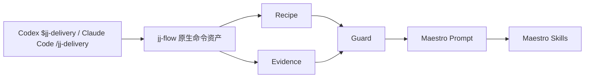
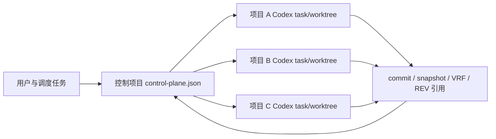

# 架构

## 一句话

`jj-flow` 是 Maestro 上层的交付编排协议：它只负责把项目交付需求翻译成 Maestro 能执行的 prompt、上下文包和调用链。`jj` 只是一个简单标识，不代表组织或业务品牌。

## 数据流

跨项目调度使用独立控制平面，不改变上面的业务交付链：

## 核心模块

- `.codex/skills/jj-*/SKILL.md`：Codex skill 入口，正式命令使用 `$jj-delivery` 这类连字符缩写。
- `.codex/skills/jj-same/`：Codex 跨同源项目迁移入口，包含项目族参考、handoff snapshot 契约、真实案例和只读证据脚本。Snapshot 附着源 `ANL-SOURCE` 并只引用 `BLP/REQ`；目标复用共享语义但仍独立分析与实施。
- `.codex/skills/jj-dispatch/`：Codex 控制项目调度入口，负责 `PREVIEW / DISPATCH / RECONCILE / BIND_THREAD`，不替代实际开发 skill，也不提供 Claude command。
- `.codex/agents/*.toml`：项目族调度的角色期望配置；Reviewer 默认只读，Developer 默认使用 workspace-write。由于子会话会继承 host 的实际 sandbox，TOML 不能替代运行时证明；BIND_THREAD 必须核对 host 返回的 `effective_sandbox_mode` 与 `sandbox_evidence_ref`，缺失时保持 fail-closed。
- `.claude/commands/jj-*.md`：Claude Code slash command 入口，正式命令使用 `/jj-delivery` 这类连字符缩写。
- `.claude/commands/jj-same.md`：Claude Code 跨同源项目迁移入口。
- `bin/jj.mjs`：安装和维护调试入口，不是普通交付入口。
- `src/cli.mjs`：安装参数解析和内部调度，供入口和测试复用。
- `src/dispatch.mjs`：模式识别、prompt 生成、Markdown/JSON 输出。
- `src/recipes.mjs`：`delivery`、`validate`、`evolve`、`feat`、`fix`、`knowhow`、`review` 的流程定义。
- `src/evidence.mjs`：证据结构。
- `src/evidenceProviders.mjs`：把 YApi、ARMS/SLS、禅道等工具输出转换成标准 evidence JSON。
- `src/guards.mjs`：判断证据是否足够，不足时保持 `PENDING`。
- `src/maestroCompatibility.mjs`：检查 Maestro CLI 是否可用、版本是否兼容，并把缺失或不兼容状态输出为 evidence。
- `src/maestroExecution.mjs`：基于 intent、evidence、guard 和 Maestro 兼容性生成可选执行决策。
- `src/knowledgeLoop.mjs`：把完成的交付整理成 knowhow、spec 或 workflow recipe 捕获计划，并生成团队协作上下文。
- `src/projectValidation.mjs`：读取项目文件、`.workflow`、文档、recipe 和测试状态，生成 `$jj-validate` 证据。
- `src/projectEvolution.mjs`：把自检证据转换成 correction backlog、升级计划和边界证据。
- `src/dispatchControlPlane.mjs`：纯控制平面状态协议，负责动态角色校验、稳定 task key、幂等派发意图、thread 恢复绑定和 reference/checkpoint 门禁；不直接调用 Codex App。
- `scripts/build-docs.mjs`：把 `docs/*.md` 生成 GitHub Pages 可部署的静态站点。
- `src/installSkill.mjs`：把包内 `.codex/skills` 与 `.codex/agents` 作为原子冲突检查的一组复制到本机或项目级 `.codex`，并独立支持 `.claude/commands`。

## 关键决策

### 保持薄入口

原因：`catlog22/maestro-flow` 已经提供 intent routing、workflow orchestration、knowledge system 和 multi-agent dispatch，并把 `.claude/commands`、`.codex/skills` 作为 AI coding agent 的原生入口随 npm 包分发。`jj-flow` 不重复这些能力，只把项目级真实证据和交付边界注入进去。边界是明确的：不 fork Maestro core，不把 `/jj-*` 或 `$jj-*` 做成重型编排引擎。

### 控制项目与业务产物分离

项目族不再把某个基线仓库永久设为唯一源。控制项目只保存 `origin_project`、`requirement_owner`、`lead_project`、`reference_implementation`、`targets`、thread、状态和 artifact 引用；业务需求正文、源码、目标分析和验证仍归属实际项目。这样 B 或 C 都可以成为本轮需求来源或领头项目，控制平面不会污染业务仓库。

Codex App 的 `create_thread`、project binding 和 worktree 是 host capability，不是 npm CLI 的稳定 API。`src/dispatchControlPlane.mjs` 只实现纯状态转换和内嵌审计事件；控制项目 host 负责把 manifest 写回文件，并可将事件镜像到 `events.ndjson`。能力缺失时保持 `PREVIEW_ONLY/BLOCKED`。

用户可见的控制任务与临时 subagent 必须分层：控制任务拥有稳定 `task_key`、host/thread/worktree 绑定和可恢复状态，是控制面的持久身份；subagent 只是某个任务内部的临时执行单元，可用于代码探索、官方文档核对或并行只读审查，不能自行创建控制任务、修改批准快照，也不能作为 checkpoint 的 thread identity。主调度任务保留需求、关键决策、批准和最终汇总。

Memory 仅用于回忆稳定决策索引、用户偏好和 artifact 引用，不是交付状态源。正式状态以 control-plane manifest、Git commit、Maestro artifact、verification/review evidence 和 runtime sandbox attestation 为准；memory、自然语言“完成”或 thread 停止均不能推进 checkpoint。Maestro 是分析、计划、执行、测试、审查和知识沉淀基建，但不能替代 Codex 的 sandbox、project trust、MCP、task identity 或控制面事实。

上述边界对齐 Codex 官方的 [AGENTS.md](https://learn.chatgpt.com/docs/agent-configuration/agents-md)、[custom agents 与 subagents](https://learn.chatgpt.com/docs/agent-configuration/subagents)、[sandbox](https://learn.chatgpt.com/docs/sandboxing) 和 [memory](https://learn.chatgpt.com/docs/customization/memories) 约定。

详细决策见 [ADR 0002](adr-0002-project-family-control-plane.html)。

### 证据优先于结论

如果没有 YApi、ARMS/SLS、diff、测试、禅道任务等证据，guard 只能给 `PENDING`，不能因为模型写得像就算通过。

### 证据适配器只做转换

证据适配器的职责是把外部工具输出转换成 `src/evidence.mjs` 可接受的 JSON，不直接替代外部工具。适配器必须区分 3 类状态：成功输出标准 evidence，字段缺失或部分输出保持 `PENDING`，工具失败输出 `FAIL`。这样 `$jj` 后续可以基于真实 evidence 推进，而不是把工具失败包装成通过。

### Recipe 按证据类型收口

Recipe 的 guard 会把证据要求落到具体类型：功能交付要求接口、设计和测试 evidence；线上修复要求 ARMS/SLS、root cause 和验证 evidence；知识沉淀与交付审查要求来源、diff、测试或复盘证据可追溯。这样 `$jj` 只负责判断证据是否足够，具体执行仍交给 Maestro。

### 先输出 prompt，后续再执行

第一版默认不直接调用外部工具，先让输出稳定、可读、可测试。等 recipe 稳定后，再让 Codex/Claude Code 原生命令按需调用 Maestro skills 和真实项目工具。

### 自检后再迭代

`$jj-validate` 先读取当前项目状态、文档、recipe、guard、测试和 `.workflow`；`$jj-evolve` 再把 validate evidence 转换成 correction backlog 和下一轮升级计划。这样项目管理入口的默认动作是自我验证、自我纠正，再进入下一项功能升级。这个管理入口仍是 Maestro 上层协议，不依赖未文档化的 Maestro core 行为。

### Maestro 兼容性先报告

`jj-flow` 不假设 Maestro 一定可用。`$jj-validate` 会报告 Maestro 兼容性：CLI 缺失、不兼容或无法解析版本时都作为 evidence 输出，后续 `$jj-evolve` 再决定是修正环境、延后执行，还是继续只生成 Maestro prompt。

### 执行决策不是执行引擎

`jj-flow` 可以根据 intent、evidence、guard 和 Maestro 兼容性输出 `execution_decision`：证据不足时 `disabled`，guard 失败或 Maestro 不兼容时 `blocked`，证据和兼容性都满足时才是 `ready`。它只决定是否应该进入 Maestro 调用链，不在 `jj-flow` 内重写 Maestro 编排。

### 交付完成后进入知识闭环

当 guard 和证据足够时，`jj-flow` 会输出 knowledge loop package：捕获目标可以是 `knowhow`、`spec` 或 `workflow_recipe`；团队协作者可以看到 evidence 摘要、guard 状态、execution decision 和下一步动作。这个闭环只组织上下文和捕获计划，不修改 Maestro core。

### 少参数 delivery

`$jj-delivery` / `/jj-delivery` 是 Codex/Claude Code 内的端到端入口，不要求用户先传固定的 PRD、接口或设计参数。它先把当前项目、`.workflow`、用户消息、历史线程链接和已有资料整理成 Maestro 可消费上下文；只有阻塞交付边界、方案取舍或上线风险时才要求用户决策。

### 文档站是长期表面

GitHub Pages 文档站从 `docs/` 生成，和命令资产、recipe、guard 一样纳入 `npm run verify`。原因是 `jj-flow` 会长期维护，README 只负责快速入口，完整使用、架构、规划、维护和部署说明必须能稳定发布、可链接、可回归检查。

文档站的主体内容必须解释安装方式、每个 `$jj` 命令什么时候用、要给什么、使用方案和会得到什么。首页可以提供导航，但不能替代命令参考和安装说明。
