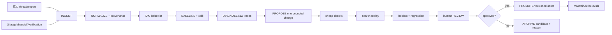

# `/jj-evaluated` 真实工作流评估与泛化学习设计

> 状态：Proposed
>
> 范围注记：完整 eval 闭环未关闭；skill MVP 可用不等于 Implemented
>
> 已落地：`.codex/skills/jj-evaluated` skill 入口；`docs/evaluations/*` episode 与回放笔记
>
> 未关闭：标准化 holdout / regression 套件、批准后自动演进 skill 的机械门禁、与 harness GC 的联动
>
> 事实边界：不自动训练模型、不自动改生产代码

## 1. 摘要

`/jj-evaluated` 是一个只读、离线、可回放的学习系统入口，用真实项目对话
导出和交付工件评估 `jj-same`（同源迁移/持续同步）、`jj-ralph`（单仓闭环）
和 `jj-dispatch`（多项目调度）的实际使用。第一阶段学习对象是 workflow
策略、skill 文本、handoff 规则和工具编排，不自动训练模型、不自动改生产
代码，也不替代现有事实源和门禁。

核心问题不是“哪次对话更快”，而是：在保持需求正确性、目标项目原生适配、
回归安全和证据完整的前提下，哪些策略能减少重复分析、无效等待和返工，并
能迁移到未见过的项目、角色、功能和模型。

## 2. 外部依据

本设计以浏览器直接核对的三份资料为方法依据：

- [Better Harness: A Recipe for Harness Hill-Climbing with Evals](https://www.langchain.com/blog/better-harness-a-recipe-for-harness-hill-climbing-with-evals)：用生产 trace、用户纠正和人工样本构建带行为标签的 eval；分 optimization、holdout、regression；从 trace 诊断，一次做一个有边界的改动，并保留人工审查和 eval 清理。
- [Meta-Harness: End-to-End Optimization of Model Harnesses](https://arxiv.org/abs/2603.28052)：让 proposer 按需从文件系统读取历史候选的 source、scores、prompts、tool calls、outputs 和 state updates；避免只依赖标量或压缩摘要；用 search set 反馈，隔离 holdout，并从混杂失败中做因果诊断。
- [AutoHarness: improving LLM agents by automatically synthesizing a code harness](https://arxiv.org/abs/2603.03329)：用环境反馈、critic/refiner、树搜索和廉价早停学习 action filter/verifier 或完整 harness-as-policy；说明可验证器和测试成本控制很重要，也提醒当前方案仍有环境定制性。

迁移到 jj-flow 的原则是：搜索 workflow/harness 的可版本化资产，保留完整
诊断轨迹，只在批准后入库；不把论文中的环境专用代码搜索直接当作生产自动
修改权限。

## 3. 当前真实使用基线

### 3.1 角色与项目证据

第一批检查到的角色映射如下。路径是样本证据，不是永久配置；每次评估仍须
重新核对 branch、commit、dirty worktree 和当前 handoff：

| 角色 | 样本路径 | 观察 |
| --- | --- | --- |
| 承接前台 | `D:\codeup\chengjie\cj-frontend-web` | 旧密码提醒波次中的项目之一 |
| 兑接前台 | `D:\codeup\duijie\dj-frontend-web` | 旧波次目标项目之一 |
| 承载前台 | `D:\codeup\chengjie\cz-broker-web` | 新企标签右对齐样本的源项目 |
| 候选 draft-manager | `D:\codeup\chengjie\cz-draft-manager-web` | 存在，但样本未证明它是当前承载源 |

承接、兑接、承载保持三个独立角色，不能因为出现 handoff 就把它们合并。

### 3.2 旧密码提醒波次：主要成本

代表性线程为 `019f5a11-daa6-7bb1-85b0-2017cb3e5d38`。从线程 active turn
可得到一组近似工作段：

主要证据根包括：

- `D:\codeup\chengjie\cj-frontend-web\.workflow\.csv-wave`
- `D:\codeup\duijie\dj-frontend-web\.workflow\.csv-wave`
- `D:\codeup\chengjie\cj-frontend-web\.workflow\ralph`

| 工作段 | 估计时长 | 解释 |
| --- | ---: | --- |
| 初始分析 | 约 3 分钟 | 需求/代码摸底 |
| 范围确认 | 约 1 分钟 | 收敛边界 |
| 设计与截图补充 | 约 21 分钟 | 视觉/行为补充 |
| `window.require` 纠正 | 约 2.7 分钟 | 用户/环境事实纠正 |
| 原始执行与验证 | 约 86.5 分钟 | 子代理、实现和验证混合 |
| 当前页弹窗纠正 | 约 54.2 分钟 | 返工与再次验证 |
| 最终提交 | 约 4.1 分钟 | 收口 |

这些数值是 thread-derived active-turn 估计，不是精确墙钟。它们显示的高价值
问题是重复分析、需求纠正后的返工、过早或过多的昂贵验证，以及多波次协作
等待；不能简单相加后当作工时事实。

### 3.3 新 handoff 波次：可复用模式

企标签右对齐样本线程为 `019f9446-8672-73f0-b928-f4831433c25f`：

handoff baseline 目录为：

`D:\codeup\chengjie\cz-broker-web\.workflow\.csv-wave\20260724-analyze-source-acceptor-enterprise-tag-right-align\requirement-baseline`

- `HOF-001`、`HOF-002` 因旧分支/dirty worktree 被阻断；
- 分支和 commit 稳定后产生 `HOF-003`，标记为 `FRESH` + `READY`，并以 successor
  关系取代旧 snapshot；
- 源 commit 为 `d54b25cdb28484855153a3f0e3ea5887331b533b`；
- 承接、兑接均消费同一 HOF-003，只按各自架构 `ADAPT`，不重建源分析；
- 目标分析工件跨度约 1 秒与 80 秒，源到目标 commit 墙钟跨度约 36 分钟与
  53 分钟。这些跨度需要进一步拆成 active/wait/tool/human attention。

这是当前最优先推广的策略：减少重复源分析比优化单个 artifact mtime 更有
价值；successor、freshness、execution readiness 和 dirty-worktree 事实必须
成为评估特征。

### 3.4 时间数据不能直接当真相

目前观察到：`.csv-wave` 的 mtime 有时只有 0–1 秒；旧目录可能跨数小时；
ralph `run.json` 只给 `created_at`/`updated_at`；`progress.md` 可能超出
`run.json` 边界；active/archive 可能出现同一 `run_id` 的重复 `run.json`。

因此系统必须同时报告 `active_duration`、`wall_span`、`idle_duration`、
`handoff_wait`、`tool_wait`、`human_attention`、`artifact_write_span`，并为
每个值标注 `timestamp_provenance` 与 `clock_quality`。任何冲突都保留，不用
单一数字“平滑”掉。

## 4. 目标与边界

### 目标

1. 用真实 episode 建立可追溯、可查询、可回放的行为数据集。
2. 找出时间成本的机制：重复工作、等待、返工、纠正、无效 token 和协作波次。
3. 通过 holdout 和 immutable regression 检验策略是否泛化，而不是只让 search
   分数上升。
4. 让批准后的改动进入 versioned skill/spec/recipe，并能回滚。

### 不做

- 不从聊天正文、thread 状态或 memory 推进 jj-flow checkpoint；
- 不把系统做成只看工时的排行榜；
- 不自动改模型权重、业务仓库、生产规则或批准快照；
- 不把承接/兑接/承载强行统一成 handoff；
- 不用伪造对话或论文示例冒充真实项目样本。

## 5. 系统闭环

### 5.1 Ingest 与 normalize

输入优先级为：用户明确提供的导出、thread trace、Git commit/branch、handoff
snapshot successor、ralph `run.json`/progress、verification/review 工件、
filesystem mtime。每个事件保留原始路径、hash、来源和可复核偏移。

统一事件包括：`user_request`、`user_correction`、`agent_turn`、`tool_call`、
`subagent`、`artifact_write`、`handoff_created`、`handoff_superseded`、
`commit`、`verification`、`review`、`wait`、`escalation`。

### 5.2 Tag 与 baseline

至少支持 `requirement_recovery`、`role_mapping`、`handoff_reuse`、
`redundant_analysis`、`target_native_adaptation`、`branch_correction`、
`stale_snapshot`、`clock_inconsistency`、`validation_wait`、`regression`、
`subagent_overhead`、`evidence_gap`。标签必须指向 trace 或 artifact 证据。

Baseline 同时记录结果质量和成本质量：需求正确性、验收/审查结果、目标适配、
active/wall/wait、重复分析比、返工比、纠正次数、token/tool 数和 reviewer
attention。时间只是多目标 score 的一个维度。

### 5.3 Split 与防泄漏

建立三套集合：

| 集合 | 用途 | 约束 |
| --- | --- | --- |
| `optimization/search` | 诊断和候选比较 | 允许 proposer 读取 |
| `holdout` | 泛化验证 | proposer 不可见，冻结候选后才跑 |
| `regression` | 保护已通过行为和关键不变量 | 失败即需人工处理 |

按 thread、feature、snapshot lineage、role、时间窗口、人员/模型做 group
split；同一对话或同一 handoff lineage 不得跨 search/holdout。保存 split
manifest 和 hash。

## 6. 候选策略与成本优化

每次迭代只提交一个边界清晰的变更，并给出因果假设、混杂变量和反证条件。
建议优先级：

1. `FRESH` + `READY` successor handoff 复用，阻止重复 source analysis；
2. 在模型调用前完成 role/path/branch/dirty-worktree preflight；
3. 对无效 subagent 波次、不可用 endpoint 和重复读取设置预算/早停；
4. 只有验收契约需要时才运行 build/lint/browser 等昂贵检查；
5. 用用户纠正和 stale snapshot 事件驱动返工减少；
6. 将 trace 写成层级化、机器可读、可 grep 的目录，便于 proposer 选择历史。

候选 scorecard 至少包含：

| 维度 | 例子 |
| --- | --- |
| Outcome | requirement correctness、accept/review |
| Generalization | holdout 的 role/feature/time/model 分组结果 |
| Safety | regression、sandbox/worktree、权限边界 |
| Efficiency | active token、wait、重复分析、返工、tool calls |
| Usability | 用户纠正、handoff 清晰度、reviewer attention |

若没有候选支配全部维度，报告 Pareto frontier，不把时间压缩换来的正确性损失
称为优化。

## 7. 权限、隐私与事实边界

第一版运行级别为 A0/A1 只读；任何外部写入都需要显式批准。原始项目对话只
在用户授权的本地范围处理；脱敏/哈希做成可配置安全门，不能因为脱敏而丢失
诊断所需的结构。`harness-manifest.json`、Git commit、ralph run、verification/
review artifact 和 sandbox attestation 仍是 jj-flow 的交付事实源；业务仓库
的 `.workflow` 只能作为被分析项目提供的输入证据。

## 8. 分阶段落地与验收

### P0：协议和样本登记

- 完成 episode/event/time/split/promotion contract；
- 登记旧密码提醒和企标签 handoff 两个脱敏引用；
- 验收：每个 duration 有 provenance/quality，旧 snapshot successor 可识别。

### P1：只读采集与 baseline

- 读取 thread export、Git、handoff、ralph 和 verification；
- 生成可查询的事件目录与 baseline report；
- 验收：不写业务仓，不以 mtime 伪造 active time，能复核原始引用。

### P2：离线 replay

- 实现 cheap contract check、分层 search/holdout/regression replay；
- 验收：split 无 lineage 泄漏，失败可定位到 trace 和候选 diff。

### P3：人工门禁与知识入库

- 生成候选 skill/spec/recipe diff 和 reviewer decision；
- 只把批准候选写入 versioned knowledge；
- 验收：有回滚目标、回归记录和拒绝理由，不能自动改生产规则。

后续才考虑并行环境、Thompson/tree search 或自动 proposer；先证明数据质量和
泛化评估可靠，否则搜索只会更快地放大错误信号。

## 9. 待决策

- thread export 的正式脱敏格式和保留期限；
- active/wait/human attention 的事件级标注来源；
- holdout 的最小样本数与按角色的覆盖阈值；
- reviewer 是否需要双人批准高风险 skill/recipe；
- `src/knowledgeLoop.mjs` 接入候选入库时的 schema 版本和回滚策略。
