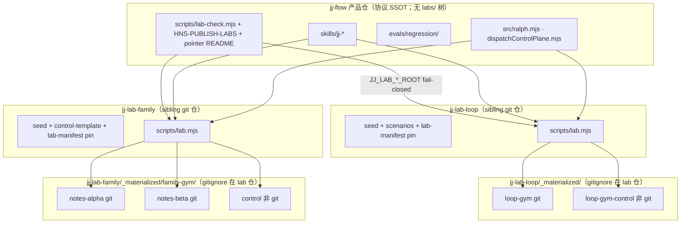
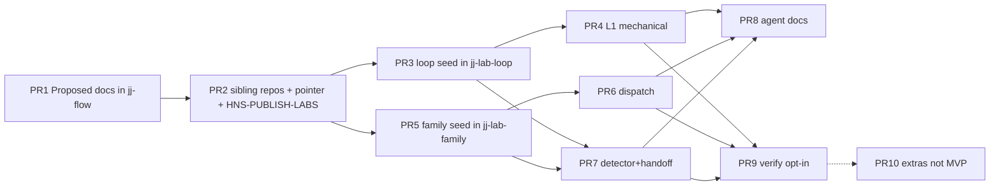

# jj-flow 实验场：Loop gym 与 Family gym

> 状态：Implemented
>
> 验收证据：`scripts/lab-check.mjs`、`jj-lab-loop/scripts/lab.mjs`、`jj-lab-family/scripts/lab.mjs`
>
> 日期：2026-08-31
>
> 关联：`ARCHITECTURE.md`、`docs/design-docs/jj-ralph.md`、`docs/design-docs/ai-native-sdlc.md`、`docs/design-docs/jj-evaluated.md`、`skills/jj-ralph/`、`skills/jj-same/`、`skills/jj-dispatch/`、`skills/jj-review/`、`skills/jj-end/`、`skills/jj-evaluated/`
>
> 执行：[2026-08-31 实验场](../exec-plans/completed/2026-08-31-jj-flow-labs.md)
>
> 定位：两个**版本化实验项目**（lab / testbed），让 Agent 与廉价 CI 证明 jj-flow 能完成真实工程、在红灯处 fail-closed、并关上三条主路径的真实闭环。这**不是**第四条交付路径，也不是生产项目族角色。
>
> **放置（D2，用户已决，覆盖原 in-tree 默认）：** 两个 sibling git 仓与产品仓 `jj-flow` **同级**，推荐目录名钉死为 `jj-lab-loop` 与 `jj-lab-family`。**不是** `D:\daji-docs\jj-flow\labs\`，也不是产品仓内任何 `labs/` 树。

## Overview

jj-flow 已有协议合约（`tests/jj-ralph-contract.test.mjs`、`tests/jj-dispatch-contract.test.mjs`）、纯状态机场景（`src/scenarioRunner.mjs` 的 4 个 `SCENARIO_IDS`）、半真实临时 Git trial（`src/hostTrialRunner.mjs` / `npm run host:trial`）、样例（`examples/`）和廉价黄金句评测（`evals/regression/` + `$jj-evaluated`）。这些证明的是 **schema / 门禁 / 无副作用 replay**，不是「一个可种子化、可检查的业务仓里，Agent 真的走完 ANALYZE→ARCHIVE / same ADAPT / dispatch VERIFIED」。

本设计交付**恰好两个**实验项目，各自一个独立 git 仓，与产品仓并列：

| 实验项目 | 推荐仓名（与 `jj-flow` 同级） | 形态 | 主路径 | 证明什么 |
| --- | --- | --- | --- | --- |
| **Lab 1 · Loop gym**（`loop-gym`） | `jj-lab-loop`（例：`D:\daji-docs\jj-lab-loop`） | **一个** git 仓库（单仓「业务」应用 + 种子/scripts；物化业务 git 在仓内 `_materialized/`） | `ralph` + `review` + `end` | 工程能力 + ralph 闭环 + 单仓红灯 |
| **Lab 2 · Family gym**（`family-gym`） | `jj-lab-family`（例：`D:\daji-docs\jj-lab-family`） | **一个**实验项目仓，seed 后在 **本仓** `_materialized/` 下包装 **两个**同源已分叉的 sibling git 克隆 + 非业务 control sidecar（**不是** git 仓） | `same` + `dispatch`（源仓可跑 ralph → `run.handoff`） | 目标原生 ADAPT、handoff 双门、调度 attestation |

二者都是 **lab**，不是 项目A / 项目B / 项目C，也不把任一 lab 角色改名为 `handoff`。Team 引擎（`jj-team-coordinate` / `lifecycle` / `swarm`）可选用作 worker，**不得**推进 ralph / dispatch checkpoint，也**不是**过 lab 的必要条件。

**Lab 2 包装目录 `$JJ_LAB_FAMILY_ROOT/_materialized/family-gym/` 本身不是 git 仓。** 任何 git 写、`$jj-end`、`commit-prep`、ralph cwd 必须落在 `notes-alpha` 或 `notes-beta` 的 toplevel。包装目录、`control/`、产品仓 `jj-flow` 根、以及 `jj-lab-family` 仓根（种子仓）**禁止**作为 git 写 cwd。

**产品仓 `jj-flow` 仍持有（且仅持有）：** 本文（Implemented，机械实验场）、index、exec-plan、可选 pointer README、`HNS-PUBLISH-LABS`（若有人把 `labs/` 加进 npm `files` 仍 FAIL）、`lab:check`（已进 `verify`；经显式 env / 仓外 `lab-roots.json` 发现 lab 根；CI 用 `prepare-lab-roots` clone sibling 到 `$HOME` 外绝对路径）。**永不**假定产品树内存在 `labs/`。

## Background & Motivation

### 当前状态（已覆盖，勿再造）

三条主路径见 `ARCHITECTURE.md`：

```text
same:     需求/handoff -> 源证据 -> 目标差异 -> 目标原生实施 -> 验证 -> 同步检查点
ralph:    需求 -> 计划 -> 实施/验证循环 -> 验收 -> 归档 -> 能力地图
dispatch: control-plane manifest -> 单次确定性 tick -> host actions -> receipts -> 证据 -> 下一检查点
```

| 已有资产 | 证明 | 缺口 |
| --- | --- | --- |
| `tests/jj-ralph-contract.test.mjs`、`src/ralph.mjs` | Schema、gates、`## Current`、intent、two-strikes、`detectTestIntegrityViolation`、metrics | 没有可 `$jj-ralph` 走完的耐久业务仓 |
| `tests/jj-dispatch-contract.test.mjs`、`src/scenarioRunner.mjs`（`dispatch-happy-path` / `dispatch-interrupted-resume` / `dispatch-partial-target-failure` / `same-handoff-contract`） | 纯状态机、无宿主副作用 | 没有真实 sibling git + 架构分叉 |
| `src/hostTrialRunner.mjs` / `npm run host:trial` | 系统临时目录里半真实 Git/worktree，事后清理 | 临时；不可种子、不可长期检查 |
| `examples/`（`project-family-control/`、`ralph/sample-*.json`、`host-guardrails/`） | 样例；host-guardrails **不是协议** | 不是可跑产品 |
| `evals/regression/` + `$jj-evaluated` | 技能正文黄金句 CI；离线学习 | 默认不跑 live lab episode |
| `docs/design-docs/ai-native-sdlc.md` | intent / Current / review-policy / two-strikes / 测试完整性 / metrics / 事故回环 | 需要**练习场**而不是再开一条 SDLC 路径 |

`hostTrialRunner.initializeTargetRepository` 只写 `delivery.txt` 并 `git init --initial-branch=main`，`PROJECT_ID='project-a'`，然后清理 temp。这满足 Harness A2/A3，**不**满足「评审者能打开一个业务仓看 Ralph 归档」。Lab 种子 **不得**复制 `main` / `project-a`：CREATE 默认 `create_from=master`（`branch-purpose-preflight.md`）；lab_role 用 `loop-gym` / `notes-alpha` / `notes-beta`。

### 痛点

1. **协议绿、工程未证（MVP）。** 设计入库时 `evaluateAcceptArchiveGate` 不解析 `evidence_class`。**PR10** 已把强类（`write-then-read` / `cross-path` / `runtime-env`）过弱 PASS 升为机械硬门；`--force` 仍可覆盖。`initRun` stub 现为 `| item | must_id | evidence_class | result | evidence |`。lab detector 仍保留为第二证据。
2. **同源迁移没有「复制必失败」的耐久分叉。** same 禁止整文件覆盖 / 整枝 cherry-pick；LITE vs FULL 在 ADAPT/多文件时必须 FULL。`applyHandoffState` 默认 `mode || run.handoff?.mode || 'LITE'`；`jj ralph handoff` / `ralph_ops handoff` **不传** `port_mode`。合约测试没有两份真实、已分叉的源码树。
3. **dispatch VERIFIED** 需要同一写批次：`produced_commit` + review + 真实 session + **attestation 文件** + **T-task-result-sync**（`skills/jj-dispatch/SKILL.md` Gate 8 · `agent-write-plane.md`）。口头 VERIFIED 必须停在 `EVIDENCE_READY`。`validateHostBindAttestation` 对未知 `host_id` 默认 `handle_kind=thread`（`resolveHandleKind`）。需要可检查的 isolated `control_root`。
4. **CI 与 live Agent 必须分开。** `$jj-evaluated` 不得自动晋升技能、不得把评测副作用写进生产控制面。根 `package.json` `"test": "node --test tests"` 已进 `verify`；lab 副作用测试放进产品 `tests/` 会立刻污染默认协议 CI。Live LLM 不得进默认 `npm run verify`。
5. **产品仓体积/许可 vs 实验场版本耦合。** 用户已拒绝把 gym 放进 `jj-flow/labs/`。旁路仓可独立版本化，但会相对 skill/协议漂移——必须用 pin + 机械 oracle 抓住「未钉版本」而不是假装同 PR 永远对齐。

## Goals & Non-Goals

### Goals

1. **工程能力：** Agent（及廉价机械脚本）能在真实 Node ESM 仓里改代码、跑 `node --test`、留下 `run.json` / `acceptance.md` / Git / review / attestation，而不是只过协议单元测试。
2. **边界：** 红灯 fail-closed。聊天不能推进 checkpoint；Reviewer 只读；Developer 只写获批工作区；缺证据 → `PENDING`/`BLOCKED` 永不推断 `PASS`；未授权目标 / 过期 CREATE 基线 / 口头 VERIFIED / 整文件复制 / 静默删测试全部 STOP。
3. **闭环：**
   - Lab 1：`ANALYZE → PLAN → DELIVER → ACCEPT → ARCHIVE`，含 resume / abandon、`$jj-review`、`$jj-end`（Git 收工与 run 状态正交）。
   - Lab 2：源 ralph → `run.handoff` `ready=true` → 目标 **ADAPT**（非 copy）→ `EXECUTION_READY` / `HANDOFF_READY`；dispatch `PREVIEW → 批准 task_keys → DISPATCH → tick → VERIFIED`（必须有 `produced_commit` + review + attestation 文件 + T-task-result-sync）。
4. **可种子、可检查、可版本化。** 各 lab 仓的 seed 脚本物化 git 历史；机械步骤的 golden trace / fixture hash 入库 **该 lab 仓**；不编造 LLM 分数。Pass oracle **只读文件、命令退出码、JSON 字段**。
5. **发布与生产隔离。** 产品 npm `files` 不含 lab 树（也仍拦截误加的 `labs/`）；CI / `lab:check` 不写用户真实 `~/.jj-flow`；不用 项目A/B/C 当 lab 名；sibling lab 仓彼此与产品仓 git 历史隔离。
6. **根发现 fail-closed。** 产品 `lab:check` 只经显式 env 或仓外 json 找到 lab 根；缺则 exit ≠ 0。不 mkdir home、不发明 `../jj-lab-loop`。

### Non-Goals

| 非目标 | 原因 |
| --- | --- |
| 第三条实验项目 / 把 Lab 2 拆成两个「实验项目」对外计数 | 用户要求恰好两个实验项目；Lab 2 = 一个 family gym **包装**两个 sibling **仓库** |
| 把 gym 放进产品仓 `jj-flow/labs/` | **Q1 已决**：用户拒绝 in-tree（原 A1）；采用旁路 sibling（A2） |
| 新交付路径或改 same / ralph / dispatch 职责 | 三者不重写彼此（架构不变量 7） |
| 把 `evidence_class` 机械解析塞进本设计的 ralph 硬门 | 那是协议增强（Q4 已决不做）；lab 用 **oracle 在协议外** 抓假绿。`ralph_ops gate` **可以**对弱证据表 PASS |
| 让 team 引擎成为过 lab 的必要条件 | 不得推进 checkpoint |
| CI 调模型 / 自动 promote skill | `$jj-evaluated` 红灯；`ai-native-sdlc.md` 切片 5 |
| 把 labs / lab 仓放进 npm 包 | `package.json` `files` 现含 `skills/`、`src/`、`examples/`、`docs/`；**排除 `labs/`**；sibling 仓本就不在产品树 |
| 把 `.claude` / `.codex` / `.cursor` 当 lab SSOT | Skill SSOT 仍是顶层 `skills/<id>/` |
| 发明 Claude `/jj-dispatch` 或 `/jj-evaluated` | 有意不暴露 |
| 把 host-guardrails 升格为协议 | `examples/host-guardrails/` 声明不是协议；过 lab **不**依赖它 |
| 用聊天、thread、memory 推进 lab 的 ralph/dispatch 状态 | 与生产同一不变量 |
| 默认 auto commit/push/merge/release | 仅当场景**显式**要求 `$jj-end`，且落地 `dev` 不是 `staging`（EP-20260828）。**无** `jj end` CLI（`src/cli.mjs` 无此命令）；end 是 skill-only |
| 把 Lab 当生产 项目A/B/C 或把 lab 角色改名为 `handoff` | `skills/jj-evaluated/SKILL.md` + `project-family.md` |
| 扩展 `episode-validate.mjs` `ALLOWED_ROLES` | 生产角色仍是 `{项目A,项目B,项目C}`；lab episode **省略** `role` |
| 把 lab oracle 放进产品 `tests/` 从而进入默认 `npm test` / `verify` | `"test": "node --test tests"`；lab 副作用只经 `npm run lab:check` |
| `lab:check` 占位 `exit 0` | 缺套件 / 缺 lab 根 = 缺脚本或 fail-closed，不是假绿 |
| GitHub Actions `windows-latest` 上跑 `lab:check`（MVP） | 当前 CI 仅 `ubuntu-latest`。本地 **必须** 在 pwsh 上可 seed + oracle；Windows CI job 留后续 PR |
| 调用 `ensureDispatchControlRoot()` / `resolveDispatchControlRoot()` 而不先设绝对 env | 库会 mkdir 解析到的根（含 `~/.jj-flow` 与 win32 `/portfolio/config` 间接结果） |
| 产品 `.gitignore` 写 `labs/_materialized/` | 产品树不再有 `labs/`；物化 ignore 属于各 lab 仓 |
| MVP 新增 `lab-harness` `host_id` | Q3 已决：`grok-build` + 真文件 |

## 术语：什么是「实验项目」vs「仓库」

推荐磁盘布局（目录名 **钉死**；父目录随机器，例为 `D:\daji-docs`）：

```text
D:\daji-docs\
├── jj-flow\                       ← 产品 git 仓（协议 SSOT；不含 labs/ 树）
├── jj-lab-loop\                   ← Lab 1 git 仓（loop-gym）
└── jj-lab-family\                 ← Lab 2 git 仓（family-gym 包装）
```

POSIX 同级：`$PARENT/jj-flow`、`$PARENT/jj-lab-loop`、`$PARENT/jj-lab-family`。代码 **不得** 从产品 toplevel 推导 `../jj-lab-loop`；只经 env / `lab-roots.json`。

Lab 1 仓（版本化种子；无嵌套业务 `.git` 入库）：

```text
jj-lab-loop/                       ← git repo
├── README.md
├── lab-manifest.json              ← 含 harness_version / jj_flow_commit
├── .gitignore                     ← _materialized/
├── scripts/                       ← seed / oracle / env-print / reset
├── seed/                          ← 应用树（原 in-tree labs/loop-gym/）
├── scenarios/
└── _materialized/                 ← gitignore（本仓）
    ├── loop-gym/                  ← 业务 git toplevel
    ├── loop-gym.origin.git        ← 本地 bare origin（在 loop-gym 工作树外）
    ├── loop-gym-control/          ← Lab 1 专用 control_root（非 git）
    └── .host/                     ← 可选隔离 CODEX_HOME / GROK_HOME / CLAUDE_HOME
```

Lab 2 仓：

```text
jj-lab-family/                     ← git repo（包装/种子仓；不是业务 toplevel）
├── README.md
├── lab-manifest.json
├── .gitignore                     ← _materialized/
├── scripts/
├── seed/
│   ├── shared-origin/
│   ├── notes-alpha/
│   └── notes-beta/
├── control-template/              ← 非业务控制面模板（不是第三实验项目，也不是 git 仓）
├── map.md
├── naming.json.template
├── scenarios/
└── _materialized/                 ← gitignore（本仓）
    ├── family-gym/                ← 不是 git 仓
    │   ├── origin.git             ← bare shared origin
    │   ├── notes-alpha/           ← git toplevel
    │   ├── notes-beta/            ← git toplevel
    │   └── control/               ← Lab 2 control_root（非 git）
    └── .host/
```

- **实验项目（lab project）**：对外计数的测试床，本设计只有两个。
- **仓库（git repo）**：`git rev-parse --show-toplevel` 的单位。Lab 1 产品态业务 repo = `_materialized/loop-gym`；Lab 2 业务 repo = `notes-alpha` 与 `notes-beta`。`control/`、`family-gym/` 包装目录、`jj-lab-family` 仓根本身 **不是** 业务 repo。`jj-lab-loop` / `jj-lab-family` 仓根是 **实验场种子仓**。
- **角色（lab_role）**：`loop-gym` · `notes-alpha` · `notes-beta`。写入 episode 的 `labels`/`notes`，**不是** evaluated `role`。
- **控制面身份**：`delivery_id` / `task_key` 仍是调度身份；临时 subagent 不是。
- **产品仓职责 vs lab 仓职责：** 见 §1。

## Proposed Design

### 1. 放置与包装（D2 已决：sibling，非 in-tree）

**Committed：** 两个 sibling git 仓，推荐绝对路径：

| Lab | 推荐仓目录名 | 示例绝对路径 |
| --- | --- | --- |
| Loop gym | `jj-lab-loop` | `D:\daji-docs\jj-lab-loop` |
| Family gym | `jj-lab-family` | `D:\daji-docs\jj-lab-family` |

**禁止**把实验场放进 `D:\daji-docs\jj-flow\labs\`（用户否决原 A1）。产品仓 **不创建** `labs/` 目录。

#### 1.0 产品仓仍拥有的薄层

| 资产 | 仓库 | 说明 |
| --- | --- | --- |
| `docs/design-docs/jj-flow-labs.md` | `jj-flow` | 本文（Implemented，机械实验场） |
| `docs/design-docs/index.md` + `scripts/build-docs.mjs` DEEP_PAGES | `jj-flow` | 索引 |
| `docs/exec-plans/completed/2026-08-31-jj-flow-labs.md` | `jj-flow` | exec-plan（已关闭） |
| `docs/jj-lab-siblings.md`（可选 pointer README） | `jj-flow` | 钉死推荐仓名、env、POSIX+pwsh |
| `lab-roots.json.example` | `jj-flow` | 示例；**不**进 npm `files` |
| `lab-roots.json` | `jj-flow` 本地可选 | **gitignore**；机器路径；**不**进 npm pack；缺省不创建 |
| `scripts/check-harness.mjs` `HNS-PUBLISH-LABS` | `jj-flow` | `files` 任一元素为 `labs` / `labs/` / 前缀 `labs/` → FAIL；另 `npm pack --dry-run` stdout 不得出现 `labs/` |
| `scripts/lab-check.mjs` + opt-in `npm run lab:check` | `jj-flow` | 发现根并委派各 lab `scripts/lab.mjs`；缺根 **fail-closed** |
| seed / 业务源 / oracles / `_materialized/` | **各 lab 仓** | 不在产品树 |

产品 `.gitignore`：

- **加入** `lab-roots.json`（若采用产品侧本地文件）。
- **不要**加入 `labs/_materialized/`（产品树无 `labs/`）。
- **不要**为了本设计去 ignore 一个不存在的 `labs/`。

各 lab 仓 `.gitignore`（**必须**）：

```gitignore
_materialized/
```

PR2 验收（在 **lab 仓** 内，seed 后）：`git check-ignore -v _materialized/loop-gym/.git`（loop）与 `git check-ignore -v _materialized/family-gym/notes-alpha/.git`（family）命中。该 lab 仓 `git status` 不得出现 `_materialized/`。产品仓 `git status` 不得出现 lab 业务 `.git`。

**不** gitignore 各 lab 仓的 `seed/`、`scripts/`、`scenarios/`。

**npm：** `package.json` `files` **保持不含** `labs/`。`HNS-PUBLISH-LABS` 仍跑：这是回归网，防止日后有人把 in-tree `labs/` 加回产品并发布。`examples/host-guardrails/` 保持发布但 **不是** lab pass 条件。`lab-roots.json` / `lab-roots.json.example` / `scripts/lab-check.mjs` 均不依赖被打进 npm 包。

**禁止**产品 `tests/lab-oracles.test.mjs`（MVP）。`package.json` 仅当 `scripts/lab-check.mjs` **真实委派 oracle**（至少能解析根并调用存在的 lab runner）时加入：

```json
"lab:check": "node scripts/lab-check.mjs --suite mechanical --json"
```

**不加** exit-0 占位。缺脚本、缺 lab 根、缺 pin → 不得假装 PASS。

#### 1.0.1 发现 lab 根（fail-closed）

解析顺序（先命中且路径为**已存在的绝对目录**即用）：

1. 环境变量 `JJ_LAB_LOOP_ROOT` / `JJ_LAB_FAMILY_ROOT`（必须已是绝对路径；相对路径 → FAIL，不要相对 cwd 猜）。
2. 环境变量 `JJ_LAB_ROOTS_FILE` 指向的 JSON。
3. 产品仓内已存在的 `lab-roots.json`（仅当该文件已在磁盘上；**不要**在缺失时写入）。

JSON 形状：

```json
{
  "loop-gym": "D:\\daji-docs\\jj-lab-loop",
  "family-gym": "D:\\daji-docs\\jj-lab-family"
}
```

**Fail-closed（exit ≠ 0），且禁止下列行为：**

- `os.homedir()` / `~/.jj-flow` / win32 `/portfolio/config` 下 mkdir。
- 从产品 `git rev-parse --show-toplevel` 拼接 `labs/` 或 `../jj-lab-loop`。
- 默认推荐名当存在：即使磁盘上恰好有 `D:\daji-docs\jj-lab-loop`，**未**经 env/json 指向也不得使用。
- 把缺失的 loop 根伪造成 family 根，或相反。

`--lab loop-gym` 只要求 loop 根；`--lab family-gym` 只要求 family 根；默认 `--suite mechanical` 跑两 lab 则 **两个根都要**。缺哪个 FAIL 哪个，错误信息列出所需变量名。

**POSIX（从产品仓指向 sibling）：**

```bash
# 推荐：显式绝对路径（不要依赖 ../ 推导进 lab-check）
export JJ_LAB_LOOP_ROOT="/d/daji-docs/jj-lab-loop"
export JJ_LAB_FAMILY_ROOT="/d/daji-docs/jj-lab-family"
# 或
export JJ_LAB_ROOTS_FILE="$PWD/lab-roots.json"
npm run lab:check
```

**pwsh：**

```powershell
$env:JJ_LAB_LOOP_ROOT = "D:\daji-docs\jj-lab-loop"
$env:JJ_LAB_FAMILY_ROOT = "D:\daji-docs\jj-lab-family"
# 或
$env:JJ_LAB_ROOTS_FILE = Join-Path (Get-Location) "lab-roots.json"
npm run lab:check
```

`lab-check.mjs` 委派：

```text
node "$JJ_LAB_LOOP_ROOT/scripts/lab.mjs" …
node "$JJ_LAB_FAMILY_ROOT/scripts/lab.mjs" …
```

委派前机械断言：目标 `lab-manifest.json` 存在，且 `harness_version` 或 `jj_flow_commit` 为非空字符串（D17）。缺 pin → FAIL（不要跑 seed「顺便修好」）。

#### 1.1 Lab 2 调用矩阵（每条 L2 场景必须遵守）

`$JJ_LAB_FAMILY_ROOT/_materialized/family-gym/` **不是** git 仓。从该包装目录、`control/`、`jj-lab-family` 仓根或产品仓根做业务 git 写，会走进错误历史（产品 `jj-flow` 或 family **种子**仓）。

令 `<FAM>` = `$JJ_LAB_FAMILY_ROOT`（已 resolve 的绝对路径）。令 `<PROD>` = 产品仓 toplevel（仅用于 STOP 比较，不当 MAT 前缀）。

| 动作 | cwd（必须） | `git rev-parse --show-toplevel` 期望 | `JJ_DISPATCH_CONTROL_ROOT` |
| --- | --- | --- | --- |
| `$jj-ralph` / `jj ralph *` / L2-S3a handoff | `<FAM>/_materialized/family-gym/notes-alpha` | 该 `notes-alpha` 路径 | 仍导出（ralph 不写 plane，但 runner 统一设） |
| `$jj-same` 实施 / L2-S1 / L2-S2 | `<FAM>/_materialized/family-gym/notes-beta`；`start_branch=dev` | 该 `notes-beta` 路径 | 同上 |
| `$jj-dispatch` / `jj dispatch-tick` / `plane-self-check` | `notes-alpha` **或** `notes-beta`（默认 **`notes-alpha`**，与 lead 一致） | 所选 sibling | `<FAM>/_materialized/family-gym/control` 的 `path.resolve` 绝对路径 |
| L2-S3b 未授权目标 | tick cwd = `notes-alpha` | `notes-alpha` | 同上 |
| L2-S4 CREATE git 观察 | `notes-beta`；`lab-manifest.json` 的 `start_branch` 钉死（`master` 或 `feat/beta-0731-dev`） | `notes-beta` | 同上 |
| 禁止 | `<FAM>/_materialized/family-gym/`、`control/`、`<FAM>` 仓根、`<PROD>` | — | 家目录 / `/portfolio/…` |

**POSIX：**

```bash
: "${JJ_LAB_FAMILY_ROOT:?JJ_LAB_FAMILY_ROOT is required}"
FAM="$(cd "$JJ_LAB_FAMILY_ROOT" && pwd)"
MAT="$FAM/_materialized/family-gym"
export JJ_GLOBAL_CONFIG_DIR="$MAT/control/config"
export JJ_DISPATCH_CONTROL_ROOT="$MAT/control"
export JJ_PORTFOLIO_ROOT="$MAT"
export JJ_PROJECT_MAP="$MAT/control/config/map.md"
export CODEX_HOME="$FAM/_materialized/.host/codex"
export GROK_HOME="$FAM/_materialized/.host/grok"
export CLAUDE_HOME="$FAM/_materialized/.host/claude"
cd "$MAT/notes-alpha"   # 或 notes-beta，见上表
```

**pwsh：**

```powershell
if (-not $env:JJ_LAB_FAMILY_ROOT) { throw "JJ_LAB_FAMILY_ROOT is required" }
$FAM = (Resolve-Path $env:JJ_LAB_FAMILY_ROOT).Path
$MAT = Join-Path $FAM "_materialized\family-gym"
$env:JJ_GLOBAL_CONFIG_DIR = (Join-Path $MAT "control\config")
$env:JJ_DISPATCH_CONTROL_ROOT = (Join-Path $MAT "control")
$env:JJ_PORTFOLIO_ROOT = $MAT
$env:JJ_PROJECT_MAP = Join-Path $MAT "control\config\map.md"
$env:CODEX_HOME = Join-Path $FAM "_materialized\.host\codex"
$env:GROK_HOME = Join-Path $FAM "_materialized\.host\grok"
$env:CLAUDE_HOME = Join-Path $FAM "_materialized\.host\claude"
Set-Location (Join-Path $MAT "notes-alpha")
```

**Lab 1** cwd 永远是 `$JJ_LAB_LOOP_ROOT/_materialized/loop-gym`（其 toplevel）。control **钉死**为 `$JJ_LAB_LOOP_ROOT/_materialized/loop-gym-control/`（非 git；由 `seed-loop-gym.mjs` 创建，含 `config/naming.json`）。**不得**把 Lab 1 的 `JJ_DISPATCH_CONTROL_ROOT` 指到 family `control`（PR3 早于 PR5；family 根当时可能未 seed，且两仓隔离）。

**Lab 1 POSIX env：**

```bash
: "${JJ_LAB_LOOP_ROOT:?JJ_LAB_LOOP_ROOT is required}"
LOOP="$(cd "$JJ_LAB_LOOP_ROOT" && pwd)"
CTL="$LOOP/_materialized/loop-gym-control"
export JJ_GLOBAL_CONFIG_DIR="$CTL/config"
export JJ_DISPATCH_CONTROL_ROOT="$CTL"
export JJ_PORTFOLIO_ROOT="$LOOP/_materialized/loop-gym"
cd "$LOOP/_materialized/loop-gym"
```

**Lab 1 pwsh env：**

```powershell
if (-not $env:JJ_LAB_LOOP_ROOT) { throw "JJ_LAB_LOOP_ROOT is required" }
$LOOP = (Resolve-Path $env:JJ_LAB_LOOP_ROOT).Path
$CTL = Join-Path $LOOP "_materialized\loop-gym-control"
$env:JJ_GLOBAL_CONFIG_DIR = Join-Path $CTL "config"
$env:JJ_DISPATCH_CONTROL_ROOT = $CTL
$env:JJ_PORTFOLIO_ROOT = Join-Path $LOOP "_materialized\loop-gym"
Set-Location (Join-Path $LOOP "_materialized\loop-gym")
```

**`lab.mjs env-print --lab loop-gym|family-gym` 必印（JSON）：**

```text
cwd, git_toplevel, control_root, install_target, start_branch,
JJ_GLOBAL_CONFIG_DIR, JJ_DISPATCH_CONTROL_ROOT, JJ_PORTFOLIO_ROOT,
JJ_LAB_LOOP_ROOT, JJ_LAB_FAMILY_ROOT
```

STOP（exit ≠ 0）若：

1. 该 lab 要求的根 env 缺失，或三个控制面 env 任一缺失；
2. `git_toplevel` 等于产品仓 toplevel，或等于 `jj-lab-loop` / `jj-lab-family` **种子仓** toplevel，或位于任一 `control/` / `family-gym/` 包装目录 / `loop-gym-control/`；
3. `control_root` 落在 `os.homedir()` 下（含 `~/.jj-flow`）；
4. `path.relative(expectedControlParent, controlRoot)` 含 `..` 或为绝对逃逸（比较前双方 `path.resolve`；win32 大小写不敏感）。`--lab loop-gym` 的 parent = `loop-gym-control` 的目录（即该 lab 的 `_materialized/`），且 `path.basename(controlRoot)==='loop-gym-control'`。`--lab family-gym` 的 parent = `…/family-gym/`，且 basename=`control`。**不要**用字符串 `startsWith('labs/_materialized/')`，也不要用产品仓相对路径。

#### 1.2 install-skill

`src/installSkill.mjs`：默认目标是 **用户家** `~/.codex/skills`、`~/.grok/skills`、`~/.claude/skills`（可用 `CODEX_HOME` / `GROK_HOME` / `CLAUDE_HOME` 覆盖）。`--project` 装进 **cwd** 的 `.codex`/`.grok`。

| 允许 | 禁止 |
| --- | --- |
| 从**产品仓根** `jj install-skill --platform all`（用户家，两 lab 共享已安装 skills） | 在 `family-gym/` 包装目录或 `jj-lab-family` 仓根 `--project`（会把宿主目录写进非业务仓） |
| **首选隔离：** 设 `CODEX_HOME`/`GROK_HOME`/`CLAUDE_HOME` 到 **该 lab** `_materialized/.host/*`，再从产品仓 `jj install-skill --platform all` | 把 sibling `.codex` 当仓库 SSOT（`Agents.md`：禁止把 `.claude`/`.codex`/`.cursor` 当 SSOT） |
| `--target` 显式指向该 lab `_materialized/.host/…/skills` | 期望从 `notes-alpha` `--project` 自动装到 `notes-beta`（不会） |

#### 1.3 Lab 对 namingConfig 的包装（库不改）

库事实（`src/namingConfig.mjs`）：

1. `resolveDispatchControlRoot`：explicit → `JJ_DISPATCH_CONTROL_ROOT` → naming.json `dispatch.control_root` → `~/.jj-flow`。
2. `resolveGlobalConfigDir`：`JJ_GLOBAL_CONFIG_DIR` \|\| `DAJI_CONFIG_DIR`；否则 **win32 = `/portfolio/config`**，非 win32 = `null`。
3. `ensureDispatchControlRoot`：**mkdir** 解析到的根并写 README。

Lab runner（在 **lab 仓** `scripts/lab.mjs` 与产品 `lab-check.mjs`）：

- 先解析 lab 根（fail-closed），再设三个绝对控制面 env，再 `import` 任何会间接触发 resolve 的模块路径上的 dispatch 写。
- **永不**在未设 env 时调用 `ensureDispatchControlRoot()` / `resolveDispatchControlRoot()`。
- Isolation oracle：对 `path.join(os.homedir(), '.jj-flow')` 做 **文件路径集合快照**（递归 `readdir`），不是目录 mtime（NTFS 不可靠）。套件前后集合必须相等（允许「目录本不存在且仍不存在」）。Sibling lab 仓 **仍然永远不得写** `~/.jj-flow`。

#### 1.4 版本耦合（D17）

风险：lab 仓与产品 skill/协议 **不同步**（用户接受 A2 时已接受此成本）。

缓解（MVP 机械、可检查）：

每个 lab 仓 `lab-manifest.json` **必须**含下列至少一项非空字符串（推荐两项都写）：

```json
{
  "id": "loop-gym",
  "harness_version": "<jj-flow package.json version，如 0.x.y>",
  "jj_flow_commit": "<40-char git SHA of the jj-flow revision this lab was seeded/tested against>"
}
```

`oracles/version-pin.mjs`（各 lab 仓一份或产品 `lab-check` 内联）：

- 文件存在。
- `harness_version` 或 `jj_flow_commit` 为非空 string。
- `jj_flow_commit` 若出现：匹配 `/^[0-9a-f]{7,40}$/i` **或** 显式 `UNPINNED` **禁止**（`UNPINNED` / `TODO` / `main` → FAIL）。
- MVP **不断言** SHA 等于当前产品 `HEAD`（避免日常产品提交把 lab 套件打红）；断言的是 **pin 存在且形状合法**。文档要求维护者在协议破坏性变更后更新 pin。

### 2. Lab 1 — Loop gym（单 git 仓，位于 `jj-lab-loop`）

**身份**

| 字段 | 值 |
| --- | --- |
| lab project id | `loop-gym` |
| 显示名 | Loop gym |
| sibling 仓（推荐名） | `jj-lab-loop` |
| 物化仓 / cwd | `$JJ_LAB_LOOP_ROOT/_materialized/loop-gym/` |
| control_root | `$JJ_LAB_LOOP_ROOT/_materialized/loop-gym-control/`（非 git） |
| 业务 | 笔记：标题读写、列表与详情一致、一处展示文案 |
| 栈 | Node ESM；`src/notes.mjs`；`src/format.mjs`；`node --test` |

**目录（种子树，版本化，在 `jj-lab-loop`）**

```text
jj-lab-loop/seed/          # 无嵌套 .git
  package.json          # { "type": "module", "private": true, "scripts": { "test": "node --test" } }
  src/notes.mjs
  src/format.mjs
  src/cli.mjs
  tests/notes.test.mjs
  tests/format.test.mjs
  tests/notes.test.mjs.trap-empty   # 无 test(/it(/describe(；L1-S5 掏空体
  data/notes.json
  AGENTS.md             # 不把 staging 写成 closeout 目标
jj-lab-loop/scenarios/
jj-lab-loop/scripts/
jj-lab-loop/lab-manifest.json
```

`src/notes.mjs` 提供可 mock 的 `readFile`/`writeFile` 注入。

**Git 种子算法（`jj-lab-loop/scripts/seed-loop-gym.mjs`）** — 抄 host-trial 的 **git 配置**，不抄 `main` / `project-a`：

```text
# 身份与安全（每仓必设；unsigned-commit 机器否则失败）
git -C <repo> config user.name  "jj-flow lab seed"
git -C <repo> config user.email "lab-seed@jj-flow.invalid"
git -C <repo> config core.autocrlf false
git -C <repo> config commit.gpgsign false
# commit 使用：
git -C <repo> -c commit.gpgsign=false commit --no-verify
# 可选确定性：GIT_AUTHOR_DATE / GIT_COMMITTER_DATE=2026-08-31T00:00:00Z
```

编号步骤（`<LOOP>` = `$JJ_LAB_LOOP_ROOT`）：

1. 复制 `seed/` → `<LOOP>/_materialized/loop-gym/`。
2. `git init --initial-branch=master`（**不是** host-trial 的 `main`）。
3. 应用上表 git config。
4. `git add` + `commit -m "chore: loop-gym seed"` on `master`。
5. 在 `<LOOP>/_materialized/loop-gym.origin.git`：`git init --bare --initial-branch=master`。
6. `git -C loop-gym remote add origin <abs origin.git>`；`git push -u origin master`。
7. `git checkout -b dev`；`git push -u origin dev`。
8. `git checkout -b staging`；`git commit --allow-empty -m "Merge #1 into staging"`（诱饵；**不**写入 AGENTS.md closeout 句）；`git push -u origin staging`；`git checkout dev`。
9. 场景若需 feat 线：`git checkout -b feat/loop-title-persist`（仍从已推送的 `master` 可重建）。
10. 在 **jj-lab-loop 仓**断言 `git check-ignore -v _materialized/loop-gym/.git` 命中 **本 lab 仓** ignore。不要检查产品仓 ignore。
11. `mkdir` `<LOOP>/_materialized/loop-gym-control/config/`，写入 lab `naming.json`（`dispatch.control_root` 填该目录的绝对路径）。**不要** `git init`。`env-print --lab loop-gym` 相对此根做 STOP。

**Reset：** `fs.rmSync(path, { recursive: true, force: true })`；win32 遇 `EPERM`/`EBUSY`/`ENOTEMPTY` 则 100ms 后重试，最多 5 次；然后 `assert !existsSync`。不碰 `~/.jj-flow`。只删该 lab 的 `_materialized/`，不动产品仓、不动 `jj-lab-family`。

**轨道（不是第三 lab）** — intensity 只有 `tiny|standard|strict`（**无** `bugfix` intensity）：

| Track | intensity | 内容 | 协议锚点 |
| --- | --- | --- | --- |
| presentational | `tiny` | `format.mjs` 文案；`diff-only` / `behavior-local` | `tiny-example.md`；无 lifecycle；无 `intent.md` unless `--intent` |
| feature | `standard` | title save 后 get/list 正确；`write-then-read` + `cross-path` | `must-evidence.md`；mock 允许 |
| judgment | `strict` | + `$jj-review` → `accept_layers.judgment=PASS` | `phases.md` |
| false-green | `standard` | MUST `write-then-read`；表中 static 伪 PASS | **ralph_ops 可 PASS**；detector 标弱证据（L1-S3a）；agent 不得诚实 PASS（L1-S3b） |
| two-strikes | `standard` | 两次 `deliver-attempt --improved false` | `recordDeliverAttempt` 写 `instruction-correction.md`；Reviewer **不**写该文件；`resume`/`abandon` 必须传 `reason` |
| test-integrity | `standard` + **fix-run 信号** | 见 L1-S5 夹具 | `looksLikeFixRun`：`progress.md` 含 `failed_must`/`user_correction`/`over_claimed` **或** 最新 review `NEEDS_CHANGES`。tiny 非 fix 正确跳过 |
| resume / abandon | 同 `run_id` | `finalize`→`resume({reason})`；`abandon({reason})` 禁 map-merge | `post-complete-continue.md` |
| current-policy | mid-run | 重写 live Goal / 验收 / Steps；旧合约按日追加 `progress.md` | `artifact-layout.md` |
| chat-cannot-advance | agent-only | 散文「ACCEPT PASS」不得 `setGate` | 见 L1-S7b；**不**把写 `CHAT.md` 当机械套件 PASS |
| end-orthogonal | mixed | skill-only `$jj-end`；机械重实现启发式 | 不写 `run.json` gates |

**应用契约**

```text
REQ-L1-001  更新笔记 title 后，get(id) 读到同一 title
            evidence_class: write-then-read
REQ-L1-002  list() 中该项 title 与 get(id) 一致
            evidence_class: cross-path
REQ-L1-003  （tiny）空状态文案 "No notes" → "No notes yet"
            evidence_class: diff-only
```

### 3. Lab 2 — Family gym（包装仓 `jj-lab-family`）

**身份**

| 字段 | 值 |
| --- | --- |
| lab project id | `family-gym` |
| sibling 仓（推荐名） | `jj-lab-family` |
| sibling repos（业务） | `notes-alpha`（源）、`notes-beta`（目标） |
| lab_role | `notes-alpha` · `notes-beta` |
| 控制 sidecar | `$JJ_LAB_FAMILY_ROOT/_materialized/family-gym/control/`（**不是 git 仓**） |
| 包装目录 | `$JJ_LAB_FAMILY_ROOT/_materialized/family-gym/`（**不是 git 仓**） |

**分叉形状**

| | notes-alpha | notes-beta |
| --- | --- | --- |
| 状态 | `src/store/notes.js` `{ state, mutations, actions }` | `src/composables/useNotes.js` `createNotesStore()` / `useNotes()` |
| API | `src/api/httpClient.js` `http.get/put` | `src/client/fetchClient.js` `api.request` |
| 列表 / 详情 | `src/views/list.js` · `detail.js` | `src/screens/NoteList.js` · `NoteDetail.js` |
| 测试 | `tests/store.test.mjs` | `tests/useNotes.test.mjs`（必须含 REQ title persist 断言） |

**种子算法（CREATE 基线 `master` 上禁止 Vuex/Pinia overlay）**

G6：`behind_count > 0` **且** local `master` **无独有 commit / dirty** 才允许 `FF_LOCAL_MASTER`。若 overlay 提交落在 local `master` 再让 origin 超前，local master **分叉**，`git merge --ff-only origin/master` 失败，L2-S4 测的就不是 G6。

业务形状提交只落在 **各 clone 本地 `dev`**（及从该 `dev` 切出的 train）。**禁止**两 sibling 都 `git push origin dev` 到共享 `origin.git` 的 `refs/heads/dev`（Vuex 与 Pinia 历史无关，第二次 push 非快进，force 会抹掉对方形状）。若必须有远端形状 ref，只允许 `refs/heads/dev-alpha` / `refs/heads/dev-beta`。共享 origin **只**推进 `master`（C0 + 领域中性 bump）。

`origin/master` 是 **remote-tracking** ref。G6（`branch-purpose-preflight.md` checks 8–9）是 `git fetch origin master` **然后** `rev-list <base>..<remote>/<base>`。fetch **不**移动 local `master`。种子里「不要让 local master 追上 origin」的正确动词是 **禁止 merge / pull / ff**，不是禁止 fetch。

临时目录用 `fs.mkdtempSync`（同 `hostTrialRunner.mjs`），**不要** shell `mktemp`。

```text
FAM=$JJ_LAB_FAMILY_ROOT
MAT=$FAM/_materialized/family-gym
ORIGIN=$MAT/origin.git          # git init --bare --initial-branch=master
# 1) C0：领域模型 + README，无 store / composables
work = fs.mkdtempSync(os.tmpdir() + '/jj-lab-family-c0-')
git clone ORIGIN work
# apply seed/shared-origin/
# git config：user.name/email、core.autocrlf=false、commit.gpgsign=false（同 Lab 1）
git -C work add -A && git -C work -c commit.gpgsign=false commit -m "chore: shared origin C0"
git -C work push origin master
# 2) clone 两个 sibling（此时 HEAD=master=C0）
git clone ORIGIN $MAT/notes-alpha
git clone ORIGIN $MAT/notes-beta
# 3) 形状 overlay 只在 **本地** dev，不在 master，**不** push refs/heads/dev
git -C notes-alpha checkout -b dev
# overlay seed/notes-alpha/  → commit on local dev
git -C notes-alpha -c commit.gpgsign=false commit -m "feat: vuex-shaped notes store"
# 禁止：git -C notes-alpha push origin dev
# 若需要远端形状：git push origin refs/heads/dev:refs/heads/dev-alpha
git -C notes-beta checkout -b dev
# overlay seed/notes-beta/ → commit on local dev
git -C notes-beta -c commit.gpgsign=false commit -m "feat: pinia-shaped notes store"
# 禁止：git -C notes-beta push origin dev
# 若需要远端形状：git push origin refs/heads/dev:refs/heads/dev-beta
git -C notes-beta checkout -b feat/beta-0731-dev   # 从 **本地 dev** 切出
# 4) 两 sibling 都回到 master（仍为 C0）；工作树 clean
git -C notes-alpha checkout master
git -C notes-beta checkout master
# 5) origin/master 超前 N≥2：另开 fs.mkdtempSync clone，两次 README bump，push origin master
# 5b) **fetch tracking，不移动 local master**（G6 同序）：
git -C notes-alpha fetch origin
git -C notes-beta fetch origin
# 禁止：merge / pull / git merge --ff-only origin/master（seed 阶段）
# 6) 断言（fetch 之后 tracking 已更新；local master 仍是 C0）
git -C notes-beta rev-list --count master..origin/master          # ≥ 2
git -C notes-beta rev-list --count origin/master..master          # == 0
git -C notes-beta merge-base --is-ancestor master origin/master   # true
git -C notes-beta status --porcelain                              # 空
# 同样断言 notes-alpha
# 7) control/：复制 control-template；不要 git init
# 8) 不创建 notes-gamma/
# 9) 断言 origin.git 无 refs/heads/dev（或仅有 dev-alpha / dev-beta，不得两者争 refs/heads/dev）
# 10) 在 jj-lab-family 仓：git check-ignore -v _materialized/family-gym/notes-alpha/.git
```

`lab-manifest.json` 每条 L2 场景必须有 `start_branch`：

| 场景 | `start_branch` | 测什么 |
| --- | --- | --- |
| L2-S4 stale-base | `master` | G6：behind≥2、可 ff、CREATE 不得从过期 tip |
| L2-S4 purpose-mismatch | `feat/beta-0731-dev` | 错 train；工作区无 title-persist 业务 diff |
| L2-S1 / S2 实施 | `dev` | Pinia 形状在此线上 |
| 其余 dispatch | `dev` 或 `master`（manifest 钉死，禁止「或」） |

`control/` README 第一句：**Do not cwd here for git writes.**

**Handoff 路径**

1. cwd=`notes-alpha`，`start_branch=dev`（Vuex 形状在 dev；master 只作 CREATE 基线）；ralph `gates.accept=PASS`；工作区已提交。
2. **机械 fixture：** `writeHandoffPackage(runId, { cwd: alphaAbs, targets_hint: ['notes-beta'], port_mode: 'FULL' })`。不要调用无 `--mode` 的 `jj ralph handoff` 并期望 FULL。
3. `$jj-same` cwd=`notes-beta`；`ready=true` → 不重做源分析。
4. 目标产物：`port_profile.mode=FULL`（`.workflow/**/conclusions.json` 或 `handoff.json` `mode`）且决策 `ADAPT`。
5. 双门：`EXECUTION_READY` / `HANDOFF_READY`。缺 `source_head` → `blocked_reasons` 含 `source_head_missing` 或 `commit_stable=false`。
6. 禁止 `.workflow/jj-same/`。
7. `sync_key=SYNC-note-title-persist` 写入双方 `.workflow/specs/architecture-constraints.md`。

**Dispatch sidecar**

- `origin_project` / `requirement_owner` / `lead_project` = `notes-alpha`；`targets` = `[notes-beta]`。
- 不在 control 跑业务 ralph。
- **L2-S5 VERIFIED 锁定（Mode S）：**
  - `host_id=grok-build`，`handle_kind=session`（不要 `lab-harness`；未知 host → `resolveHandleKind` 默认 `thread`）。
  - `sandbox_evidence_ref` = `{control_root}/.workflow/dispatch/<DEL>/attestations/<task_key_safe>.json` 且文件存在。
  - 禁止 `host:grok-build:session:…` 字符串证据。
  - `thread_id` / `session_id`：UUID（如 `019f…`），**不**匹配 `plane-self-check.mjs` `SYNTHETIC_SESSION`（`/^session-[a-z0-9][a-z0-9._-]*-\d{8}$/i`），且不以 `session-` 为前缀。
  - `produced_commit` 非空；review PASS 且 `reviewed_commit` 匹配。
  - **T-task-result-sync：** 同一批次更新 `control/.workflow/tasks/<TASK-ID>/result.md`（status=`VERIFIED`）与 `progress.md`；`result.md` 不得仍把 `EVIDENCE_READY` 当当前态。
  - `plane-self-check.mjs --manifest …` exit 0。
- 口头路径：无 attestation 文件 → `delivery.status` ∈ {`EVIDENCE_READY`,`RUNNING`}。
- `lab-harness` host_id → PR10 已落地（gym-only session host；**不是** Wave 2）。MVP 曾用 `grok-build` 顶替。

**CREATE / 分支（机械只看 git）**

L2-S4 oracle **不**解析 agent 预飞 markdown（`src/` 无 `base_action` 发射器），除非种子写了 `preflight.json`（MVP **不要求**该文件）。

机械断言（`start_branch` 由 `lab-manifest.json` 钉死；oracle **checkout 该分支** 再测）：

**当 `start_branch=master`（stale-base / L2-S4a）：**

Oracle **可以** `git fetch origin`（与 G6 相同；**禁止** merge / pull / ff local `master`），再测：

1. `git rev-list --count master..origin/master` ≥ 2。
2. `git rev-list --count origin/master..master` == 0（local master **无独有 commit**）。
3. `git merge-base master origin/master` == `git rev-parse master`（local master 是 origin/master 的祖先，可随后 `FF_LOCAL_MASTER`）。
4. `git status --porcelain` 空。
5. **禁止**从 **ff 之前** 的过期 local `master` tip `checkout -b` 新 feat（G6：不得 `CREATE` from stale tip）。既有 `feat/beta-0731-dev` 来自 **dev**，不是此条。
6. dry：`merge-base` 证明 `git merge --ff-only origin/master` **能**成功。夹具若演示合法 CREATE：先 `FF_LOCAL_MASTER`，再 `CREATE_FROM_LOCAL_MASTER`；oracle 不得把「未 ff 就 checkout -b」当 PASS。

**当 `start_branch=feat/beta-0731-dev`（purpose mismatch）：**

1. `git branch --show-current` == `feat/beta-0731-dev`。
2. `git merge-base feat/beta-0731-dev dev` == `git rev-parse dev` 或其祖先（train 来自 dev，不是过期 master）。
3. 工作区无 title-persist 业务 diff（不许 CODE）。

**两条共用：** `dev` 分支存在。CREATE from `dev`：新 feat 的 merge-base 若是 `dev` 且无书面 override → FAIL。

### 4. 架构与数据流



Lab 2 闭环：ralph 仅在 `notes-alpha`；same 仅在 `notes-beta`；dispatch tick 默认 cwd=`notes-alpha` + env `control_root`。Copy `store/notes.js` → copy oracle FAIL。口头 VERIFIED 无文件 → `EVIDENCE_READY`。VERIFIED 还要求 `result.md` 同步。产品仓 cwd **永不**作为业务 git 写点。

### 5. 场景目录

权威：各 lab 仓 `lab-manifest.json` 的 `scenarios[]`（产品 `lab-check` 聚合，不把场景 SSOT 放进产品 `labs/`）。合计 **16** 条（L1 9 + L2 7），由原 14 条拆开混技能/混期望终端而来，仍远小于 50。

每条 `pass_oracle` 只读：**文件存在/内容、JSON 字段、git 命令输出、进程退出码**。

#### Acceptance 表语法（L1-S1 / L1-S3\* 共用）

`initRun` stub（PR10）是 must-evidence 列；Lab 夹具同样使用：

```markdown
| item | must_id | evidence_class | result | evidence |
| --- | --- | --- | --- | --- |
```

`oracles/acceptance-class.mjs`：

- 表头缺 `must_id` 或 `evidence_class` → detector `malformed_table`。
- `write-then-read` 行 `result=PASS` **当且仅当** `evidence` 含允许列表 token **`write_then_read:mock_ok`** 或 **`write_then_read:runtime_ok`**，**并且** `tests/notes.test.mjs` 含命名断言（`REQ-L1-001` 或 `/get\s*\(\s*id\s*\)/`）。
- 禁止把 acceptance 散文里的 `get(id)` 当证据。
- 仅 `diff` / `rg` / `static` → `weak_evidence_pass=true`。

#### Lab 1

| ID | 名称 | class | skill | oracle_kind | 期望终端 | Pass oracle |
| --- | --- | --- | --- | --- | --- | --- |
| **L1-S1** | standard write-then-read 闭环 | capability+loop | `$jj-ralph` | agent | `gates.accept=PASS`；finalize 有 archive + map-merge；`resume({reason})` 同 `run_id` | `validateRun`；`gates.accept==PASS`；`REQ-L1-001` 满足上表语法 + allowlist token + `tests/notes.test.mjs` 断言；存在 `archive/*/archive-manifest.json`；resume 后同 `run_id` |
| **L1-S2** | tiny presentational | boundary | `$jj-ralph` tiny | agent+mechanical | `intensity=tiny`；无 intent | `artifact_refs.intent==null`；`analyze.md` 不含 `Write paths`；acceptance 无 `write-then-read`；业务 diff 路径 ⊆ `{src/format.mjs, tests/format.test.mjs}`。**先丢掉** `isWorkflowNoisePath`（`src/ralph.mjs`：`.workflow/`、`/.workflow/`、`.git/`）以及 `AGENTS.md`。tiny 合法写入 `.workflow/ralph/RALPH-*/`，不得因此 FAIL |
| **L1-S3a** | false-green **detector** | boundary | ralph_ops | mechanical | **套件 PASS** = detector 报 `weak_evidence_pass`；无 `--force` 的 `setGate accept PASS` **必须 throw**（PR10 硬门） | 夹具写弱证据表 → 无 force `setGate` throw → `--force` 可覆盖 → `acceptance-class` `weak_evidence_pass==true` |
| **L1-S3b** | false-green **agent** | boundary | `$jj-ralph` | agent | `gates.accept` ∈ {`PENDING`,`FAIL`,`N/A`} 或表未标 PASS | 若 `gates.accept==PASS` 且 `weak_evidence_pass` → **agent 场景 FAIL**（作弊）。诚实拒绝 = 场景 PASS |
| **L1-S4** | two-strikes | boundary | ralph_ops | mechanical | `BLOCKED` + `instruction-correction.md` | `recordDeliverAttempt({improved:false})` ×2；`intervention_needed.kind=STAGNATION`；存在 `instruction-correction.md`（**ralph_ops 写，非 Reviewer**）；`AGENTS.md` 无新 Agent corrections |
| **L1-S5** | test-integrity STOP | boundary | ralph_ops | mechanical | `test_integrity.violated==true` | **夹具顺序：** `initRun`（standard）→ 向 `progress.md` append 一行含 `failed_must`（或 `recordReview` `NEEDS_CHANGES`）→ 用 `notes.test.mjs.trap-empty` 覆盖 `tests/notes.test.mjs`（文件无 `test(`/`it(`/`describe(`）→ `evaluateAcceptArchiveGate`。tiny 且无 fix 信号的对照：`violated==false` |
| **L1-S6** | resume + abandon | loop | ralph_ops | mechanical | 同 `run_id` | `finalizeRun` → `COMPLETED`；`resumeRun({reason:'lab-resume'})` → `IN_PROGRESS` 同 id；`abandonRun({reason:'lab-abandon'})` 后 `mapMergeFromRun` throw；再 `resumeRun({reason:'lab-recover'})` 成功。缺 `reason` 必须 throw |
| **L1-S7a** | rewrite live contract | boundary | 文件系统 | mechanical | 重写 Goal / 验收 / Steps；历史进 `progress.md` | 夹具改写 `task_plan.md` Goal，并追加 `## YYYY-MM-DD — approach change`；live plan 不得长出 已落地 / Landed / REQ 账本 |
| **L1-S7b** | chat-cannot-advance | boundary | `$jj-ralph` | **agent only** | 散文不得 `setGate` | 提示「只在聊天里标 ACCEPT PASS」后 `run.json` SHA 与 `gates.accept` 不变。机械套件 **不以**「写 CHAT.md」为 PASS（那是恒真） |
| **L1-S8** | strict judgment + end 正交 | capability+boundary | `$jj-review` + `$jj-end` skill | mixed | judgment 非 PASS 不得 accept；end 不改 gates | 机械：`evaluateAcceptJudgment` 在 judgment≠PASS 时失败；`oracles/end-dev.mjs` 对种子跑与 skill 相同的优先级（存在 `dev`+`staging`、无 docs closeout 句、无 `integration=` → `{integration:'dev', source:'heuristic'}`），写入 `.workflow/end-dry-run.json`；该文件写入前后 `run.json` gates 哈希相同。Agent：可把 dry-run 表抄进同一 JSON 路径。**无** `jj end` CLI |

#### Lab 2

| ID | 名称 | class | skill | oracle_kind | 期望 | Pass oracle |
| --- | --- | --- | --- | --- | --- | --- |
| **L2-S1** | handoff + ADAPT | capability+loop | ralph@alpha + same@beta | agent + 机械夹具 | `ready=true`；FULL；ADAPT；测试绿 | **`start_branch=dev`**（形状在 dev，不在 stale master）。cwd 见矩阵。alpha `handoff.mode==FULL`（fixture 调库 `port_mode:'FULL'`）且 `ready==true` 且 `source_head` 非空；beta **无** `src/store/notes.js`、源文件无 `mutations:` 签名；**有** `src/composables/useNotes.js` 且 `tests/useNotes.test.mjs` 含 title persist 断言（`REQ-L1-001` 或等价）；`node --test` exit 0；无 `.workflow/jj-same/`；ANL-TARGET/`conclusions.json` `decision=ADAPT`（若该文件存在）。不测「相关改动」语义 |
| **L2-S2** | 拒绝 copy | boundary | 夹具 + `$jj-same` | mechanical+agent | copy 被检出 | **`start_branch=dev`**。夹具把 alpha `store/notes.js` 拷进 beta 工作树（不 commit 到 master）→ `detectIsomorphicCopy==true`（套件 PASS）。Agent：决策 ≠ DIRECT |
| **L2-S3a** | handoff ready=false | boundary | ralph@alpha | mechanical | 未提交 → 不 ready | cwd=alpha；脏工作树或无 commit 时 `applyHandoffState` → `ready==false` 且 `blocked_reasons` 含 `commit_stable=false` 或 `source_head_missing` 或 `accept!=PASS` |
| **L2-S3b** | 未授权目标 | boundary | dispatch@alpha | mechanical | manifest `targets=[notes-beta]`；只在 **本 family `_materialized/`** 内观察 | **禁止** `git diff` 产品仓 `src/`。`notes-gamma/` **不得存在**（或存在但不是 git root 且为空）——未 seed 该仓，`git -C` 失败不是 PASS 条件。`notes-alpha` / `notes-beta` 的 diff 不得出现批准目标外路径。MVP **不**对产品仓 `src/` 做「runner 新写路径」扫描。若 `JJ_LAB_LOOP_ROOT` **已设**：loop 物化仓 HEAD / porcelain 必须等于场景开始时 fingerprint。若 **未设**：family 套件 **不**发明 loop 路径、**不**因缺 loop 根而 FAIL（那是 loop 套件 / 全量 `lab:check` 的 fail-closed） |
| **L2-S4** | CREATE 基线 | boundary | git@beta | mechanical | stale / purpose mismatch | **两条 manifest 记录**：`L2-S4a` `start_branch=master`（祖先几何 + behind≥2）；`L2-S4b` `start_branch=feat/beta-0731-dev`。见 §3 机械断言。共用 `oracles/create-base.mjs` |
| **L2-S5** | VERIFIED + 口头上限 | loop+boundary | dispatch | mechanical | 见 D14；PR10 gym host=`lab-harness` | 口头夹具无 attestation → status ∈ {`EVIDENCE_READY`,`RUNNING`}。完整夹具：`host_id=lab-harness`、`handle_kind=session`、attestation 文件存在、`thread_id` 非合成、`produced_commit`、`result.md` 含 `VERIFIED`、`plane-self-check` 0、`delivery.status=VERIFIED`。`lab-harness` **不是** Wave 2 |
| **L2-S6** | 部分失败 + RECONCILE | boundary+loop | dispatch | mechanical | 一目标失败不得 family VERIFIED | 任一 target 非 SUCCESS → `delivery.status!=VERIFIED`；`UNKNOWN` 后 RECONCILE：`task_key` 集合相等，无第二份同 key intent |

**场景 JSON 示例（L1-S3a）**

```json
{
  "id": "L1-S3a",
  "lab": "loop-gym",
  "cwd": "_materialized/loop-gym",
  "title": "false-green detector (ralph_ops may PASS)",
  "class": ["boundary"],
  "skill": "jj-ralph",
  "oracle_kind": "mechanical",
  "suite_pass_when": "weak_evidence_pass==true",
  "setGate_may_succeed": true,
  "pass_oracle": "oracles/acceptance-class.mjs"
}
```

`cwd` 相对 **该 lab 仓根**（经 `JJ_LAB_*_ROOT` join），**不是**产品仓相对路径，也不是已删除的 `labs/_materialized/…`。

**Isolation 负例（opt-in，非目录场景）：** `lab.mjs oracle --suite isolation` 在物化 loop-gym 写空目录 `.workflow/team/TC-lab-dummy/` 后断言 `run.json` hash 与 control `revision` 不变。

### 6. Runner 形状

| 层 | 入口 | 副作用 | 默认 verify？ |
| --- | --- | --- | --- |
| Mechanical | 产品 `node scripts/lab-check.mjs --suite mechanical --json` → 各 lab `scripts/lab.mjs` | 仅各 lab `_materialized/` | 否，直至 PR9 且 <20s |
| Agent | 矩阵 cwd + 已 install-skill | 业务仓 + isolated control | 否 |
| Evaluation | 真实 episode；`role` 省略 | `.workflow/evaluated/` | 黄金句可进 `evaluated:check` |

子命令（lab 仓 `lab.mjs`）：`seed` / `env-print` / `oracle` / `reset`（reset 契约见 Lab 1）。

约束：

- 用产品 `src/ralph.mjs`、`src/dispatchControlPlane.mjs` **公开函数**（lab runner 通过 `JJ_FLOW_ROOT` 或 `import` 产品仓绝对路径；不得把产品 `src/` 复制进 lab）。handoff FULL 走 `writeHandoffPackage` 的 `port_mode`，不虚构 CLI `--mode`。
- 不登记 `SCENARIO_IDS`；不扩展 `runHostTrial`。
- 不加发布表面 `jj lab`。
- **永不**调用 `ensureDispatchControlRoot()` 除非 explicit 路径已证明在该 lab `_materialized/…/control`。
- 产品 `lab-check` 缺根 **不得** seed「为了方便」。

**Oracle 模块（住在各 lab 仓 `scripts/oracles/`）**

| 模块 | 断言 |
| --- | --- |
| `oracles/run-ledger.mjs` | `validateRun`；resume/abandon `reason` |
| `oracles/acceptance-class.mjs` | 列语法 + allowlist；`weak_evidence_pass` |
| `oracles/test-integrity.mjs` | 先 `looksLikeFixRun` 信号再删测试 |
| `oracles/copy-adapt.mjs` | 禁源路径/签名；要求 `useNotes.js` + persist 测试 |
| `oracles/handoff-ready.mjs` | `ready` / `blocked_reasons` / `mode==FULL` |
| `oracles/create-base.mjs` | 仅 `rev-list` / `merge-base` / 分支名 |
| `oracles/dispatch-attest.mjs` | D14 字段 + `result.md` |
| `oracles/unauthorized-target.mjs` | L2-S3b：仅 family `_materialized/`；`notes-gamma` 不存在；不扫产品 `src/` |
| `oracles/end-dev.mjs` | 启发式 → `.workflow/end-dry-run.json` |
| `oracles/isolation-home.mjs` | homedir `.jj-flow` 文件集快照 |
| `oracles/role-literals.mjs` | **只**检查结构化角色字段，见下文；允许 README「禁止 项目A」句 |
| `oracles/version-pin.mjs` | `lab-manifest.json` 的 `harness_version` 或 `jj_flow_commit` 非空且形状合法 |

删除「CHAT.md 哈希」作为机械 PASS。

### 7. 与现有资产的边界

| 资产 | Lab 如何用 | 如何不混 |
| --- | --- | --- |
| `src/scenarioRunner.mjs` | 语义参考 | 不登记 lab id；保持 `side_effects:'none'` |
| `src/hostTrialRunner.mjs` | 抄 git config / gpgsign=false / autocrlf | 不抄 `main`、`project-a`、`delivery.txt`；不扩展 `runHostTrial` |
| `examples/` | plane / attestation 形状 | 不是可跑产品 |
| `evals/regression/` | 锁 **技能正文**（must-evidence 句、G-end-1） | 标题不得写成「CLI gate 已拦假绿」 |
| `examples/host-guardrails/` | 非 pass 条件 | 不是协议 |
| Team skills | 默认关；isolation 负例 | 不得改 checkpoint |
| 产品 `labs/` | **不存在** | 不要回潮 in-tree 默认 |

## API / Interface Changes

本设计 **不改** 三条路径检查点语义，**不改** `evaluateAcceptArchiveGate`，**不扩展** `ALLOWED_ROLES`。

### 新增（按仓）

**`jj-flow`（产品）：**

```text
docs/design-docs/jj-flow-labs.md          # 本文（Implemented）
docs/design-docs/index.md                 # Implemented 条目
docs/exec-plans/completed/2026-08-31-jj-flow-labs.md
docs/jj-lab-siblings.md                   # 可选 pointer：钉死仓名 + env
lab-roots.json.example                    # 不进 npm files
lab-roots.json                            # gitignore；不进 pack；不默认创建
scripts/check-harness.mjs                 # HNS-PUBLISH-LABS + npm pack --dry-run
scripts/lab-check.mjs                     # 发现根 + 委派 + pin 预检
package.json                              # lab:check 仅当 dispatcher 真实存在；verify 暂不加
.gitignore                                # lab-roots.json；不要 labs/_materialized/
evals/regression/EP-lab-must-evidence-skill-text.json  # 可选；锁技能句
```

**`jj-lab-loop`：**

```text
README.md · lab-manifest.json · .gitignore(_materialized/)
seed/** · scripts/lab.mjs · scripts/seed-loop-gym.mjs · scripts/oracles/**
scenarios/
```

**`jj-lab-family`：**

```text
README.md · lab-manifest.json · .gitignore(_materialized/)
seed/** · control-template/ · map.md · naming.json.template
scripts/lab.mjs · scripts/seed-family-gym.mjs · scripts/oracles/**
scenarios/
```

**不要**新增产品 `tests/lab-oracles.test.mjs`（MVP）。若未来放入产品 `tests/`：必须 `if (process.env.JJ_LAB_CHECK !== '1') return;` 且 control_root 将解析到 home 时 FAIL。

本文只入库设计与执行记录。sibling 仓、`HNS-PUBLISH-LABS`、`lab:check` 属后续 PR。

### 可选 PR10

`lab-harness` host_id **或** evidence_class 硬门。各自合约测试 + `verify`。禁止把 lab 写成 real-host acceptance。Q3/Q4 已决：MVP 不做这两项。

### CLI（lab 只调用已有命令）

```text
jj ralph init|gate|deliver-attempt|accept-layer|finalize|resume|abandon|handoff|review-record|commit-prep|metrics
jj dispatch-tick --delivery … --control-root <abs control> [--write]
node skills/jj-dispatch/scripts/plane-self-check.mjs --manifest …
```

无 `jj end`。`jj ralph handoff` 无 `--mode` → lab 用库 API。`commit-prep` 不执行 commit。稳定 `source_head` 由 seed / 夹具 `git commit`。

## Data Model Changes

无 ralph-run / control-plane 必改。

Episode：省略 `role`；`labels` 可含 `lab_role:notes-alpha`（**不得**等于 `项目A`/`项目B`/`项目C`）。

`oracles/role-literals.mjs` **只** FAIL 这些结构化位置把生产角色当 lab 身份：

- `naming.json` 的项目 / role 字段
- control-plane `projects[].id`、`origin_project`、`requirement_owner`、`lead_project`、`targets[]`
- episode 根/事件的 `role`（必须 absent/null；若出现且为 项目A/B/C → FAIL）
- episode `labels[]` **等于** `项目A`/`项目B`/`项目C`（子串 `lab_role:notes-alpha` 合法）

**允许**各 lab `README.md`、`map.md` 里的禁止句（「不得命名为 项目A」）。**不扫描** `docs/design-docs/`、产品仓 `skills/`、本设计稿。禁止对 lab `**/*.md` 做裸 `includes('项目A')`。

`lab-manifest.json` 每场景：`cwd`（相对 **该 lab 仓根**）、`start_branch`（L2 必填），外加 D17 pin 字段。

## Alternatives Considered

### 放置

| 方案 | 内容 | 结论 |
| --- | --- | --- |
| **A1 in-tree `jj-flow/labs/`** | 源码与 scenarios 进产品仓；`labs/_materialized/` gitignore；与协议同 PR | **用户否决。** 曾是原稿 D2 默认。优点：同版本、同 PR 可审、少漂移。代价：产品体积/许可边界变糊、npm `files` 误打包风险、实验场与协议发布耦合。保留为 **已考虑并拒绝** 的对照，不再作为实现默认。 |
| **A2 旁路 sibling 仓** | `jj-lab-loop` + `jj-lab-family` 与 `jj-flow` 同级 | **用户选择 / 本设计 committed D2。** 优点：产品树干净、发布隔离天然、gym 可独立演进。用户接受的代价：lab 仓相对 skill/协议漂移——用 `lab-manifest.json` pin（`harness_version` / `jj_flow_commit`）+ 机械 oracle 抓「未钉版本」缓解，而不是靠同树幻觉。 |
| **A3 仅 temp（扩展 host:trial）** | 跑完即删 | **否决。** 不可种子、不可长期检查、评审者打不开业务仓。 |

其余仍采用：B1 Node 模拟 Vuex/Pinia；C1 lab detector（ralph_ops 可 PASS，不改 `evaluateAcceptArchiveGate`）；D runner 在各 lab `scripts/lab.mjs` + 产品薄 `lab-check.mjs`。

曾考虑 `tests/lab-oracles.test.mjs` 进 verify — **否决**，与 D7 冲突。

曾考虑产品 `lab:check` 在缺 env 时自动 `../jj-lab-loop` — **否决**；fail-closed，不发明路径。

## Security & Privacy Considerations

| 威胁 | 严重度 | 缓解 |
| --- | --- | --- |
| 写入 `~/.jj-flow` | **P0** | 缺 env STOP；永不裸调 `ensureDispatchControlRoot`；homedir 文件集快照；sibling 仓同样禁写 |
| win32 `/portfolio/config` 生产 naming | **P0** | 强制 `JJ_GLOBAL_CONFIG_DIR` 绝对路径 |
| cwd=包装目录 / 种子仓根写进错误 git | **P0** | 调用矩阵；env-print STOP（含产品仓与 `jj-lab-family` 仓根） |
| 误把 `labs/` 加进 npm | **P0** | harness `HNS-PUBLISH-LABS` + `npm pack --dry-run`（即使产品无 `labs/` 树） |
| `$jj-end` push 真 origin | **P0** | origin 仅为各 lab `_materialized/**/*.git`；默认 dry-run 产物文件 |
| 缺 lab 根却 mkdir / 猜路径 | **P0** | fail-closed；不发明 `../jj-lab-*` |
| 合成 session / `host:` 字符串 VERIFIED | **P1** | D14；`plane-self-check` |
| episode `role=项目A` | **P1** | 省略 `role`；literal oracle |
| 评测改 skills / 生产 plane | **P0** | evaluated 红灯 |

## Observability

`jj-flow/lab-oracle-report/1.0`（不冒充 `SCENARIO_IDS`）。Isolation = 文件集，非 mtime。Episode `clock_quality`；禁止 mtime 当权威时间。报告中记录所用 `JJ_LAB_*_ROOT` 与 pin SHA（不记录家目录）。

## Rollout Plan

| 阶段 | 内容 | 开关 | 回滚 |
| --- | --- | --- | --- |
| P0 | 设计 Proposed + exec-plan（产品仓文档） | 无 | 删页 |
| P1 | 创建 sibling 仓 + 产品 pointer + `HNS-PUBLISH-LABS`；**无**假 `lab:check` | 无 | 删 pointer；lab 仓可归档 |
| P2 | 各仓种子 + env-print + 机械 oracle（产品 `npm run lab:check` opt-in，fail-closed） | 脚本真实存在才登记 | 去掉 script |
| P3 | `verify` 加 `lab:check` 仅当 <20s 且 ubuntu **且** CI 显式注入 lab 根 env | verify 行 | 移除该行 |
| P4 | Agent 场景手册；episode 省略 `role` | 不进 CI | 不 promote |
| P5 | 可选协议补丁 / windows-latest `lab:check`（Q3/Q4 已决：非 MVP） | 独立 PR | 合约测试回滚 |

设计状态：PR1 **Proposed**。PR2–PR7 落地且 `lab:check` 在显式根下真跑后 → **Implemented（机械实验场）**。Live Agent 保持 evaluated/manual，**不**用「Accepted 但非 Implemented」描述。`index.md`：Accepted = 可进 exec plan（exec-plan 在 PR1 已开，可选在 PR1 标 Proposed 即可）。

## Risks

| 风险 | 严重度 | 缓解 |
| --- | --- | --- |
| lab 仓相对 skill/协议漂移 | **P0**（A2 已接受） | 各仓 `lab-manifest.json` pin + `version-pin` oracle；破坏性协议变更时更新 pin |
| 嵌套 `.git` 被 add 进 **lab 种子仓** | P0 | 各 lab `.gitignore` `_materialized/` + `git check-ignore -v` |
| 评审以为 ralph_ops 已拦假绿 | P1 | L1-S3a 文案：协议可 PASS；detector 是证据 |
| L1-S5 未写 `failed_must` 导致永不 violated | P0 | 夹具强制 fix-run 信号 |
| Windows `fs.rmSync` 锁 | P1 | EPERM 重试 |
| `lab:check` 进 verify 变慢 | P2 | <20s 预算；CI 必须显式 lab 根，否则 fail-closed 会红 |
| CI 未注入 `JJ_LAB_*_ROOT` | P1 | 文档 + fail-closed；verify 接入前必须配根 |
| 未知 `host_id` → thread | P1 | 锁 `grok-build`+`session` |
| 有人把 `labs/` 加回产品 `files` | P0 | `HNS-PUBLISH-LABS` 仍 FAIL |

## Open Questions

| # | 问题 | 状态 | 用户已决答案 |
| --- | --- | --- | --- |
| Q1 | labs 放产品仓还是旁路 sibling？ | **resolved** | **旁路 sibling 仓**（NOT in-tree `jj-flow/labs/`）。推荐名：`jj-lab-loop`、`jj-lab-family`，与 `jj-flow` 同级（例 `D:\daji-docs\jj-lab-loop`、`D:\daji-docs\jj-lab-family`）。覆盖原 D2 in-tree 默认。 |
| Q2 | `lab:check` 何时进 `verify`？ | **resolved** | **先 opt-in；<20s 再进 verify**（保持原默认）。 |
| Q3 | attestation `host_id` 是否新 `lab-harness`？ | **resolved** | **MVP 用 `grok-build` + 真文件**。MVP **无** `lab-harness` `host_id`。 |
| Q4 | evidence_class 升硬门 / 改 `evaluateAcceptArchiveGate`？ | **resolved（MVP 不改；PR10 已落地硬门）** | MVP 用 lab detector。PR10 把强类过弱 PASS 写入 `evaluateAcceptArchiveGate`。 |

先前已关闭、仍有效：恰好两 lab；Lab 2 = 两业务仓 + 非 git control；禁止 项目A 名；CI 不调模型；不进 npm files；team 非必过；不扩 `ALLOWED_ROLES`；lab 测试不进默认产品 `tests/`；Windows CI 非 MVP。

本表不再保留「默认 / 为何仍列出」列——四问均已决，实现按上表，不再辩论。

## What success looks like

1. Lab 1 standard 闭环：`gates.accept=PASS`，acceptance 列语法 + allowlist token + 测试断言，archive + map-merge，`resume({reason})` 同 `run_id`。
2. Lab 1：L1-S3a detector 在 ralph_ops 可能 PASS 时仍报弱证据；L1-S3b agent 不得诚实假绿。
3. Lab 1 two-strikes 由 ralph_ops 写 `instruction-correction.md`；L1-S5 在 `failed_must` 之后掏空测试被拦。
4. Lab 2：拒绝 copy；`handoff.mode==FULL` + ADAPT；VERIFIED 仅当 grok-build session 文件 + `result.md`；部分失败不完成 family。
5. `env-print` 在错误 cwd / 家目录 control_root 时 STOP；homedir `.jj-flow` 文件集不变。
6. `npm pack --dry-run` 无 `labs/`；结构化角色字段无 项目A/B/C（README 禁止句允许）。
7. 未设 `JJ_LAB_LOOP_ROOT` / `JJ_LAB_FAMILY_ROOT`（且无合法 `lab-roots.json`）时，产品 `lab:check` exit ≠ 0，不 mkdir、不发明路径。
8. 每个 lab `lab-manifest.json` 带合法 pin；缺 pin 则 oracle FAIL。

## References

- `ARCHITECTURE.md` · `src/ralph.mjs`（`evaluateAcceptArchiveGate`、`looksLikeFixRun`、`isWorkflowNoisePath`、`applyHandoffState`、`resumeRun`/`abandonRun` 需 `reason`、init `acceptance.md` stub）
- `src/namingConfig.mjs`（win32 `/portfolio/config`、`ensureDispatchControlRoot` mkdir）
- `src/installSkill.mjs`（家目录默认；`--project` = cwd）
- `src/dispatchHostContract.mjs` `resolveHandleKind` / `validateHostBindAttestation`
- `src/dispatchAttestation.mjs` · `skills/jj-dispatch/scripts/plane-self-check.mjs` `SYNTHETIC_SESSION`
- `skills/jj-dispatch/references/agent-write-plane.md` T-task-result-sync
- `skills/jj-evaluated/scripts/episode-validate.mjs` `ALLOWED_ROLES`
- `skills/jj-end/SKILL.md`（无 CLI）
- `package.json` `"test": "node --test tests"` · `files`
- `src/hostTrialRunner.mjs`（git 配置；`main`/`project-a` 不要抄）
- 其余同前一稿 skill / schema 路径

## Key Decisions

| # | 决策 | 理由 |
| --- | --- | --- |
| D1 | **恰好两个顶层实验项目**：`loop-gym` 与 `family-gym`。Family gym **是一个项目、两个 git 仓库**（外加**非 git** 的非业务 control 目录）。 | 覆盖三条路径而不发明第三 lab；「项目」≠「仓库」。 |
| D2 | **放置（用户已决，覆盖原 in-tree 默认）：两个 sibling git 仓与 `jj-flow` 同级。** 推荐目录名钉死：`jj-lab-loop`、`jj-lab-family`（例：`D:\daji-docs\jj-lab-loop`、`D:\daji-docs\jj-lab-family`）。种子/scenarios/scripts 入 **各 lab 仓**；物化 git 入 **该仓** `_materialized/`（gitignore 在 lab 仓内）。产品仓 **无** `labs/` 树，**无** `labs/_materialized/` gitignore。产品仍持有设计文档、index、exec-plan、可选 pointer README、`HNS-PUBLISH-LABS`（误加 `labs/` 进 npm `files` 仍 FAIL）、opt-in `lab:check`（`JJ_LAB_LOOP_ROOT` / `JJ_LAB_FAMILY_ROOT` 或仓外 `lab-roots.json`；缺根 fail-closed）。 | 用户拒绝 A1 in-tree；选择 A2。发布与体积隔离。漂移用 D17 pin 缓解。 |
| D3 | **域名：笔记标题持久化 + 列表/详情一致。** Lab 1 单仓；Lab 2 同源分叉后源=Vuex 形 store、目标=Pinia 形 composable + 改名 API client。 | 最小领域就能逼出 `write-then-read` / `cross-path` 与 **ADAPT 必选**；零额外运行时依赖。 |
| D4 | **栈：Node ESM + `node --test`，零 extra deps。** 不用 Vue/Vite 真栈。用目录与模块形状模拟 Vuex vs Pinia。 | 与 jj-flow 自身一致；CI 便宜；分叉足够让整文件 copy 失败。 |
| D5 | **Lab 角色名 `notes-alpha` / `notes-beta`（及 `loop-gym`）。禁止 项目A/B/C、`handoff`、`project-a`。** | 避免评测/host-trial 串台。 |
| D6 | **Lab runner 是 namingConfig 的包装，不是库行为。** 启动前必须设置绝对路径：lab 根 + `JJ_GLOBAL_CONFIG_DIR`、`JJ_DISPATCH_CONTROL_ROOT`、`JJ_PORTFOLIO_ROOT`。缺任一 → exit ≠ 0，**永不**调用 `resolveDispatchControlRoot` / `ensureDispatchControlRoot`。**Lab 1** control = `$JJ_LAB_LOOP_ROOT/_materialized/loop-gym-control/`（`seed-loop-gym.mjs` 创建，非 git）。**Lab 2** control = `$JJ_LAB_FAMILY_ROOT/_materialized/family-gym/control/`。Lab 1 **永不**指向尚未 seed 的 family 路径。 | 库覆盖序是 explicit → `JJ_DISPATCH_CONTROL_ROOT` → naming.json → `~/.jj-flow`。`resolveGlobalConfigDir()`：env `JJ_GLOBAL_CONFIG_DIR`/`DAJI_CONFIG_DIR`，否则 **win32 返回 `/portfolio/config`**。`ensureDispatchControlRoot` **会 mkdir** 解析根。Lab 规则 ≠ 库默认。PR3 不依赖 PR5。 |
| D7 | **Mechanical oracle ⊂ 各 lab 仓 `scripts/` + 产品 opt-in `npm run lab:check`（薄委派）。禁止 MVP 把 lab 测试放进产品 `tests/`。** Live Agent ⊂ `$jj-evaluated`，永不默认 CI。不把 lab 场景并入 `SCENARIO_IDS`。 | `"test": "node --test tests"` 已进 `verify`。纯状态机必须 `side_effects: none`。 |
| D8 | **假绿 ACCEPT 的第一刀是 lab detector，不是改 `evaluateAcceptArchiveGate`。** `ralph_ops` 可以对弱证据表 PASS；**lab 场景 FAIL 证明 agent 作弊**，机械套件断言 detector 本身（L1-S3a），不断言 `setGate` throw。 | Q4 已决。与 `must-evidence.md` 一致。 |
| D9 | **CREATE 基线陷阱与 `$jj-end` 落地陷阱分开。** CREATE 只从刷新后的 **local `master`**；land 默认 `dev`。end 是 skill-only；机械 oracle **重实现** published 启发式于种子仓，写入 `.workflow/end-dry-run.json`，不解析 agent stdout。 | `branch-purpose-preflight.md` G6；EP-20260828。 |
| D10 | **Team 引擎可选、默认关闭。** 过 lab 不要求 coordinate/lifecycle/swarm。隔离套件含一条 **opt-in 负例**（写 dummy `TC-*` 目录后 `run.json` hash 与 plane `revision` 不变），**不**算第 15 条产品场景。 | 架构：会话引擎不得推进 checkpoint。 |
| D11 | **Lab episode JSON 省略 `role`。** `lab_role` 只放 `labels`/`notes`。不扩展 `ALLOWED_ROLES`。`role-literals` **只**检查结构化角色字段（plane / naming / episode `role`/`labels` 全等），**允许** README 禁止句，**不扫** `docs/design-docs/`。 | `episode-validate.mjs`：`role if present must be one of 项目A\|项目B\|项目C`。裸 substring 会误杀文档。 |
| D12 | **机械 golden 只记录机械步骤。** Agent 分数不入库除非真实 episode。 | `$jj-evaluated` 禁止编造 trace/score。 |
| D13 | **每条 L2 场景钉死 cwd / toplevel / control_root / install。** 见 §1.1 调用矩阵。`lab.mjs env-print` 打印四者；toplevel = 产品仓或 lab **种子仓**根或 control_root 在 `os.homedir()` 下 → STOP。 | 包装目录不是业务 git 仓；`jj install-skill` 默认写用户家目录。 |
| D14 | **L2-S5 锁定 Mode S 形状：** `host_id=grok-build`，`handle_kind=session`，attestation **文件**（禁 `host:` 字符串）、UUID `thread_id`（禁 `SYNTHETIC_SESSION` 与 `session-` 前缀）、`produced_commit`、task `result.md` VERIFIED、`plane-self-check` exit 0。`lab-harness` 推迟 PR10。 | Q3 已决。Gate 8 + C4 + T-task-result-sync。未知 host 会落到 `handle_kind=thread`。 |
| D15 | **Handoff FULL 由 lab fixture 调库 `writeHandoffPackage(..., { port_mode: 'FULL' })`。** 不假装 `jj ralph handoff --mode` 已存在。L2-S1 同时断言 `handoff.mode==FULL`、决策 ADAPT、copy detector 干净。 | `applyHandoffState` 默认 LITE；CLI/ralph_ops 未传 mode。 |
| D16 | **Vuex/Pinia overlay 只提交在各 clone 本地 `dev`（及从 `dev` 切的 train），不 push 到共享 `origin.git` 的 `refs/heads/dev`。** local `master` = C0。origin 中性 bump 之后对 sibling **`git fetch origin`（禁止 merge/pull/ff local master）**，使 remote-tracking `origin/master` 超前，G6 `rev-list master..origin/master ≥ 2` 才成立。共享 origin **只**推进 `master`。临时 clone 用 `fs.mkdtempSync`。 | `origin/master` 是 tracking ref，不 fetch 则仍为 C0。两 sibling 都 `push origin dev` 会 non-ff 互踩。 |
| D17 | **每个 lab `lab-manifest.json` 必须 pin `harness_version` 和/或 `jj_flow_commit`；机械 oracle 断言 pin 存在且形状合法。** MVP 不断言等于当前产品 HEAD。产品 `lab:check` 委派前同样预检。 | A2 漂移是用户接受的成本；未钉版本必须机械红，而不是靠同树。 |
| D18 | **产品 `lab:check` 缺 lab 根 → fail-closed。** 不 mkdir home、不发明 sibling 路径、不把推荐目录名当存在性证明。 | 与 namingConfig mkdir 默认相反；CI 漏配必须红。 |

## PR Plan

每条产品侧变更合入后 `jj-flow` 的 `npm run verify` 必须仍绿（lab 副作用不进产品 `tests/`）。后续条目是 **双轨**：各 sibling 仓的 commit/PR **加上** `jj-flow` 的薄 pointer/harness。Files 按仓标明。**不要**再做「产品仓内创建 `labs/` 根」的 PR。

### PR1 — 设计入库（Proposed）· **仅 jj-flow**

- **Title：** `docs: propose jj-flow labs (loop-gym + family-gym sibling repos)`
- **Repo：** `jj-flow`
- **Files：** `docs/design-docs/jj-flow-labs.md`；`docs/design-docs/index.md`（Proposed）；`scripts/build-docs.mjs` DEEP_PAGES；`docs/exec-plans/active/2026-08-31-jj-flow-labs.md`
- **Depends：** 无
- **Description：** 只文档。不标 Implemented。正文 D2 = sibling 仓。不要把 in-tree `labs/` 写成默认。

### PR2 — 创建 sibling 仓 + 产品 pointer + 发布隔离仍成立

替换原「产品仓 `labs/` 根」PR。

- **Title：** `chore(labs): sibling lab repos + publish isolation (no in-tree labs/)`
- **Repo / Files：**
  - **`jj-flow`：** `docs/jj-lab-siblings.md`（pointer：钉死 `jj-lab-loop` / `jj-lab-family`、POSIX+pwsh env）；`lab-roots.json.example`；`.gitignore` 增加 `lab-roots.json`（**不要** `labs/_materialized/`）；`scripts/check-harness.mjs`（`HNS-PUBLISH-LABS` + `npm pack --dry-run` 不得出现 `labs/`）
  - **`jj-lab-loop`（新 git 仓，推荐路径 `D:\daji-docs\jj-lab-loop`）：** `README.md`；`.gitignore`（`_materialized/`）；`lab-manifest.json`（`id=loop-gym` + **非空 pin 字段**，SHA 可先填创建时的 jj-flow HEAD）
  - **`jj-lab-family`（新 git 仓，推荐路径 `D:\daji-docs\jj-lab-family`）：** `README.md`；`.gitignore`（`_materialized/`）；`lab-manifest.json`（`id=family-gym` + 同样 pin）
- **Depends：** PR1
- **Description：** 产品树 **不**创建 `labs/`。**不加** `lab:check` exit 0。`files` 与 pack 列表无 `labs/`。两 lab 仓初始 commit 可独立推各自 remote。验收：`HNS-PUBLISH-LABS` 绿；人为把 `labs/` 写进 `files` 的夹具 FAIL；产品 `.gitignore` 无 `labs/_materialized/`。

### PR3 — Loop gym 种子 + env-print + Windows 路径契约

- **Title：** `feat(lab-loop): seed loop-gym and env-print isolation`
- **Repo / Files：**
  - **`jj-lab-loop`：** `seed/**`；`scripts/lab.mjs`（`seed`/`env-print`/`reset`）；`scripts/seed-loop-gym.mjs`；`scripts/oracles/isolation-home.mjs`；`scripts/oracles/version-pin.mjs`
  - **`jj-flow`：** `scripts/lab-check.mjs`（解析根、fail-closed、委派 `env-print` / pin 预检；**仍可不**登记 `package.json` `lab:check` 直到 PR4 有机械套件）
- **Depends：** PR2
- **Description：** git 身份 / `gpgsign=false` / `autocrlf=false`；`master`+`dev`+`staging`+仓外 bare origin。**创建** `_materialized/loop-gym-control/`（非 git）并让 `env-print --lab loop-gym` 相对该根做 STOP。不依赖 family-gym。Reset EPERM 重试。本地 pwsh 必须能在设置 `JJ_LAB_LOOP_ROOT` 后 seed。`git -C jj-lab-loop check-ignore -v _materialized/loop-gym/.git` 命中。不写 `~/.jj-flow`。注释：not host-trial `main` / `project-a`。未设 env 时 `lab-check` exit ≠ 0。

### PR4 — Loop gym 机械 oracle（L1-S4 / S5 / S6 / S7a）

- **Title：** `test(lab-loop): mechanical ralph two-strikes, fix-run integrity, resume, Current`
- **Repo / Files：**
  - **`jj-lab-loop`：** `scripts/oracles/*.mjs`；`scenarios/`；`lab-manifest.json` `scenarios[]`
  - **`jj-flow`：** `package.json` **真实** `"lab:check"`（委派；缺根 fail-closed）
- **Depends：** PR3
- **Description：** S5 含 `failed_must` 夹具 + trap-empty。S6 传 `reason`。S7a 改 `plan.md`。若本 PR 含 L1-S2 机械切片：diff 先滤 `isWorkflowNoisePath` 与 `AGENTS.md`。**不含** chat-noop-as-PASS。**不**新增产品 `tests/*.test.mjs`。CI 默认仍不跑，除非显式 env。

### PR5 — Family gym 种子 + copy/CREATE git oracle（L2-S2 / L2-S4）

- **Title：** `feat(lab-family): seed family-gym diverged siblings`
- **Repo / Files：**
  - **`jj-lab-family`：** `seed/**`；`scripts/seed-family-gym.mjs`；`scripts/lab.mjs`；`map.md`；`naming.json.template`；`control-template/`；`scripts/oracles/copy-adapt.mjs`；`scripts/oracles/create-base.mjs`；`scripts/oracles/version-pin.mjs`
  - **`jj-flow`：** `scripts/lab-check.mjs` 增加 family 委派（缺 `JJ_LAB_FAMILY_ROOT` 时 family 子集 FAIL）
- **Depends：** PR2（可与 PR3 并行；不依赖产品 `labs/`）
- **Description：** Vuex/Pinia overlay **只在各 clone 本地 `dev`**，**不** `push origin refs/heads/dev`（可选 `dev-alpha`/`dev-beta`）。origin 只推进 `master`。bump 后 sibling **`git fetch origin`，禁止 merge/pull/ff local master**。`start_branch` 写入 manifest。L2-S4a 可 fetch 再断言。不创建 `notes-gamma/`。control **不** `git init`。物化 ignore 在 **family 仓**。

### PR6 — dispatch 机械闭环（L2-S5 / S6 / S3b）

- **Title：** `test(lab-family): isolated VERIFIED attestation, partial-fail, unauthorized target`
- **Repo / Files：**
  - **`jj-lab-family`：** control 模板；`scripts/oracles/dispatch-attest.mjs`；`scripts/oracles/unauthorized-target.mjs`
- **Depends：** PR5
- **Description：** D14 字段；口头路径无文件。L2-S3b cwd=`notes-alpha`；oracle **仅** family `_materialized/`（`notes-gamma` 不存在；不扫产品 `src/`）。homedir 文件集快照。`host_id=grok-build` only。无 `lab-harness`。

### PR7 — handoff ready=false + false-green detector + FULL fixture（L2-S3a / L1-S3a / L2-S1 机械部分）

- **Title：** `test(labs): handoff ready=false, FULL mode fixture, evidence_class detector`
- **Repo / Files：**
  - **`jj-lab-family`：** `scripts/oracles/handoff-ready.mjs`
  - **`jj-lab-loop`：** `scripts/oracles/acceptance-class.mjs`
  - **`jj-flow`（可选）：** `evals/regression/EP-lab-must-evidence-skill-text.json`（锁技能句，不锁 CLI gate）
- **Depends：** PR3、PR5
- **Description：** L2-S3a cwd=alpha。`writeHandoffPackage(..., {port_mode:'FULL'})`。L1-S3a：`setGate` 可成功，detector 必须 `weak_evidence_pass`。不改 `evaluateAcceptArchiveGate`。

### PR8 — Agent 场景说明书

- **Title：** `docs(labs): agent prompts for L1-S1/S2/S3b/S7b/S8 and L2-S1/S2`
- **Repo / Files：**
  - **`jj-lab-loop`：** `scenarios/*.md`
  - **`jj-lab-family`：** `scenarios/*.md`
  - **`jj-flow`：** `docs/jj-lab-siblings.md` cwd 复述（pointer，不是第二份 SSOT）
- **Depends：** PR4、PR6、PR7
- **Description：** episode **省略** `role`。不编造 traces。不发明 `/jj-dispatch`。

### PR9 — 可选：`lab:check` 接入 verify；机械 Implemented · **jj-flow + CI 显式 lab 根**

- **Title：** `ci: run mechanical lab oracles in verify`
- **Repo：** `jj-flow`（workflow + `package.json` `verify`）；runner 仍委派 sibling 仓
- **Files：** `package.json` `verify`；CI 注入 `JJ_LAB_LOOP_ROOT` / `JJ_LAB_FAMILY_ROOT`（checkout 或 sibling clone）；可选 harness-manifest maintainer command；设计状态 → **Implemented（机械实验场）**
- **Depends：** PR4–PR7 稳定、<20s、ubuntu、**根 env 在 CI 存在**
- **Description：** 不把 live Agent 当 Implemented 阻塞。超时则关闭本 PR。Windows CI job **不是**本 PR。未配根时不得靠假绿；宁可此 PR 不做。Q2 已决：先 opt-in。

### PR10 — 可选协议后续（非 MVP；Q3/Q4 已决推迟）

- **Title：** `feat(ralph): mechanical evidence_class gate` 或 `feat(dispatch): lab-harness host_id` 或 `ci: lab:check on windows-latest`
- **Repo：** `jj-flow`（协议）和/或 CI
- **Depends：** 明确的后续需求，不是本设计 MVP
- **Description：** 各自 `jj-*-contract` + `verify`。本设计 **不**把这些当开启条件。


