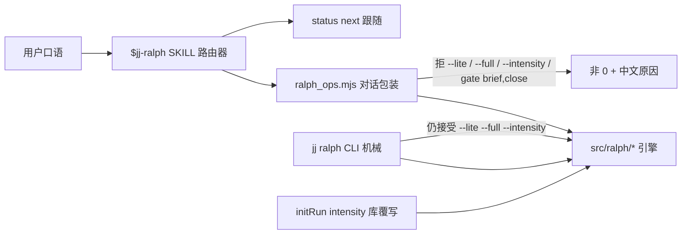
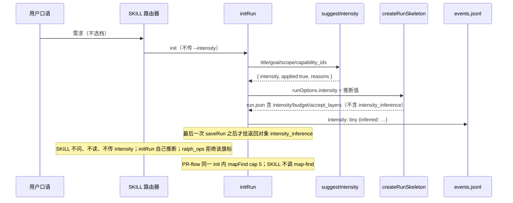

# Ralph 对话协议瘦身

> 状态：Implemented
>
> 验收证据：`tests/jj-ralph-contract.test.mjs`（聚合 `tests/ralph/*.contract.mjs`，76 项）、`tests/task-artifacts.test.mjs`、`tests/memory-hot-layer.test.mjs`；`npm run verify` 422/422。
>
> 日期：2026-09-07
>
> 作者：—
>
> 关联：[jj-ralph](jj-ralph.md)（Implemented）· [Ralph 任务工作区 `.plans` 化改造](ralph-plans-workspace.md)（Implemented）· [Ralph 自动结案](ralph-auto-closeout.md)（Implemented）· [Ralph → 知识库贡献](ralph-knowledge-contribute.md)（Proposed，对话路径冻结）· [Ralph 工作区目录对齐](ralph-workspace-layout.md)（Proposed overlay，本轮冻结）
>
> PR1、PR2、PR-flow、PR3 已按依赖顺序实施，详见 [已完成实施计划](../exec-plans/completed/2026-09-07-ralph-skill-slim.md)。下文 PR0 / PR1 窗口、会话切分限制与代码行号保留为设计时快照；2026-09-07 用户已授权本任务完成全部开发，最终实现以执行计划、代码和测试为准。

## 实施审查修正（2026-09-07）

- `initRun` 返回对象会被 dispatch 绑定 family 后再次保存：保存层须过滤临时检索/推断字段，不仅依赖 init 内的最后一次保存顺序；schema 仍为 1.2。
- 产物检查排除 `1. [ ]` 空骨架；验收须有正文，每个 Step 须有实施文件路径。
- 折叠保留机械 `setGate` 的语义，独立交付 helper 在内存应用三个 gate 后一次保存 ledger。检查拒绝写零键；不宣称 run/index/events 跨文件事务，中断后按 ledger 恢复重试。
- `next=commit-scoped-review` 是证据需求，不能授予 Git 提交权限；遵循当前会话已有授权，缺授权时给出 `commit-prep`。
- 实施按 PR1 → PR2 → PR-flow → PR3 依次验证，完成后统一分发；原 PR0 的“仅文档、不开 exec-plan”不再约束本次已授权开发。

## 0. 结论速览

| 问题 | 结论 | 章节 |
| --- | --- | --- |
| 对话协议为什么大 | `$jj-ralph` 把手册、命令目录、27 行黑名单、知识投喂、handoff 字段全塞进 `SKILL.md`（复核 260 行 / 25KB）。运行时 `src/ralph/` 与 dispatch 同量级，**不是**要重写的对象 | §3 |
| SKILL 目标体积 | 硬顶 120 行，目标 **≤100 行**。SKILL = **一条** playbook：路由器 + 红检查点 + 指针。**不**按强度档分支 | §6.1 |
| intensity 还是不是产品档 | **对话面：否，连提都不提。** `$jj-ralph` / SKILL **一条路径**：不菜单、不教、不推断、不读 `run.intensity`、不传 `--intensity`、不把 `tiny`/`strict` 当 trigger、没有 `CHECKPOINT (strict)`。引擎档 `tiny \| standard \| strict` 仍在 ledger；PR2 `initRun` **静默**推断写入。Agent 跟 `status next` / gate 错误，不因「这是 strict」改步骤。`next` **不**读 `run.intensity`。默认 closeout **不是**每次 `review-record` | §4 / §6.3 / Cut 1 |
| 与 P2+b `suggestGateSet` 的差别 | `gate_set` 启发式只建议（`applied=false`，ledger 永 default `full`）。intensity 推断 **必须落地** `run.json`：`buildBudgetForIntensity` / `createEmptyAcceptLayers` / tiny 跳过空 `## 存疑` 都读它 | §6.3 |
| `--intensity` 留不留 | 机械覆写**只**留 `jj ralph init --intensity` 与 `initRun({ intensity })`。PR2：`ralph_ops` **拒绝** `--intensity`（与拒 `--lite` 同类中文错误）。**不**进对话白名单、**不**进用户文档当功能 | §6.4 |
| `--lite` | 对话路径继续禁止。PR2：`ralph_ops` fail-closed 拒 `--lite` / `--intensity` / `gate brief\|close`；`jj ralph` CLI 与 `GATE_SETS` 引擎保留给遗留 run。不删 lite。Cut 3 **不是** lite / `brief` | §6.4 / §6.7 |
| Cut 1 默认收尾 | 对话主链停在 `gate accept → finalize`。`review` / `commit` / `review-record` / `$jj-end` **只**在用户开口或 `next` 为 `review` / `commit-scoped-review`。`$jj-end` 仍是 Git-only，**不**进 ralph happy path | §6.1 / §6.7 / D14 |
| Cut 2 `map-find` | **不是** skill 步。`initRun`/`resumeRun` 内建 `mapFind`（cap 5，空命中合法）。SKILL 不调 `map-find`、不 Read `business-map.json`。机械 `jj ralph map-find` 留 ops.md | §6.7 / D15 |
| Cut 3 `gate deliver PASS` | **PR-flow 目标：** 对话 `ralph_ops` 折叠 analyze+plan（产物齐则写三键）。五 ledger 键仍在。**不是** `--lite` / `brief` / `gate_set=lite`。`jj ralph gate` 保持原子 = **degraded unfold**。**PR1 SKILL 仍走** `gate analyze` → `gate plan` → `gate deliver`，**不**声称已折叠 | §6.1 / §6.7 / D16 |
| 下一步 overlay | **冻结** `ralph-workspace-layout.md` Proposed 修订，以及把 knowledge-contribute 拉进对话路径 | §6.5 |
| 本文件做什么 | PR0：设计 + 索引 + CHANGELOG。载荷 = **三条流程简化**（Cut 1/2/3）+ 对话面不区分强度。实现从 PR1 起；Cut 2/3 引擎在 **PR-flow**（Depends PR1 **and PR2**；合入 **PR2 先、PR-flow 后**） | §PR Plan |

## 1. 目标

1. **压缩 Agent 对话面。** `skills/jj-ralph/SKILL.md` 目标 ≤100 行（硬顶 120）。保留 Entry 决策表、Happy path、红检查点标题、**10** 条对话命令白名单、指向 references 的指针。**一条 playbook，不按强度分支。**
2. **一事一处（skill-design-principles）。** 手册进 `references/`；SKILL 只做路由、红线、指针。同一事实不在 SKILL / phases / layout / tiny-example / claude-command / 用户文档各写一遍。
3. **Skill 也不区分强度。** `$jj-ralph` 不教、不推断、不读、不传 intensity。引擎可在 PR2 静默写入 `run.intensity`（对对话协议不可见）。口语「文案两字 / 单像素 / 鉴权 / 协议」只是引擎启发式输入，不是 Agent 选档信号。
4. **把反模式下沉到 CLI fail-closed**，SKILL 不再维持 27 行黑名单。对话包装层拒掉未教的旗标，引擎仍能加载遗留 lite run。
5. **冻结后续 ralph overlay**：不在本工作启动 `ralph-workspace-layout.md` Proposed 修订，不把 knowledge-contribute 拉进对话路径。
6. **三条流程简化（用户已决，可编码）：** 默认 closeout 不审不提交不 `$jj-end`；`map-find` 不是 skill 步；对话 `gate deliver PASS` 折叠 analyze+plan（五键仍在，不是 lite）。

## 2. 非目标

| 非目标 | 原因 |
| --- | --- |
| 重写 `src/ralph/` DAG | 运行时体积与 dispatch 同级；问题在对话载荷。DAG 已是 `state ← gates ← map ← knowledge ← archive`（`src/ralph.mjs` 门面） |
| 从引擎删除 `gate_set=lite` / `GATE_SETS` | 遗留 run 与合约测试仍加载 lite；tiny ≠ lite |
| 让引擎 `tiny` 丢掉五 gate | 引擎档只缩短计划 / 跳过空 `## 存疑`；对话路径永远五 gate |
| 在 SKILL 里写「init 会推断 / 不要按 run.intensity 分支」 | 那仍是在区分强度。SKILL **只是不提**；合约 `doesNotMatch` 钉死 |
| 实现 Proposed `ralph-workspace-layout.md` | 冻结 overlay；本设计不碰目录方案 |
| 合并热层与 Portfolio KB | 两层正交；对话路径不教 `knowledge-contribute` / `knowledge-confirm` / `knowledge-prune` |
| 让聊天 / memory 推进 checkpoint | 架构不变量 1；本设计不改 |
| 顺手修 `docs/design-docs/jj-ralph.md` 里过期的 `RALPH-{slug}` 产物树 | 只记 follow-up 债，不绑进本工作 |
| 本轮写 exec-plan 文件 | PR Plan 即切片清单；文档 PR 不另开 `docs/exec-plans/` |
| 把 intensity 收成单一档（永远 `standard`） | 会丢掉 tiny 跳过空存疑与 strict 必做 judgment，且没有替代品 |
| 把 ANALYZE+PLAN 合成一个 ledger 阶段，或对话走 `gate brief` / `gate_set=lite` | Cut 3 只在 `ralph_ops gate deliver PASS` 折叠；`setGate` / `jj ralph gate` 保持原子五键（H） |
| 默认每次 working_tree 审查 + commit + `$jj-end` | 与黑名单 #4 冲突；无 PASS review 时 ARCHIVE 已允许无 commit-scoped SHA（G） |

## 3. 背景与动机

### 3.1 对话面过大，运行时并没有失控

复核（2026-09-07，cwd `D:\daji-docs\jj-flow`）：

| 资产 | 规模 | 含义 |
| --- | --- | --- |
| `skills/jj-ralph/SKILL.md` | **260 行 / 25269 字节** | Agent 每轮都要吃完整手册（诊断口径曾记 ~219 行 / ~25KB，正文后续又加了 unconfirmed-requirement 等段） |
| `skills/jj-ralph/references/` | 15 文件 / **1958 行**（含空行） | SKILL 已引用手册，但仍把手册摘要复制回 SKILL |
| `src/ralph/*.mjs` | **4680 行**（`state.mjs` 1474、`gates.mjs` 1446、`knowledge.mjs` 855、`migrate.mjs` 400、`archive.mjs` 285、`map.mjs` 220） | 热文件已按 DAG 切开，不要再设计拆分 |
| `src/dispatch*.mjs` | **6398 行** | ralph 运行时与 dispatch **同量级**（dispatch 更大）；重写 runtime 解决不了对话载荷 |
| skill `scripts/` | **7852 行** | 主要是 `ralph:sync` 便携副本（`scripts/lib/ralph/` ≡ `src/ralph/`），不是协议膨胀 |
| `tests/jj-ralph-contract.test.mjs` | **3469 行 / 62 个 `test()`** | SKILL 被 **50+ 条字符串 marker** 钉死（约 L340–400 与 L515–533）。不先改测试就瘦 SKILL，必然红 |
| `jj ralph` 子命令 | **~28 个**（含 `resume`/`continue`、`close` 别名则 ~30） | 机械面完整；对话路径不该教齐 |

`ARCHITECTURE.md` 已划清：修改用户可见工作流从 `skills/jj-ralph/` 起；只有机械步骤才进 `src/ralph.mjs` + `src/ralph/`。本设计动的是**对话协议**，不是 DAG。

### 3.2 当前 intensity 是教 Agent 替用户选档

```text
2. **intensity** (user speech first): single-point / `tiny` / 文案两字 / 单像素 → `tiny`; auth·protocol / `strict` / review-before-archive → `strict`; else `standard`.
   - Optional intent is the Goal paragraph in `task_plan.md`. `tiny` skips empty `## 存疑` at init unless `--intent`. Open questions (analyze-hold or unconfirmed requirement) go under `## 存疑`.
   - **No second tier.** Do not pass `--lite` / `--full`. Do not take `gate_set?` advisory. Five gates always.
```

`normalizeIntensity`（`src/ralph/state.mjs`）缺省为 `standard`。`INTENSITY_DEFAULTS` 决定 `max_iterations` / `budget` / `stagnation_patience` / `judgment_policy`（tiny=`auto`，standard=`if_review`，strict=`required`）。`createRunSkeleton` 在 init 时把档写进 ledger；`writeIntent`（`knowledge.mjs` ~228）用 `run.intensity !== 'tiny'` 决定是否写空 `## 存疑`。

用户文档 `docs/commands/jj-ralph.md` 仍把「强度档」写成可点名功能（`$jj-ralph tiny：` / `$jj-ralph strict：` + 「口语里点名即可」）。这是要拆掉的用户面，不是引擎档。

### 3.3 当前 lite 已是第二套废弃旋钮

对话路径已经禁止 `--lite`（SKILL L31、phases「Gate set (deprecated)」、CHANGELOG 0.2.0）。但默认文本 `jj ralph init` 仍打印 `gate_set?` 建议行：

```js
      if (run.gate_set_suggestion?.gate_set === 'lite') {
        stdout.write(`gate_set? lite (advisory; gate_set stays ${run.gate_set || 'full'} — pass --lite explicitly to take it) · ${run.gate_set_suggestion.reasons.join('; ')}\n`);
      }
```

`suggestGateSet`（`src/ralph/gates.mjs` ~1053）是 P2+b **只建议**：`applied=false`，`run.json.gate_set` 无显式 `--lite` 永不变 lite。`ralph_ops init` 仍接受 `--lite`（`ralph_ops.mjs` ~242），合约测试也会 `ralph_ops init --lite`（`tests/jj-ralph-contract.test.mjs` ~2851）。对话包装层与机械 CLI 没有分开。

### 3.4 Marker 测试把 SKILL 钉成手册

`test('ralph schemas, samples, skill and command assets exist with key markers')` 要求 SKILL 含 `metrics`、`Idle offer`、`knowledge-confirm`、`hot_memory`、`MasterGo`、`Goal / 验收 / Steps`、`gate_set?`、`Tool use (speed)` 等。`test('ralph asks first when requirement cannot be confirmed')` 把 unconfirmed-requirement 细则同时钉在 SKILL、phases、layout、tiny、claude-command、用户文档。瘦 SKILL 而不改 marker 归属，不可能合入。

## 4. 产品规则（用户已决，覆盖先前聊天方案）

**拆掉用户用不到的多旋钮。** 对话路径只教一条主链。

| 表面 | 对话路径 | 机械 / 引擎 |
| --- | --- | --- |
| intensity `tiny\|standard\|strict` | **SKILL 一条路径，零强度词汇当行为。** 不菜单、不教、不推断、不读 `run.intensity`、不传 `--intensity`、frontmatter **不**把 `tiny`/`strict` 当 trigger、没有 `CHECKPOINT (strict)`。`$jj-ralph tiny …` 仍进本 skill，因为命令名是 `jj-ralph`，不是 description 列了档名。Agent 不因档改步骤；`computeRalphNext` **不**因 `judgment_policy=required` 改 next | 引擎静默：PR2 `suggestIntensity` 在 `createRunSkeleton` 前写入 ledger。`INTENSITY_DEFAULTS` 保留。机械覆写只留 `jj ralph init --intensity` 与 `initRun({ intensity })`。`ralph_ops` 拒绝 `--intensity`。空存疑由 `writeIntent` 机械决定；judgment 由 gate 拒绝文案机械决定（PR2 错误指向 `review-record`，不教 `accept-layer`）。**默认不**在 accept 前跑 `review-record` |
| `--lite` / `gate brief\|close` | 永不传；忽略 `gate_set?`。PR2：`ralph_ops` 拒绝这些旗标以及 `--intensity`。Cut 3 **不**用 `brief` | `GATE_SETS`、`initRun({ gate_set: 'lite' })`、`jj ralph --lite`、`GATE_ALIASES.brief`（仅 `gate_set=lite`）保留给遗留 run / 合约 |
| `map-find` | **不教、不调。** 禁止 Read `business-map.json`。空 CAP 合法，继续 | PR-flow：`initRun`/`resumeRun` 调 `mapFind`（`map.mjs` L217）。机械 `jj ralph map-find` / ops.md 仍在 |
| 默认审查 / 提交 / `$jj-end` | **不做**（黑名单 #4）。只在用户开口或 `next=review` / `commit-scoped-review` | `$jj-end` 仍是 Git-only。无 PASS review ⇒ ARCHIVE 不要求 commit-scoped SHA（`evaluateAcceptArchiveGate` **L940–L943**：仅当 latest 是 PASS 才要求 `review_scope=commit` + SHA） |
| `gate deliver PASS` | **PR1：** SKILL 仍教 `gate analyze` → `gate plan` → `gate deliver`（**不**声称折叠；**不**说忽略 `next=gate analyze`）。先不写代码：写 Goal+存疑后 **STOP**。**PR-flow 之后：** 对话 `ralph_ops gate deliver PASS` 折叠 analyze+plan（产物齐）；SKILL 才改成不把 `next=gate analyze` 当 happy path | `jj ralph gate --gate analyze\|plan\|deliver` **原子**（`setGate` 一次一键）。折叠**只**在 `ralph_ops`。脚本缺失回落到 `jj ralph gate --gate deliver` = **degraded unfold**（analyze/plan 保持 PENDING；该路径禁止 finalize） |
| `knowledge-confirm` / `knowledge-prune` / `knowledge-contribute` | 不教；不把投喂拉进对话主链 | CLI / `ops.md` 仍可调用 |
| `migrate` / `adopt` / `host-record` / `metrics` / `dispatch-snapshot` | 不教 | 机械 ops |

引擎启发式仍用「文案两字 / 单像素 / 鉴权 / 协议 / 审查过再归档」作 **initRun 输入**（PR2，对话看不见）。档名 `tiny` / `strict` / `standard` / `single-point` 既不是推断信号也不是 skill 分支（D13）。SKILL **不问**「要用 tiny 还是 strict？」，也**不写**那句禁令——不提即不区分。

## 5. 现状（代码指针）

```text
对话入口     skills/jj-ralph/SKILL.md          260 行手册
             claude-commands/jj-ralph.md       薄入口，仍写「只有 intensity」
             docs/commands/jj-ralph.md         用户「强度档」菜单
机械包装     skills/jj-ralph/scripts/ralph_ops.mjs
CLI          src/cli.mjs runRalphCommand        ~28 子命令；文本 init 打 gate_set?
库 DAG       src/ralph.mjs 门面
             state.mjs   INTENSITY_DEFAULTS / normalizeIntensity / createRunSkeleton / computeRalphNext
             gates.mjs   suggestGateSet / GATE_SET_HEURISTIC / evaluateAcceptJudgment
             knowledge.mjs initRun / resumeRun / recordFinding
             map.mjs mapFind / findInMap
             archive.mjs / migrate.mjs
便携副本     skills/jj-ralph/scripts/lib/ralph/*   ralph:sync
合约         tests/jj-ralph-contract.test.mjs      marker + lite + intensity 默认
```

`initRun` 调用顺序（关键约束）：`createRunSkeleton(runOptions)` **先**按 `options.intensity`（缺省 `'standard'`）写入 budget / accept_layers，**然后**才跑 `suggestGateSet`。因此 intensity 推断必须发生在 `createRunSkeleton` **之前**。`writeIntent` 读的是骨架已经写好的 `run.intensity`。

`attachKnowledgeRefs`（`knowledge.mjs` L203，portfolio KB）**不是** `mapFind`（`map.mjs` L217，仓内 `business-map.json` CAP）。今日 `initRun` L310 已调 `mapFind`，但只把 `run_refs` 填进 `reuse_suggestions`，**不**把 CAP 行给 Agent；SKILL 另调 `map-find`——Cut 2 要拆掉这跳。`resumeRun`（L839）今日不调 `mapFind`。

`appendProgressLine`（`state.mjs` ~1096）只写 `.state/events.jsonl`（机器 SSOT），不再镜像进 `progress.md`。init 骨架仍在 `progress.md` 写一行 `- intensity: …`；后续机器行走 jsonl。观察性应同时覆盖骨架行与 jsonl。

## 6. 方案

### 6.1 SKILL.md 目标结构（~90 行）

**一条路径，不按档分支。** SKILL 不得按 `tiny | standard | strict` 分支，不得教引擎档，不得让 Agent 去推断，不得把 `tiny`/`strict` 当 behavioral trigger，不得有 `CHECKPOINT (strict)`，不得含「init infers / init must infer」合同行。frontmatter `description` **删掉** `tiny, strict` 这类强度 trigger；保留 单仓闭环 / resume / 继续 / 改坏了 / 按审查改 / 先不写代码，以及「Conversational path never uses --lite」。`$jj-ralph tiny …` 仍路由进本 skill，因为 skill/命令名是 `jj-ralph`。

**禁止作为 SKILL 行为正文出现：** `intensity`、`run.intensity`、`--intensity`、档名 `tiny`/`strict`、`CHECKPOINT (strict)`、`init infers`、`init must infer`。指针文件名 `tiny-example.md` 可以留（「单点 / 文案两字例子」），**不要**写「这是 intensity=tiny」。

**两条 playbook（诚实窗口 vs 目标合同）。** 不要把折叠抄进 PR1 SKILL。下面两份草图都会进 SKILL 正文，因此 **不得**含 `\bintensity\b` / `intensity-agnostic`。

#### PR1 窗口（合入后立刻生效；引擎仍原子；**不**声称折叠）

PR1 SKILL **仍**教 `gate analyze` → `gate plan` → `gate deliver`。**不**声称 fold。**不**说忽略 `next=gate analyze`。折叠只作为 **目标合同（PR-flow）** 写在 `ops.md` / `phases.md`，不写进 PR1 SKILL happy path。

```text
frontmatter（无档名 trigger）
Role（≤5 行）：单仓闭环；同需求同 run_id；事实只在 .workflow/ralph/ 与 Git
Entry decision table（保留，这是路由器；Git 收工仍指向 $jj-end，不进 happy path）
Immediate actions — **无 map-find 步、无推断合同行**：
  1 locate（index → locate CLI；多候选红检查点；截图先读图）
  2 phases：从 DELIVER 起读 phases.md。写短 Goal/Steps/验收（已确认）→ 改+验
     → deliver-attempt → gate analyze PASS → gate plan PASS → gate deliver PASS
     → gate accept PASS → MUST finalize
     禁止 Read business-map.json。空 CAP 合法，继续。
  3 跟 status next：含 gate analyze / gate plan / gate deliver / gate accept /
     review / commit-scoped-review / finalize / check
     不要发明每次 working_tree 审查 + commit 仪式
  4 短报告
Happy path command chain（无 accept-layer、无 map-find、无默认 $jj-end）：
  locate → init|resume
  → short Goal/Steps/验收 (confirmed) → edit → verify
  → deliver-attempt → gate analyze PASS → gate plan PASS → gate deliver PASS
  → gate accept PASS → finalize
  # review / commit / review-record / $jj-end 只在 next 或用户开口
  # 先不写代码: write Goal+存疑, STOP（不 gate analyze / deliver）
Checkpoints 只留红标题：
  多候选 / unconfirmed requirement / 先不写代码 / irreversible
  （NEEDS_CHANGES/BLOCKED → next=review。analyze+plan+deliver 皆 PASS 后 next=gate accept。
    默认 accept→finalize。
    若 gate accept 错误说 record a passing review → review-record 跟随动作。
    不点名 accept-layer / setAcceptLayer）
Conversational ops whitelist（10，init 与 resume 分计）：
  init, resume, locate, status, deliver-attempt, gate,
  finalize, abandon, finding, commit-prep
Pointers：phases / must-evidence / artifact-layout / rollback / tiny-example / ops.md
  tiny-example 指针文案：「single-point / 文案两字 example」（不是档位 playbook）
Examples（口语样本，不标注档名）
```

#### PR-flow 之后（折叠落地后才改 SKILL happy path）

**仅当** `ralph_ops gate deliver PASS` 已折叠 analyze+plan 之后，才把 SKILL 改成下面这份。这时才写「不要把 `next=gate analyze` 当 happy path」。

```text
Immediate actions — **无 map-find 步、无推断合同行**：
  1 locate（同上）
  2 phases：从 DELIVER 起读 phases.md。写短 Goal/Steps/验收（已确认）→ 改+验
     → deliver-attempt → gate deliver PASS（折叠 analyze+plan，见 ops.md / phases.md）
     → gate accept PASS → MUST finalize
     禁止 Read business-map.json。空 CAP 合法，继续。
     对话 deliver PASS **必须**走 ralph_ops；回落 jj ralph gate --gate deliver
     = degraded unfold（analyze/plan 保持 PENDING；该路径禁止 finalize）
  3 跟 status next：**只**当 next 是 review / commit-scoped-review / finalize / check
     不要把 next=gate analyze / gate plan 当 happy path（Cut 3 折叠已落地）
     不要发明每次 working_tree 审查 + commit 仪式
  4 短报告
Happy path command chain：
  locate → init|resume
  → short Goal/Steps/验收 (confirmed) → edit → verify
  → deliver-attempt → gate deliver PASS   # 产物齐则折叠 analyze+plan；必须 ralph_ops
  → gate accept PASS → finalize
  # review / commit / review-record / $jj-end 只在 next 或用户开口
  # 先不写代码: write Goal+存疑, STOP（不 gate deliver）
```

frontmatter / Role / Entry / Checkpoints 红标题 / 白名单 10 / Pointers 与 PR1 窗口相同。不要把两份草图合成「一边声称折叠、一边禁止 `gate analyze`」的单稿。

**不要**在 SKILL 加「不要按 run.intensity 分支」——那仍是在区分。合约 `doesNotMatch`（大小写敏感、无 `/i`）钉：`\bintensity\b`、`accept-layer`、`CHECKPOINT \(strict\)`、`intensity=tiny`、`init must infer`、`init infers`、`--intensity`；可选 frontmatter `/tiny,\s*strict/`。SKILL **不能**写「不要 `--intensity`」（会被 `--intensity` 负锁定误伤）；该禁令只在 claude-command。

`review-record` **覆盖**上一版「happy path 必跑」：默认 **不**跑。只在（a）`next=review` / `commit-scoped-review`，或（b）`gate accept` 错误文案要求 record a passing review。仍不是白名单产品命令。**PR1 新增**合约 loop pin：把 `review-record` 钉在 `commit-scoped-review` 旁（今日 L341–L397 **没有**这条；不是 keep）。SKILL 文案：「only if next=review|commit-scoped-review」（或 gate 错误要求）。`map-find` **退出白名单**（Cut 2）。`accept-layer` **退出白名单**。`rollback-phase` / `set-status` 只在 `phases.md` / `ops.md`。

**不要**为 `judgment_policy=required` 改 `computeRalphNext` 去返回 `review`。PR2 把 `evaluateAcceptJudgment`（`gates.mjs` L561–L567）错误从 `use setAcceptLayer` 改成「record a passing review (`review-record`) then retry `gate accept`」。无 PASS review 时 ARCHIVE 已不要求 commit-scoped SHA（`evaluateAcceptArchiveGate` **L940–L943**：仅当 latest 是 PASS 才要求 SHA）。

### 6.2 事实搬家（一事一处）

| 现 SKILL 块 | 迁到 | SKILL 留下 |
| --- | --- | --- |
| 完整 `ralph_ops` 命令目录（现 L139–164） | **新建** `skills/jj-ralph/references/ops.md` | 10 条白名单 + 「目录见 ops.md」 |
| Failure modes 表（现 L104–127） | `phases.md`（User intervention / Closeout 旁） | 一句「失败表见 phases.md」 |
| Knowledge contribute + Hot memory（现 L183–204） | `integrations.md`（或短 `references/knowledge.md`，优先并入已有 integrations，避免再增一本手册） | 一行：归档热层已晋升；投喂全局 KB 非对话主链 → `$jj-init` / integrations |
| 27 行反例黑名单（现 L206–236） | **删除表**。PR2 前 Entry/Checkpoints 各留不重复的一行路由，避免现场课还没下沉到 CLI 就丢 | 见 §6.4 过渡 |
| Handoff 字段 dump（现 L130–137） | `integrations.md`（已有 jj-same 节） | 一行：交接到 → `$jj-same` |
| MasterGo / Tool use 长段 | MasterGo → `integrations.md`；速度约定压成 ≤4 行留在 SKILL 或并入 phases Lean execution | SKILL 可留「批量读、offset/limit、禁止重读已注入、禁止 Read business-map」 |
| Unconfirmed-requirement 细则 | **只** `phases.md` | 检查点标题 + **ask first** |
| Goal / 验收 / Steps 形状、引擎 tiny 跳过空存疑 | `artifact-layout.md` / `tiny-example.md` | 指针（不说 intensity=tiny） |
| intensity 预算表、product-consistency、`next=` 状态机、Gate set deprecated、judgment | `phases.md`（已有 Intensity / Gate set / Closeout） | SKILL **零**推断声明；只跟 next |
| Idle offer / `knowledge-confirm` | `integrations.md` | 不进 Immediate actions |

`tiny-example.md` / `artifact-layout.md` **允许**保留引擎档名词作 **engine fact**（`tiny` skips empty `## 存疑`；`tiny` / `does **not** drop gates`；`tiny is not exempt`）。**禁止** `init --intensity tiny`。SKILL 指针只写「single-point / 文案两字 example」，**禁止**把该文件呈现为 intensity playbook。引擎是否写入 `tiny` 是 PR2 的静默行为，SKILL 不声明。

### 6.3 Intensity 推断规格（可编码；**对对话协议不可见**）

本节只约束 PR2 引擎。SKILL / claude-command / 用户文档 **不**复述这张表。Agent 从不读 `run.intensity` 来选路径。

**函数家园：** `suggestIntensity({ title, goal, scope, capability_ids })` 放在 `src/ralph/gates.mjs`，紧挨现有 `suggestGateSet`。不要放进 `knowledge.mjs`：`knowledge.mjs` 已从 `gates.mjs` 导入 `suggestGateSet`（L63–70）；gates 不得反向 import knowledge（文件头 DAG 注释）。

**与 `suggestGateSet` 的不对称（硬约束）：**

| | `suggestGateSet`（P2+b，保留） | `suggestIntensity`（本方案） |
| --- | --- | --- |
| 写入 | **不**写 `run.gate_set`；`applied=false` | **写** `run.intensity`；`applied=true` |
| 缺省 | 无 `--lite/--full` → ledger `full` | 无 `--intensity` → 推断结果进 ledger |
| 拿不准 | `full` | `standard`；**不问用户** |
| 调用点 | `initRun` 在 `createRunSkeleton` **之后** | `initRun` 在 `createRunSkeleton` **之前**（budget / accept_layers / `writeIntent` 都依赖档） |
| resume | 不重新建议 | **不重新推断** |

**启发式常量：** 新增 `INTENSITY_HEURISTIC`，**复用** `GATE_SET_HEURISTIC.small_change_terms` / `architecture_terms` / `countAcceptanceItems` / `classifyScopeEntry`，不要改 lite 的 `max_scope_in=2`。

```js
export const INTENSITY_HEURISTIC = Object.freeze({
  max_scope_in: 1, // 严于 lite 的 2；不改 GATE_SET_HEURISTIC.max_scope_in
  extra_small_terms: /两字/i, // 文案|像素|typo 已在 small_change_terms；单像素 ⊂ 像素。不加 copy（无词界会误伤 copyright / Copy the README）。不改 lite 的 regex
  review_before_archive:
    /审查过再归档|先审查再归档|审查后再归档|审查过再|review-before-archive|review before archive/i
});
```

`small_wording` = `GATE_SET_HEURISTIC.small_change_terms` ∪ `INTENSITY_HEURISTIC.extra_small_terms`。
`architecture_terms` 已含 `鉴权|协议|权限|安全|认证|授权|protocol|\bauth\b|…`，不必再加同义词；推断时在 title/goal/scope.in 上复用同一 regex。档名 `tiny`/`strict`/`standard`/`single-point` **不是** `small_wording` 也不是 `architecture_terms`（D13）。

**判定表（工程师按此写分支，不得发明第三档）：**

| 结果 | 信号（必须同时满足才能 tiny；strict 任一即中） | 引擎后果（已有，不新发明） |
| --- | --- | --- |
| `tiny` | **小改动面必须带小改口语**：`(scope.in 全是具体文件且数量 ≤1 ∧ small_wording) ∨ (scope.in 为空 ∧ small_wording)`；**且** architecture_terms 未命中；**且** 单一验收项（`countAcceptanceItems(goal)` 与非空 `capability_ids.length` 的 max == 1）。**仅 1 个具体文件、无 small_wording → 不是 tiny**（歧义 = `standard`） | `judgment_policy=auto`；可跳过空 `## 存疑`（除非 `--intent`） |
| `strict` | architecture_terms 命中 **或** `review_before_archive` 命中 | `judgment_policy=required`；`review-record` 写 `accept_layers.judgment`；`gate accept` 否则挡（PR2 错误文案指向 `review-record`，不教 `accept-layer` / `setAcceptLayer`） |
| `standard` | 其余，**包括歧义**（无 small_wording、无 scope、1 文件大功能、多文件/dir/glob、多验收项、能力 id>1、只有档名无其它信号） | `if_review` |

**优先级（fail-closed）：**

```text
explicit options.intensity 非空 → 用它，不跑推断
else tiny 信号 ∧ strict 信号 → strict（reasons 含 precedence:strict (tiny∧strict)）
else strict 信号 → strict
else tiny 信号 → tiny
else standard
```

`scope.in` 含目录 / glob / 无扩展名 → **不是** tiny 小改动面（与 `suggestGateSet` 的 `classifyScopeEntry` 一致）。`scope.in` 有 2 个具体文件：lite 建议可能仍是 lite（max 2），intensity 必须是 `standard`（max 1，且 tiny 还要 small_wording）——这是有意的正交。

**`initRun` 伪代码（切片 2）——照抄 P2+b `gate_set_suggestion` 的持久化形状：**

```js
const explicitIntensity = options.intensity != null && String(options.intensity).trim() !== '';
const intensitySuggestion = explicitIntensity
  ? null
  : suggestIntensity({
      title: options.title,
      goal: options.goal,
      scope: options.scope,
      capability_ids: options.capability_ids
    });
const runOptions = { ...options };
if (intensitySuggestion) runOptions.intensity = intensitySuggestion.intensity; // 在 createRunSkeleton 之前写入档
const run = createRunSkeleton(runOptions);
saveRun(run, cwd); // knowledge.mjs 现 L222；随后 writeIntent 后再 saveRun（L236）
// 禁止在任何 saveRun 之前把 intensity_inference 挂到 run 上。
// saveRun（state.mjs L609–L618）浅拷贝写入；validateRun 不剥未知键；
// schemas/ralph-run.schema.json 顶层 additionalProperties: false。

const intensityLine = intensitySuggestion
  ? ('- intensity: ' + run.intensity + ' (inferred: ' + intensitySuggestion.reasons.join('; ') + ')')
  : ('- intensity: ' + (run.intensity || 'standard'));
// progress.md 骨架（现 L269）与 appendProgressLine（现 L277 → events.jsonl）写同一行。

// 最后一次 saveRun 之后才挂返回对象（照抄 L323 gate_set_suggestion）：
if (intensitySuggestion) {
  run.intensity_inference = { ...intensitySuggestion, applied: true };
}
return run;
```

`run.json` **只**持久化 `intensity` 字符串 + 由它派生的 budget/layers。`intensity_inference` 只活在返回对象与 jsonl reasons。合约紧挨现有 `gate_set_suggestion` 磁盘断言：`Object.hasOwn(disk, 'intensity_inference') === false`。不升 schema。

**禁止：**

- 打印 `intensity?` / 「要用 tiny 还是 strict？」
- 对话路径传 `--intensity`
- resume / `hydrateIntensityFields` 重跑推断
- 因推断失败去问用户（歧义 = `standard`）

**允许：**

- 文本 `jj ralph init` 打事实行 `intensity: tiny`（不是选择题）
- JSON / 返回对象带 `run.intensity` 与可选 `intensity_inference`（后者**不**写入 `run.json`）
- `jj ralph status` 继续显示 intensity（已有事实，不是控件）
- `jj ralph init --intensity` 与 `initRun({ intensity })` 机械覆写（`ralph_ops` 拒绝该旗标）

口语样本对照（推断，不是菜单；Expected 列可直接写成合约断言）：

| 用户说 | 预期档 | 理由 |
| --- | --- | --- |
| 「文案修改 点击拨打改成拨打电话」 | `tiny` | `small_wording`（文案/两字），无架构词，单一验收 |
| 「tip 的 bottom 从 4px 改成 6px」+ `--in src/tip.css` | `tiny` | 1 具体文件 **且** `small_change_terms`（`4px` / 像素） |
| `--in src/dashboard.vue` + 「加上筛选和导出」 | `standard` | 1 个具体文件但**无** small_wording → 歧义，fail-closed（不是 tiny） |
| 「刷新 token 失败要重登」 | `standard` | 活 `architecture_terms` **不含** `token` / `刷新` / `重登`；也不命中 `\bauth\b` / 鉴权 / 认证 / 权限；无 small_wording |
| 「刷新鉴权 token / 登录认证失败要重登」 | `strict` | `鉴权` / `认证` 命中 `architecture_terms` |
| 「审查过再归档」 | `strict` | `review_before_archive` |
| 「文案改一下登录鉴权提示」 | `strict` | tiny∧strict → strict |
| 「先改项目A：登录后密码过期提示」 | `standard` | 无小改口语、无架构命中（「登录」不是 architecture_terms） |
| 「tiny 改一下」/「strict 做这个」（无其它信号） | `standard` | D13：档名不是推断信号 |
| 空 title/goal、无 scope | `standard` | 歧义 |

### 6.4 对话白名单与 CLI fail-closed



**对话白名单（10，init 与 resume 分计）：** `init` · `resume` · `locate` · `status` · `deliver-attempt` · `gate`（仅 `analyze|plan|deliver|accept|archive`）· `finalize` · `abandon` · `finding` · `commit-prep`。

Happy path **教哪些 gate 键**随窗口变：PR1 教 `analyze` → `plan` → `deliver` → `accept`；PR-flow 之后 happy path 教 `deliver`（折叠）/`accept`，显式 `gate analyze|plan` 仍可用但不是主链。

对话解析链：`ralph_ops.mjs` 然后 `jj ralph`（活 SKILL L166；command L24）。**PR-flow 之后**，对话 `deliver PASS` **必须**走 `ralph_ops`。脚本缺失而回落到 `jj ralph gate --gate deliver` = **degraded unfold**（analyze/plan 保持 PENDING；**不要**在该路径 finalize）。其它动词仍可回落 `jj ralph`。

`map-find` **不在白名单**（Cut 2；机械命令留 ops.md）。`accept-layer` **不在白名单**。`review-record` **不是**第 11 条：只在 `next` 或 gate 错误要求时作跟随动作。PR1 **新增** loop pin，钉在 `commit-scoped-review` 旁。PR2 `gate accept` 拒绝文案指向 `review-record`，不教 `setAcceptLayer`。

**PR2 `ralph_ops.mjs` fail-closed：**

| 输入 | 行为 |
| --- | --- |
| `init --lite` / `init --full` | exit ≠ 0：对话包装不接受 lite 档；遗留请用 `jj ralph init --lite` |
| `gate --gate brief\|close` | exit ≠ 0：对话包装只接受五键 |
| `init --intensity …` | exit ≠ 0：对话包装不接受档位旗标（与 `--lite` 同类中文错误，例如「对话包装不接受 --intensity；机械覆写请用 jj ralph init --intensity」）。测试用 `initRun({ intensity })` 或 `jj ralph init --intensity` |
| 空 finding | **分层**，不要混字段名：CLI/库 `recordFinding`（`knowledge.mjs` L125–L130）trim 后空 `--action` / `--scope` **已经** throw（`finding needs --action` / `--scope`）。`ralph_ops` finding 只转发字段，自己不校验。Markdown 标签是 `对策` / `适用范围`（`appendFindingsEntry`，`src/memoryHotLayer.mjs` L388–L389），JS/CLI 名仍是 `--action` / `--scope`。真正的绕过是 `appendFindingsEntry` 目前把空字符串写进文件且 **不** throw。`migrate.mjs` L113–L116 用原始文件 I/O 写空对策壳，**不**走这个 helper。PR2：(1) `appendFindingsEntry` 拒空对策/适用范围；(2) 可选把 `recordFinding` 错误文案改成「对策/适用范围不能空」；(3) **不**改 migrate 遗留空壳，除非另开明确增量；(4) 给 helper 加合约测试。CLI 旗标保持 `--action` / `--scope` |

**`jj ralph` CLI（机械）保持现状：** `--lite` / `--full` / `--intensity` / `gate brief|close` 仍可用。PR2 必须改的活 `ralph_ops` spawn 见 §15 PR2 测试 4（至少 L2851 `--lite`、L2855 `gate brief`、L2863 `--lite --full`、L3038 `--full`）。同一 `ralph_ops.mjs` 编辑还要剥掉 Commands 用法横幅里的这些旗标（现 L72 `init … [--intensity …] [--lite|--full]`、L86 `gate …|brief|close` 及 L73–L74 / L87 括注），机械覆写指向 `jj ralph` / `ops.md`。P2+a `jj ralph gate --gate brief`（L2592，lite run）**留作机械 CLI 测试**，不是 ops 测试。

**默认文本 init 不再打印 `gate_set?`。** JSON 可保留 `run.gate_set_suggestion`（P2+b 合约：ledger 仍 full）。`phases.md` 继续写「忽略 `gate_set?`」直到该提示从文本层消失后，把这句话收成「文本 init 不再提示 lite」。

**黑名单过渡：** PR1 删 27 行表，但 Entry 决策表与红检查点必须覆盖今天表里**尚未** CLI 化的路由（同需求 resume、先不写代码、截图、审查修复不当新 run、聊天不推进 checkpoint）。PR2 把空 finding / `--lite` 收到包装层后再允许 SKILL 不再提这些反例。

### 6.5 冻结 overlay

本工作 **不**开始、**不**修订：

- `docs/design-docs/ralph-workspace-layout.md`（Proposed：`tasks/`≡active 等）
- 把 `ralph-knowledge-contribute.md` 的投喂流程拉进 `$jj-ralph` Immediate actions / Idle offer

SKILL 瘦身时 Idle offer 整段移出对话主链；integrations 可保留「用户主动说投喂知识库时走机械命令」的一行。不把 confirm/prune 教回 Agent。

### 6.6 架构与 init 时序



### 6.7 三条流程简化（可编码；用户已决）

本节与 intensity 推断正交。PR1 改 SKILL/文档（**src-clean**）；Cut 2/3 引擎落地在 **PR-flow**（Depends PR1 **and PR2**；合入 **PR2 先、PR-flow 后**）。禁止把 PR2 推断与 PR-flow 折叠写进同一会话。

#### Cut 1 — 默认 closeout 停在 accept → finalize

对齐黑名单 #4（未要求不 commit / review / merge）。

默认对话链（Cut 1 收尾停在 accept→finalize；**走到 deliver PASS 的前置**见 Cut 3 / §6.1 两条 playbook）：

```text
# PR1 窗口（引擎仍原子）
locate → init|resume → 改+验 → deliver-attempt
  → gate analyze PASS → gate plan PASS → gate deliver PASS
  → gate accept PASS → finalize

# PR-flow 之后
locate → init|resume → 改+验 → deliver-attempt
  → gate deliver PASS（ralph_ops 折叠 analyze+plan）
  → gate accept PASS → finalize
```

`review` / `commit` / `review-record` / `$jj-end` **只**在：

- 用户明确要求，或
- `status next` 为 `review` 或 `commit-scoped-review`

覆盖上一版 D14「happy path 必跑 `review-record`」。新默认：accept→finalize。若 `gate accept` 错误说 record a passing review，再把 `review-record` 当跟随动作（仍不是白名单产品命令）。

活引擎对 **closeout** 已对齐；对 **deliver 之后的 next** 不要过读：

- `computeRalphNext`（`state.mjs` L1300–L1303）返回 `gate accept` **仅当** `gates.analyze` **和** `gates.plan` **已经是 PASS**（然后才看 deliver）。否则 `next` 仍是 `gate analyze` / `gate plan`。init 后 `next` 是 `gate analyze`。原子 `setGate({ gate: 'deliver' })` 而 analyze/plan 仍 PENDING 时，`next` **不是** `gate accept`。intensity 未参与 `next`。
- accept PASS 且无阻挡审查 → `finalize`（L1283–L1286）。这一段与 Cut 1 默认收尾一致。
- `evaluateAcceptArchiveGate` **L940–L943**：ARCHIVE 要求 commit-scoped SHA **仅当** latest review 是 PASS。无 latest review **不**挡 ARCHIVE。不要把 L925–L944 整段当这条规则（那段还含 NEEDS_CHANGES/BLOCKED 禁 accept/archive）。

`$jj-end` 仍是 Git-only（Entry 表可留），**不**进 ralph happy path。SKILL **不要**发明每次 working_tree 审查 + commit 仪式。

PR1 Immediate action 3 **跟** `next=gate analyze` / `gate plan`（引擎真值）。**只有** PR-flow 折叠落地后，SKILL 才改成只跟 `review` / `commit-scoped-review` / `finalize` / `check`。

#### Cut 2 — `map-find` 不是 skill 步

`mapFind`（`src/ralph/map.mjs` L217，`findInMap` 扫 `business-map.json` CAP）**不是** `attachKnowledgeRefs`（`knowledge.mjs` L203，portfolio KB）。DAG：`state ← gates ← map ← knowledge ← archive`，`knowledge.mjs` 已 import `mapFind`（L71）。

**PR-flow `initRun` / `resumeRun`：**

1. 调一次 `mapFind(query, { cwd, limit: 5 })`。
   - **init query 是对活代码的显式变更：** 今日 L310 是 `mapFind(run.title || run.goal || '', { cwd, limit: 5 })`，且只把 `run_refs` 填进 `reuse_suggestions`。PR-flow 改为 `knowledge_query || title || goal`（`knowledge_query` 今日喂 portfolio attach，**不**喂 CAP；本切片开始喂 CAP）。
   - **resume query（新）：** `reason || title || goal`。今日 `resumeRun` L839 **不**调 `mapFind`。
   - 空 query → 空命中，不 pad（`findInMap` L169–L184 已如此）。
2. 复用今日 L310–L321 的 `run_refs` → `reuse_suggestions`；**同一趟**把 CAP 短命中挂到**返回对象**（建议键 `map_find`：`{ query, matches, applied: true }`），**不**写入 `run.json`（`saveRun` 浅拷贝 + schema `additionalProperties: false`）。
3. **挂载点：** 最后一次 `saveRun` **之后**，紧挨现有 `gate_set_suggestion`（`knowledge.mjs` L323；活 last `saveRun` 是 L236）。**禁止**挂完 `map_find` 再 `saveRun`。PR2 已在同一点挂 `intensity_inference` 时，本切片 **追加** `map_find`，**不**发明第二次 save。
4. `events.jsonl` 一行，形状对齐 `formatHotMemoryProgressLine`（`memoryHotLayer.mjs` L239–L240）：`- map_find: CAP-a, CAP-b` 或 `- map_find: (none)`。
5. 空命中合法。Agent 可在 init/resume 输出里看到 CAP 行。SKILL **不**调 `map-find`、**不** Read `business-map.json`。
6. 机械 `jj ralph map-find` / `ralph_ops map-find` / ops.md 保留。

**PR1 窗口（诚实）：** SKILL 已不调 `map-find`；`initRun` 尚未把 CAP 行给 Agent（L310 只填 reuse）。「CAP lookup 在 PR-flow 进 init；此前对话路径 map 命中可空」——空 CAP 今日已合法。

#### Cut 3 — 对话 `gate deliver PASS` 折叠 analyze+plan

**所有**对话 run 一条路径。五 ledger 键保留。**禁止** `--lite` / `brief` / `close` / `gate_set=lite`。`GATE_ALIASES.brief`（`gates.mjs` L982：`brief = analyze+plan`）只在 `gate_set=lite` 生效（L987–L996）；Cut 3 **不**走这条别名。

折叠**只**在 `ralph_ops` `gate --gate deliver --status PASS`（`ralph_ops.mjs` 现 L410 直接 `setGate`）。`setGate` / `jj ralph gate --gate analyze|plan|deliver` **保持原子**（一次写一键；现有只 `setGate deliver` 的测试可留）。

**回落合同：** 对话 `deliver PASS` **必须**走 `ralph_ops`。脚本缺失、Agent 回落到 `jj ralph gate --gate deliver` = **degraded unfold**：analyze/plan 保持 PENDING；**不要**在该路径 finalize。SKILL / ops.md 必须写明这句话。机械 CLI 原子性不是「对话也可以 unfold」。

**`ralph_ops` 算法（inspect-then-commit；实现按此写，不要发明第二协议）：**

1. **先** `inspectAnalyzePlanArtifacts(run, cwd)`，**再**任何 `setGate`。`setGate` **不**调它。
2. **引擎拒绝（仅此两类）：**
   - 未回答的 `## 存疑` 项，或
   - 缺失 Goal / 验收 / Step backticks。
   命中则 **throw，写零键**（`gates.analyze` 仍 PENDING；plan/deliver 不写）。
3. **analyze-hold 只在 skill：** 用户说「先不写代码」则 **不要调用** `gate deliver`，直到「开始做吧」。**不要**把 analyze-hold 列为引擎条件。**不要**新增 `run.json` 旗标。引擎读不到口语。
4. **存疑 parser（对照活 stub）：** 取 `## 存疑` 直到下一个 `##`。空标题 / 空白节（`writeIntent` 空存疑）**不**挡。`- [ ]` 算未回答。已勾 `- [x]` 不算。空 `-`/`*`/`1.` 不算。tiny init 整段省略 `## 存疑` heading（`knowledge.mjs` L228–L248，`intensity === 'tiny'`）**不**发明 hold。遗留 `### 存疑事项` **不是**本节。
5. inspect 通过之后，按序：若 `gates.analyze` 不是 PASS → `setGate analyze PASS`；若 `gates.plan` 不是 PASS → `setGate plan PASS`；再 `setGate deliver PASS`（verify / deliver-attempt / product-consistency 仍在后续 accept，不在 deliver 键上）。
6. **错误目录**点名缺失产物，**不要**写 `use gate analyze`：
   - `missing Goal in task_plan.md`
   - `missing 验收 in task_plan.md`
   - `missing Step file backticks in task_plan.md`

合约：缺 Step backticks ⇒ `gates.analyze` 仍 PENDING（禁止先写 analyze 再因 plan 失败）。

建议把产物检查抽成 `inspectAnalyzePlanArtifacts(run, cwd)` 放 `gates.mjs`（已有 `readRunArtifactText` / `inspectAcceptanceEvidence`），**只**给 `ralph_ops` 调。返回 `{ unanswered_open_questions, goal_ok, acceptance_ok, plan_ok, missing: [] }`。**不要** `blocking_intent` 字段（那会暗示引擎能看见「先不写代码」）。

显式 `ralph_ops gate --gate analyze` 仍可用（少见）。**PR1 SKILL happy path 仍教** `gate analyze` / `gate plan`。**PR-flow 之后** SKILL happy path 不教这两键，用户说「开始做吧」后 Agent 进 DELIVER，只调 `ralph_ops gate deliver PASS`。

**PR1 SKILL 跟** `next=gate analyze` / `gate plan`。**PR-flow 之后**才不要把它们当 happy path（init 后 next 仍可能是 `gate analyze`，直到折叠写完键）。

## 7. 接口变化

### 7.1 对话 / 文档

| 表面 | 之前 | 之后 |
| --- | --- | --- |
| SKILL Immediate action 2 | Agent 按口语选 tiny/standard/strict 并传档 | **删除该步。** SKILL 零强度词汇；不写「init 会推断」。推断只在 `initRun`（PR2），对对话不可见 |
| SKILL gate 链 | ANALYZE→PLAN→DELIVER 逐步 `gate` | **PR1 仍逐步** `gate analyze` → `gate plan` → `gate deliver`（诚实窗口）。**PR-flow 之后** happy path 改成 `gate deliver PASS` 折叠。不要在 PR1 就写折叠或「忽略 next=gate analyze」 |
| SKILL `map-find` 步 | Immediate action 3 + 白名单 | **删除。** 禁止 Read `business-map.json`；空 CAP 合法。查找进 `initRun`/`resumeRun`（PR-flow） |
| SKILL 默认 closeout | review → commit → review-record → accept → finalize → `$jj-end` | **停在 accept → finalize**。审查/提交/`$jj-end` 只在 next 或用户开口 |
| SKILL Scripts | ~20 条 ralph_ops 含 metrics/migrate/adopt/… | **10** 条白名单（无 `map-find`、无 `accept-layer`）；全文 `ops.md`。`review-record` 仅跟随动作（PR1 **新增** loop pin） |
| `docs/commands/jj-ralph.md` §强度档 | 「口语里点名即可」+ `$jj-ralph tiny：` / `$jj-ralph strict：` | **删除菜单**（`### 强度档` 整节、点名示例、「口语里点名即可」）。`intensity`/`tiny`/`strict` **不进** userCmd 正循环。L136 的 `intensity` ledger 别名 **删掉**（CAP/DEL/task-* 机器标识可留） |
| `claude-commands/jj-ralph.md` | L26「只有 intensity…不要 `--lite`」+「map-find **只跑 CLI**」；L30 `review → commit → review-record → gate accept → MUST finalize → $jj-end`（与 L8「未要求 commit/push/review 不做」自相矛盾） | 「不要 `--lite`、不要 `--intensity`」。**删** command 上的 `map-find` 步（L505 `assert.match(command, /map-find/)` **迁** `ops.md` 或删掉；**不要**当 implied）。L30 改成 accept→finalize。**保留** L8「未要求 commit/push/review 不做」。**不要**写「init 会推断」或「只有 intensity」菜单。`doesNotMatch` 钉教过的菜单，允许 `--intensity` **禁令**行 |
| `phases.md` 选档祈使句 | L39 `init --intensity tiny\|standard\|strict`；L84 `prefer intensity=tiny` | **PR1 就改**（跟 SKILL 瘦身同 PR）：删 L84；L39 改成 ledger 事实（「engine field；对话路径不传 `--intensity`」），不是选档手续。预算表留作引擎 SSOT |

### 7.2 库

```js
// src/ralph/gates.mjs — PR2 新增
export function suggestIntensity({ title = '', goal = '', scope = null, capability_ids = [] } = {}) {
  // 返回 { intensity, applied: true, reasons, signals }
}

// src/ralph/gates.mjs — PR-flow 新增（只给 ralph_ops 调；setGate 不调）
export function inspectAnalyzePlanArtifacts(run, cwd) {
  // 返回 { unanswered_open_questions, goal_ok, acceptance_ok, plan_ok, missing: [] }
  // missing 可含 'Goal' / '验收' / 'Step backticks'。无 blocking_intent（analyze-hold 不是引擎条件）
}

// src/ralph/knowledge.mjs initRun
// 无 options.intensity（null/''）时，在 createRunSkeleton 之前把 suggestIntensity().intensity 写入 runOptions
// intensity_inference 只在最后一次 saveRun 之后挂到返回对象（照抄 gate_set_suggestion）
// PR-flow：mapFind cap 5；query 从活 L310 title||goal 改为 knowledge_query||title||goal
// 返回对象 map_find 追加挂在同一 hang 点（不发明第二次 save）；events `- map_find: …` 空=(none)；磁盘无该键
```

`src/ralph.mjs` 门面 re-export `suggestIntensity` / `INTENSITY_HEURISTIC` / `inspectAnalyzePlanArtifacts`（与现有 `suggestGateSet` 相同方式），以便合约测试从 `../src/ralph.mjs` 导入。

### 7.3 CLI 文本

| 命令 | 之前 | 之后（PR2） |
| --- | --- | --- |
| `jj ralph init` 文本 | 可能打 `gate_set? lite …` | **不再**打 `gate_set?`；可打事实行 `intensity: tiny` |
| `jj ralph init --json` | `gate_set_suggestion` | 保留建议对象；可加返回对象 `intensity_inference`（**不**进 `run.json`） |
| `printRalphHelp`（`src/cli.mjs` ~L1660 说明段） | intensity 当用户预算旋钮；「文本模式打印 gate_set? 行」 | 删掉 `gate_set?` 句。intensity 写成**已记录、可被 `jj ralph init --intensity` 覆写的引擎字段**，不是选档器。用法行可保留 `[--intensity tiny\|standard\|strict]` |
| `ralph_ops.mjs` `printHelp` Commands 横幅（现 L72、L86） | `init … [--intensity tiny\|standard\|strict] [--lite|--full]`；`gate …\|brief\|close`；L73–L74 / L87 括注教 lite 别名 | **剥掉**这些旗标与括注。对话包装只列五键 `gate`。机械覆写一句指向 `jj ralph` / `ops.md`（D4/D6） |
| `ralph_ops init --lite` / `--full` | 成功写档 | **拒绝** |
| `ralph_ops init --intensity` | 成功写档 | **拒绝**（机械覆写走 `jj ralph init --intensity` / `initRun({ intensity })`） |
| `ralph_ops gate --gate close` | 走别名 | **拒绝** |
| `jj ralph init --lite` / `--full` | 成功 | 仍成功（机械） |
| `evaluateAcceptJudgment`（`gates.mjs` L561–L567） | `strict intensity requires … use setAcceptLayer --layer judgment --status PASS` | PR2 改为：record a passing review (`review-record`) then retry `gate accept`。**不**改 `computeRalphNext` |
| `ralph_ops gate --gate deliver --status PASS`（PR-flow） | 直接 `setGate deliver` | inspect-then-commit：先 inspect，缺产物/阻挡存疑则 **零键**；齐则写 analyze+plan+deliver。错误点名 Goal / 验收 / Step backticks，不写 `use gate analyze` |
| `jj ralph gate --gate deliver` | 原子 `setGate` | **仍原子**（不折叠）= 对话路径的 **degraded unfold**。analyze/plan 保持 PENDING；不要在该路径 finalize |
| init/resume 返回对象（PR-flow） | 无 CAP 行（`mapFind` 只填 reuse；query = `title \|\| goal`） | query 改为 `knowledge_query \|\| title \|\| goal`（resume：`reason \|\| title \|\| goal`）；返回对象 `map_find` + events `- map_find:`（空 = `(none)`）；磁盘无该键；**挂完不 saveRun** |

不升 `ralph-run` schema。`run.intensity` 已是 1.2 字段。`map_find` 与 `intensity_inference` 一样不进 `run.json`。

## 8. 数据模型

无 schema 迁移。`run.json` 继续：

```text
intensity: "tiny" | "standard" | "strict"   // 缺省 standard；本方案改为「无旗标则推断」
budget / stagnation / accept_layers         // 由 INTENSITY_DEFAULTS[intensity] 派生
gate_set: "full" | "lite"                   // 无 --lite 仍 full；不因 intensity 改变
```

`gate_set_suggestion` 仍只活在返回对象 + events（P2+b）。`intensity_inference` 同样：在**最后一次** `saveRun` 之后挂到返回对象（`knowledge.mjs` 现 L323 同形），reasons 进 jsonl / `progress.md` 骨架行。磁盘断言：`Object.hasOwn(disk, 'intensity_inference') === false`（紧挨现有 `gate_set_suggestion` 磁盘断言，`tests/jj-ralph-contract.test.mjs` L2948–L2953）。PR-flow 的 `map_find` 同形：`Object.hasOwn(disk, 'map_find') === false`。

Resume 读取已有 `run.intensity`；`hydrateIntensityFields` 只补缺省，不重算启发式。`resumeRun`（`knowledge.mjs` L839）不跑 `suggestIntensity`；PR2 钉死这一点。

## 9. 合约测试（切片 1 前置）

PR1 **同一 PR** 内：先改 marker 归属，再瘦 SKILL。否则 50+ `assert.match(skill, …)` 全红。

**PR1 必须改** `test('ralph asks first when requirement cannot be confirmed')`（`tests/jj-ralph-contract.test.mjs` L515–L533）：SKILL 只留检查点标题 + `ask first`；细则迁到 `phases.md` / `artifact-layout.md` / `tiny-example.md`。不改这个测试就无法删黑名单长句。

### 9.1 SKILL 主循环 L341–L401（逐条）

来源：`test('ralph schemas, samples, skill and command assets exist with key markers')` 的 `for (const marker of […])`（L341–L397）以及紧随的两条 regex（L400–L401）。**每一条都必须有家。**

| marker | PR1 之后 | 说明 |
| --- | --- | --- |
| `ANALYZE` `PLAN` `DELIVER` `ACCEPT` `ARCHIVE` | **留 SKILL** | 五阶段名 |
| `.workflow/ralph` | **留 SKILL** | 产物根 |
| `business-map` | **留 SKILL** | 一句：禁止 Read `business-map.json`（不再教 map-find CLI） |
| `handoff` | **留 SKILL** | 一行：交接到 → `$jj-same`；字段 dump → `integrations.md` |
| `jj-dispatch` | **留 SKILL** | Entry 表 |
| `map-find` | **离开 SKILL** → `ops.md` + init/resume events（PR-flow） | **不是** skill 步。`jj ralph map-find` 不要求出现在 SKILL。正循环从 SKILL 拿掉 |
| `ralph_ops.mjs` | **留 SKILL** | 解析链 / 白名单指向 ops.md |
| `finalize` | **留 SKILL** | MUST finalize / 白名单 |
| `rollback` | **留 SKILL** | 指针 `rollback.md` |
| `rollback-phase` | **迁** `phases.md` + `ops.md` | 失败恢复，不进 10 白名单 |
| `intensity` | **离开 SKILL** → `phases.md` + PR2 `suggestIntensity` / `INTENSITY_DEFAULTS` 合约 | 引擎手册与测试钉档名。PR1 **不得**要求 SKILL 含 `init must infer intensity` 或 until slice 2 |
| `deliver-attempt` | **留 SKILL** | Happy path / 白名单 |
| `accept-layer` | **离开 SKILL** → `ops.md` + `phases.md`（机械目录） | **不**进对话白名单。judgment 由 `review-record` 写层 + `gate accept` 拒绝文案。**正循环必须从 SKILL 拿掉**（现 L358） |
| `tiny` | **离开 SKILL（档名）** → `phases.md` + PR2 测试；指针文件名 `tiny-example.md` 可留 | **不是** skill trigger / 档。例子是「单点 / 文案两字」，**不要**写 intensity=tiny。L359 不得再要求 SKILL 把 `tiny` 当档。`doesNotMatch` **不要**用裸 `/tiny/`（文件名会误伤） |
| `strict` | **离开 SKILL** → `phases.md` + PR2 测试 | **不是** skill trigger / 档。禁止 `CHECKPOINT (strict)`。`doesNotMatch` 钉 `CHECKPOINT (strict)`，不要裸 `/strict/`（以免误伤 "strictly follow"） |
| `task_plan.md` | **留 SKILL** | locate 核对 / 指针 |
| `instruction-correction` | **迁** `phases.md` | 停滞/两击 |
| `metrics` | **迁** `ops.md` | 机械-only，对话不教 |
| `2–3` | **迁** `phases.md` Lean execution | 并行流上限 |
| `~/.jj-flow` | **留 SKILL** | locate/home 一行 |
| `Idle offer` | **迁** `integrations.md` | 不进 Immediate actions |
| `jj-init` | **留 SKILL** | Entry：地图接入 |
| `knowledge-confirm` | **迁** `integrations.md` | 机械-only |
| `hot_memory` | **迁** `integrations.md` | 一行指针即可 |
| `Conversational path never uses --lite` | **留 SKILL** | 原句可保留 |
| `gate brief` `gate close` | **留 SKILL** | never-uses 那一行 |
| `先不写代码` | **留 SKILL** | analyze-hold 红标题 |
| `按审查改` `改坏了` | **留 SKILL** | Entry / 同会话 resume |
| `gate_set?` | **迁** `phases.md` Gate set deprecated | SKILL 不再钉；文本层 PR2 才停打 |
| `Tool use (speed)` | **迁** `phases.md` Lean **或** SKILL 压成 ≤4 行（若压短则标题可改，本 marker 迁走） | 默认迁 phases |
| `Goal / 验收 / Steps` | **迁** `artifact-layout.md` | 形状 SSOT |
| `MasterGo` | **迁** `integrations.md` | Grok 默认不调 |
| `offset` | **迁** `phases.md` Lean（随 Tool use） | 若 4 行速度约定留 SKILL 则本条可留 |
| `commit-scoped-review` | **留 SKILL** | 跟随 next 时出现；**不要**写成 Immediate action 编号（编号随两条 playbook 变） |
| `review-record` | **PR1 新增 loop pin**（紧挨 `commit-scoped-review`） | 今日 L341–L397 **没有**这条，不是 keep。跟随动作：**只**在 next=review\|commit-scoped-review 或 gate 错误要求时，**不是**默认 happy path，**不是**白名单项 |
| `归档提示` | **留 SKILL** | locate / 不自动归档 |
| `.workflow/ralph/index.md` | **留 SKILL** | locate-first |
| `询问用户` | **留 SKILL** | 拿不准先问 |
| `审查修复` `review-fix` | **留 SKILL** | Entry：不是新需求 |
| `同需求提示` | **留 SKILL** | Entry |
| `host.thread_id` | **留 SKILL** | 同会话（Entry 一行） |
| `wait for the user to say` | **留 SKILL** | review 只读，等「按审查改」 |
| `MUST finalize` | **留 SKILL** | happy path / 白名单；**不要**写成 Immediate action 编号 |
| `未完成收尾` | **迁** `phases.md` Closeout | SKILL next=finalize 可一句「详见 phases」；本精确串迁走 |
| `jj ralph locate` | **留 SKILL** | locate 步 / 白名单 |
| `jj ralph remediate` | **迁** `phases.md` Closeout | leftover 收尾；SKILL 若删本串，phases 必须仍钉，locate 指针可写「leftover → phases.md remediate」 |
| `CHECKPOINT (unconfirmed requirement)` | **留 SKILL** | 红标题 |
| `ask first` | **留 SKILL** | 标题级 |
| `` `tiny` only shortens the plan ``（L400） | **离开 SKILL** → `phases.md` / PR2 测试 | 引擎后果（档只缩短计划、不丢五 gate），不是用户菜单，也不是 skill 行为 |
| `/Screenshot \/ `\[Image\]` \/ 「这里」/`（L401 原文；大小写敏感、无 `/i`） | **留 SKILL** | 活正则要求反引号包住 `[Image]`。表里简化成 `Screenshot / [Image]` 会红 |

`assert.doesNotMatch(skill, /顺手修/)` 与 `/完整走一遍/` **保持**（禁止把已弃用的 lite 口语教回来）。

**正循环必须拿掉**（现 L351 `map-find`、L356–L360 与 L400；表已改归属，实现时不要因为文件名还含 `tiny` 就把 `tiny` 留在 SKILL 正循环）：`map-find`、`intensity`、`tiny`、`strict`、`accept-layer`、`` `tiny` only shortens the plan ``。

PR1 **新增** SKILL 负锁定（大小写敏感、**无** `/i`；避免 `tiny-example.md` / "strictly follow" 误伤）：

```js
assert.doesNotMatch(skill, /\bintensity\b/);
assert.doesNotMatch(skill, /accept-layer/);
assert.doesNotMatch(skill, /CHECKPOINT \(strict\)/);
assert.doesNotMatch(skill, /intensity=tiny/);
assert.doesNotMatch(skill, /init must infer/);
assert.doesNotMatch(skill, /init infers/);
assert.doesNotMatch(skill, /--intensity/);
assert.doesNotMatch(skill, /tiny,\s*strict/); // frontmatter description
```

不要钉裸 `/tiny/` 或裸 `/strict/`。`\bintensity\b` 会抓住「Full gate rules and intensity budgets」这类正文残留。SKILL **不得**复制 claude-command 的「不要 `--intensity`」（负锁定会红）；该禁令只在 claude-command。不钉 `Init infers`（无 `/i`）或全角 `CHECKPOINT（strict）`。§6.1 草图（含 Checkpoints 括注）**不得**含 `intensity-agnostic` 或任何 `\bintensity\b`。

### 9.1b `claude-commands/jj-ralph.md`（PR1 必改；不要当 implied）

活 command 与 Cut 1/2 冲突，**不要**靠「PR1 files 含 claude-commands」暗示已改。合约 L505 `assert.match(command, /map-find/)` **不是** SKILL 搬家的副作用。

| 活串 | PR1 之后 |
| --- | --- |
| L26 `map-find **只跑 CLI**` | **从 command 删掉**。Cut 2：不是 skill/command 步。L505 match **迁**到新 `ops.md`（`jj ralph map-find`）或直接删掉该断言。不要留在 command |
| L26 `只有 intensity（tiny/standard/strict）` / `不要 --lite` | 改成「不要 `--lite`、不要 `--intensity`」。负锁定见下 |
| L26 `单点跟 tiny-example` | 可留文件名指针（「single-point / 文案两字 example」）；不要写成档位菜单 |
| L30 `review → commit → review-record → gate accept → MUST finalize → $jj-end` | **改写**为 accept→finalize。审查/提交/`$jj-end` 只在 next 或用户开口 |
| L8 `未要求 commit/push/review 不做` | **保留**（Cut 1 对齐；与改写后的 L30 一致） |

```js
assert.match(command, /不要.*`--lite`/);
assert.match(command, /不要.*`--intensity`/);
assert.doesNotMatch(command, /只有 intensity/);
assert.doesNotMatch(command, /tiny\/standard\/strict/);
assert.doesNotMatch(command, /map-find/); // 正循环离开 command；ops.md 可留
```

不要钉裸 `/tiny/`（`tiny-example` 文件名合法）。**不要**写「init 会推断」。L505 迁走后，`ops.md` 若承接则 `assert.match(ops, /map-find/)`。

### 9.2 Unconfirmed 测试 L523–L533（PR1 必改）

`test('ralph asks first when requirement cannot be confirmed')` 今日把细则重复钉在 SKILL。PR1：

| 断言（现钉 SKILL） | PR1 之后 |
| --- | --- |
| `CHECKPOINT (unconfirmed requirement)` | **留 SKILL** |
| `ask first` | **留 SKILL** |
| `**Do not** invent` | **迁** `phases.md`（已有 `Do not invent, do not pick a side`） |
| `pick a side` | **迁** `phases.md` |
| `and the requirement is confirmed` | **迁** `phases.md` |
| `skips empty ## 存疑 at init` | **迁** `artifact-layout.md` / `tiny-example.md`（已有近似句） |
| `Guess an unconfirmed requirement` | **删除**（黑名单行；SKILL 不再要） |
| `cannot be confirmed` | **迁** `phases.md` |
| `stay in the current phase (or BLOCKED)` | **迁** `phases.md` |
| `do not rollback-phase to ANALYZE` | **迁** `phases.md`（已有） |
| `ACCEPT/ARCHIVE the guess` | **迁** `phases.md` |

phases / layout / tiny / claude-command / userCmd / usage 上**已经**存在的断言保持，只把 SKILL 侧多余长句拆走。`tiny-example.md` / `artifact-layout.md` 上的 `skips empty ## 存疑` / `does **not** drop gates` / `tiny is not exempt` 是 **engine fact**，PR1 保留（§9.4 SSOT）。

### 9.3 用户文档循环 L406–L430

`docs/commands/jj-ralph.md` 去掉「强度档」菜单与 `$jj-ralph tiny：` / `$jj-ralph strict：` 点名示例。`intensity` / `tiny` / `strict` **不进** userCmd 正循环（现 L414–L416 删掉）。下列 marker **必须仍出现**：

`项目A` `项目B` `项目C` `控制项目` `task-login-reminder` `DEL-password` `CAP-login-reminder` `先不写代码` `按审查改` `改坏了` `这里` `仍走五步` `归档提示` `审查修复` `MUST finalize` `未完成收尾` `jj ralph locate` `jj ralph remediate` `确认不了` `不要猜着做`

**负锁定（精确，不要裸 `/tiny/` `/strict/`）：**

```js
assert.doesNotMatch(userCmd, /### 强度档/);
assert.doesNotMatch(userCmd, /\$jj-ralph tiny/);
assert.doesNotMatch(userCmd, /\$jj-ralph strict/);
assert.doesNotMatch(userCmd, /口语里点名即可/);
```

`assert.doesNotMatch(userCmd, /轻量档（lite）/)` 与 `/顺手修/` 保持。

L136 现「可能看到 `intensity`、`CAP-login-reminder`…」：PR1 **删掉** `intensity` 词（CAP/DEL/task-* 机器标识保留）。不要留一句会让 naive `/intensity/` 变绿的 ledger 别名。L134「普通 `tiny` **不会**切到该档」改成不点名档（例如「普通对话路径不会切到 lite」）。

### 9.4 其它已有钉（归属不变或随搬家）

**`phases.md` 钉：** intensity **预算表**（引擎 SSOT）、product-consistency、`next=`（`computeRalphNext`：`review` / `commit-scoped-review` / `finalize` / `check`；deliver PASS 返回 `gate accept` **仅当** analyze+plan 已 PASS，否则仍是 `gate analyze` / `gate plan`——**不**读 `run.intensity`）、`## Gate set (deprecated)`、unconfirmed 细则、`never --lite`、`jj ralph remediate`（若离开 SKILL）、judgment 机械失败表（对话恢复 = `review-record` 仅当错误/next 要求，不是 `accept-layer`）。`accept-layer` 可留在机械步骤 / ops 目录。**PR1 Closeout 默认链**改为 `gate accept → finalize`（删默认 review→commit→`$jj-end`）。折叠 analyze+plan 标 **目标合同（PR-flow）**（PR1 SKILL **不**抄进 happy path）。PR1 窗口 phases 可写「对话路径逐步 `gate analyze` → `gate plan` → `gate deliver`；折叠是 PR-flow」。

**PR1 就改 phases 选档祈使句**（与 SKILL 瘦身同 PR，不要留到 PR2）：
- **删** L84 `prefer intensity=tiny`。改为「Single-point / single-file: shortest Goal + file list + 验收; follow `tiny-example.md`（single-point / 文案两字 example）。」
- **改写** L39：不要 `init --intensity tiny|standard|strict` 选档手续。写成 ledger 事实：「`run.intensity` 是引擎字段（`tiny|standard|strict`），驱动 budget / stagnation / accept_layers。对话路径不传 `--intensity`。Missing intensity and legacy runs = `standard`。机械覆写：`jj ralph init --intensity` / `initRun({ intensity })`。」
- 预算表保留。L52 机械 `accept-layer` 可留（机械-only）；对话失败表改指向 `review-record`。

PR1 **不要**往 SKILL / claude-command 写「init must infer」或 until slice 2。窗口期内引擎仍缺省 `standard`——SKILL 从不声称推断，不是谎言。

**PR2** 再改 L39 后半：「无 `--intensity` 则推断；legacy 缺字段仍 standard」。并改 `evaluateAcceptJudgment` 错误文案。

**`artifact-layout.md` / `tiny-example.md` 钉（engine fact SSOT）：** Goal / 验收 / Steps；**允许**档名词：`tiny` skips empty `## 存疑`、`does **not** drop gates`、`tiny is not exempt`（合约 L450 / L546 保持）。**禁止** `init --intensity tiny`。SKILL 指针只写「single-point / 文案两字 example」，禁止把该文件呈现为 intensity playbook。

**新 `ops.md` 钉：** 完整命令目录（含机械-only：`jj ralph --lite|--full`、`jj ralph --intensity`、`jj ralph map-find`、`accept-layer`、migrate、adopt、metrics、host-record、dispatch-snapshot、knowledge-*）。明确「对话白名单 ⊂ 本目录」。承接 command L505 的 `map-find` 正循环（若不断言 command）。`ralph_ops` 拒 `--lite` / `--full` / `--intensity` / `brief|close` 必须标成 **目标合同（PR2）**；`ralph_ops gate deliver PASS` 折叠标成 **目标合同（PR-flow）** vs **当前行为**（PR1 窗口包装层仍原子 `setGate`、仍接受档位旗标）。PR-flow 落地后 ops.md **必须**写：对话 `deliver PASS` 走 `ralph_ops`；回落 `jj ralph gate --gate deliver` = **degraded unfold**（analyze/plan 保持 PENDING；不要 finalize）。不要让读 ops.md 的 Agent 以为 PR1 已经 fail-closed 或已经折叠。

**`claude-commands/jj-ralph.md`：** 细则见 §9.1b（删 `map-find`、L30 改 accept→finalize、保留 L8、负锁定 `--lite`/`--intensity`）。不要与 §9.1b 再写一套不同的合同。

PR1 验证：`node --test tests/jj-ralph-contract.test.mjs`（含 **L515 unconfirmed 测试**）；`npm run ralph:check` 仍 `in_sync`（**无** `src/ralph` 变更）；然后 `node src/cli.mjs install-skill --platform all --force`。SKILL 行数 ≤100（硬顶 120，CI 可用行数断言锁目标）。

## 10. Key Decisions

| # | 决策 | 理由 |
| --- | --- | --- |
| D1 | 瘦的是对话协议，不是 `src/ralph/` DAG | 运行时与 dispatch 同量级（ralph 4680 vs `src/dispatch*.mjs` 6398）；现场痛点是 SKILL 260 行 + 50+ marker |
| D2 | intensity **不是**用户功能，也**不是** skill 分支。PR2 `initRun`/`suggestIntensity` **静默**写入 ledger。Agent 不读 `run.intensity` 选路径 | 用户不用多旋钮。budget / accept_layers / 空存疑都读 `run.intensity`，不能只建议；对话面连提都不提 |
| D3 | tiny∧strict → **strict**；歧义 → **standard**；不问用户。tiny **必须** small_wording（即使 `scope.in` 只有 1 个具体文件） | 鉴权/协议上误标 tiny 会跳过 judgment / 空存疑。1 文件大功能（「加上筛选和导出」）无小改口语 = 歧义，不能 fail-open 成 tiny |
| D4 | `--intensity` 机械覆写**只**留 `jj ralph init --intensity` 与 `initRun({ intensity })`；`ralph_ops` **拒绝**（与 `--lite` 同类中文错误）。不进白名单与用户文档 | 测试需要确定性档；对话包装上留旗标等于给 Agent 一条绕过推断的旋钮 |
| D5 | `suggestIntensity` 放 `gates.mjs`，在 `createRunSkeleton` 之前应用档；`intensity_inference` 在最后一次 `saveRun` 之后才挂返回对象 | 与 `suggestGateSet` 同家园。骨架消耗 intensity；`saveRun` 浅拷贝 + schema `additionalProperties: false`，提前挂会脏 ledger |
| D6 | `ralph_ops` = 对话包装 fail-closed（`--lite` / `--full` / `--intensity` / `gate brief\|close`）；`jj ralph` = 机械 CLI。包装层 `printHelp` 不再列出这些旗标 | 现有 lite / intensity 合约走 CLI/库；对话包装不再教第二档或档位旗标（用法横幅也算教） |
| D7 | 默认文本 init 停止打印 `gate_set?` | 对话路径早已忽略该提示；留着等于继续教废弃旋钮 |
| D8 | 删 27 行黑名单，反模式下沉 CLI；PR1 先靠 Entry 一行顶住，PR2 再 fail-closed | 避免现场课在 CLI 之前丢失 |
| D9 | 冻结 workspace-layout overlay 与 knowledge-contribute 对话化 | 用户指令：不要保留多套不用的产品面 |
| D10 | 不修 `jj-ralph.md` 过期 `RALPH-{slug}` 树 | 非本工作范围；§17 记债 |
| D11 | 本设计 PR 不开 exec-plan 文件 | 切片写在本文 PR Plan；文档与实现分开合入 |
| D12 | 会话切分：0+1 可同会话；PR2 单独；**PR-flow 单独**。禁止 1 与 2 混、禁止 1 的 marker 与 PR-flow 引擎混、禁止 PR2 intensity 与 PR-flow 折叠混。**合入顺序：PR2 先、PR-flow 后。** PR-flow Depends：**PR1 and PR2**。共享 hang-after-last-`saveRun` 点（`knowledge.mjs` L323 `gate_set_suggestion` 旁）：第二刀 **追加** `map_find`，不发明第二次 save。PR1 **src-clean**。PR1 SKILL 仍教 `gate analyze` → `gate plan` → `gate deliver`（零强度词汇、无 map-find 步、默认 accept→finalize），**不要**写 until slice 2 / init must infer，**不要**声称折叠。引擎直到 PR2 仍缺省 `standard`；直到 PR-flow 仍不自动 mapFind CAP 行、不折叠 gate deliver | marker / 推断 / 折叠混在一起无法回滚 |
| D13 | skill **不区分、不提及**强度档。档名 `tiny` / `strict` / `standard` / `single-point` 既不是推断信号，也不是 skill 分支 / frontmatter trigger。推断只发生在 `initRun`/`suggestIntensity`（PR2），对对话协议不可见。`$jj-ralph tiny …` 仍路由，因为命令/skill **名**是 `jj-ralph` | 用户已决（覆盖上一版「frontmatter 留 trigger」）。口语「tiny 改一下」无其它信号 → 引擎 `standard`。在 SKILL 里列档名当 trigger = 仍在区分 |
| D14 | 默认 closeout = `gate accept → finalize`。`review` / `commit` / `review-record` / `$jj-end` 只在用户开口或 `next=review` / `commit-scoped-review`。覆盖上一版「happy path 必跑 `review-record`」。若 `gate accept` 错误要求 record a passing review，再跑 `review-record` 跟随动作。Agent **禁止**按 `run.intensity` 改步骤。`computeRalphNext` **不读** `run.intensity`。deliver PASS 返回 `gate accept` **仅当** analyze+plan 已 PASS，否则 `next` 仍是 `gate analyze` / `gate plan`。SKILL **不**加「不要按档分支」段 | 黑名单 #4。无 PASS review 时 ARCHIVE 已不要求 commit-scoped SHA（`evaluateAcceptArchiveGate` L940–L943）。把 intensity 引进 `next` 等于对话面重新区分 |
| D15 | `map-find` **不是** skill 步。`initRun`/`resumeRun` 调 `mapFind`（cap 5，空合法）；命中只活在返回对象 + events，不进 `run.json`。init query **显式变更** 活 L310 `title \|\| goal` → `knowledge_query \|\| title \|\| goal`；resume `reason \|\| title \|\| goal`。挂 `map_find` 后 **不** `saveRun`。空命中 events `- map_find: (none)`。SKILL 不调 CLI、不 Read `business-map.json`。机械 `jj ralph map-find` 留 ops.md | 今日 init 只把 map 当 reuse，SKILL 另跳一次是税。portfolio `attachKnowledgeRefs` 正交 |
| D16 | 对话 `ralph_ops gate deliver PASS` 折叠 analyze+plan（产物齐则写三键；inspect-then-commit，失败写零键）。五 ledger 键仍在。**不是** lite / `brief` / `gate_set=lite`。`jj ralph gate` / `setGate` **原子** = **degraded unfold**（analyze/plan 保持 PENDING；该路径禁止 finalize）。缺产物点名 Goal / 验收 / Step backticks，不教 `use gate analyze`。**PR1 SKILL 仍教** `gate analyze` → `gate plan` → `gate deliver`，**跟** `next=gate analyze`。**PR-flow 之后** SKILL happy path 才改成只调 `ralph_ops` deliver，才不把 `next=gate analyze` 当主链 | 用户已决一条路径。用 lite 别名会教第二档。折叠放包装层，现有原子测试可留。PR1 声称折叠会让 ledger 留 PENDING |

## 11. 备选方案

### A. 折叠为单一 intensity（永远 `standard`）

放弃 tiny 跳过空 `## 存疑` 与 strict 必做 judgment。要补同等质量门，还得发明新开关。引擎档有用，只是对话看不见。**拒绝。**

### B. 继续把 `--intensity` 当 SKILL Immediate-action 教 Agent 选

这是现状。用户已决：不要多个不用的产品面，不要问「tiny 还是 strict」。**拒绝。**

### C. intensity 做成 P2+b 那种只建议

`applied=false`、ledger 缺省 `standard`。则 `buildBudgetForIntensity` / `createEmptyAcceptLayers` / tiny 空存疑全部读不到真实档，推断没有可观察效果。**拒绝。** 这正是与 `suggestGateSet` 必须不对称的原因。

### D. 重写 ralph 运行时以缩小体积

`src/ralph/` 4680 行 vs `src/dispatch*.mjs` **6398** 行；skill `scripts/` 7852 行里大部分是 `ralph:sync` 副本。重写 DAG 不减对话 token，还破坏已拆好的模块边界。**拒绝。**

### E. 把 SKILL 改成「只含 Entry 表 + 一句去读 phases」（<40 行）

Agent 会跳过 phases，丢掉五阶段推进与 `next=`。目标 ≤100 已含 Immediate action 3「从 DELIVER 读 phases.md」+ 测试钉指针。**不采用更激进的空壳。**

### F. SKILL 留一行「init must infer intensity」（上一版）

在 Immediate actions 写目标合同，并注明「Engine default remains standard until slice 2」；frontmatter 留 `tiny`/`strict` 当 trigger。**本轮用户已拒绝。** 那仍是 skill 区分强度，会让 Agent 去推断或按档分支。推断只许发生在 `initRun`/`suggestIntensity`，对对话不可见。

### G. 默认每次 review → commit → `$jj-end`

保留上一版 happy path 的 working_tree 审查 + 提交 + Git 收工。**拒绝。** 与黑名单 #4 冲突；无 PASS review 时 ARCHIVE 已允许无 commit-scoped SHA。用户未开口则停在 finalize。

### H. 合并 ANALYZE+PLAN 成一个 ledger 阶段，或对话走 `gate brief` / lite

少一次 gate 调用，但会改五键 schema / 教第二档。**拒绝。** Cut 3 只在 `ralph_ops gate deliver PASS` 折叠；`setGate` 与 `jj ralph gate` 保持原子；`GATE_ALIASES.brief` 仍仅 lite。

## 12. 安全与隐私

- 聊天 / memory **仍不能**推进 checkpoint。瘦 SKILL 不改这条不变量。
- 不可逆操作（push / merge / release / 删数据）仍是红检查点；对话路径只 `commit-prep` / 报告。
- **推断不得在鉴权/协议工作上跳过 strict judgment。** tiny∧strict → strict；architecture_terms 已覆盖鉴权/协议/权限/oauth/jwt。
- `--force` 仍禁止出现在对话白名单。
- 不把全局 KB 自动写成 active；投喂保持 opt-in 机械命令（本轮对话路径甚至不教）。

威胁：Agent 把「改登录文案」误标 tiny，而改动实际碰到鉴权分支。缓解：goal/title 命中架构词即 strict（tiny∧strict → strict）。1 个具体文件的大功能无 small_wording → `standard`，不会只因 `--in file` 就 tiny。

## 13. 可观察性

| 信号 | 位置 | 用途 |
| --- | --- | --- |
| `run.intensity` | `run.json` / `jj ralph status` | 事实，不是控件 |
| `intensity: tiny (inferred: …)` | `.state/events.jsonl`（`appendProgressLine`，现 L277）+ init `progress.md` 骨架行（现 L269，PR2 改成同一 `(inferred: …)` 行） | 调试推断，不给用户出题 |
| `intensity_inference` | init **返回对象** / `--json`；**从不**进 `run.json`（`Object.hasOwn(disk, 'intensity_inference') === false`） | 测试断言 reasons/signals |
| `gate_set_suggestion` | 仍可在 JSON；文本层不再 `gate_set?` | 兼容 P2+b，不教用户 |
| `map_find` / `- map_find: CAP-…` | init/resume **返回对象** + events.jsonl；**不**进 `run.json` | Cut 2；空 = `(none)` |

不新增用户可见的 `jj ralph metrics` 功能面（metrics 本就派生、缺时钟为 null；对话路径不教）。

告警：无新页。若推断大面积把鉴权任务标成 tiny，用 events 里 `architecture:none` 对账——那是启发式回归，应改 `INTENSITY_HEURISTIC` 而不是问用户。

## 14. 风险

| 风险 | 严重度 | 缓解 |
| --- | --- | --- |
| 瘦 SKILL 后 Agent 不读 `phases.md`，跳过五阶段 / `next=` | 高 | Immediate action 3 必须写「from DELIVER, read phases.md」；合约钉该指针 |
| 推断错误：鉴权任务标 tiny | 高 | tiny∧strict → strict；歧义 → standard；`--intensity` 仅 `jj ralph` / `initRun` 机械覆写 |
| 推断错误：1 文件大功能标 tiny | 高 | tiny **必须** small_wording；`--in src/dashboard.vue` + 「加上筛选和导出」→ `standard` |
| 推断错误：大改标 tiny（scope 空 + 命中「微调」） | 中 | 空 scope 才靠口语；有 2+ 文件或 dir/glob 则非 tiny；单一验收约束；`/copy/i` 不加 |
| Marker 测试在瘦身 PR 失败 | 高 | **同一 PR** 重钉归属；禁止先合 SKILL 再改测试 |
| 黑名单删早于 CLI fail-closed，现场课回潮 | 中 | PR1 保留 Entry 一行；PR2 才让包装层拒 `--lite` / 空 finding |
| `ralph_ops --lite` / `--full` / `--intensity` 测试红 | 低 | PR2 把 L2851 `--lite` 与 L3038 `--full` spawn 改走 `jj ralph` / `initRun`；新增包装层必须失败的用例；无旗标 (f) tip.css 改断言 tiny 预算 |
| 用户文档仍示范 `$jj-ralph tiny：`，Agent 继续传旗标 | 中 | PR1 删 `### 强度档` / `$jj-ralph tiny：` / `$jj-ralph strict：` / 「口语里点名即可」；userCmd `doesNotMatch` 钉这四条；正循环不要求 `intensity`/`tiny`/`strict`；L136 删 `intensity` |
| Agent 在 SKILL 不提 intensity 后仍去 Read `run.json` 并按档分支 | 中 | **不要**在 SKILL 加「不要按 run.intensity 分支」段。SKILL 只是不提；`doesNotMatch` 钉 `\bintensity\b` / `accept-layer` / `--intensity` / `CHECKPOINT (strict)`。跟 next；默认 accept→finalize |
| Agent 跟 next=`gate accept` 撞上 `setAcceptLayer` 错误，去调非白名单命令 | 高 | 不把 `accept-layer` 加回 SKILL。默认不跑 `review-record`。仅当错误文案要求时作跟随动作。PR2 改文案为「record a passing review (`review-record`) then retry `gate accept`」。**禁止** `computeRalphNext` 因 `judgment_policy=required` 返回 `review` |
| Agent 仍调 `map-find` / 仍每次 review+commit+`$jj-end` | 高 | PR1 从 SKILL 正循环拿掉 `map-find`；happy path 停在 finalize。合约钉新链，不钉默认 `$jj-end` |
| 折叠误用于 analyze-hold / 未确认存疑 | 高 | 引擎只挡未回答 `## 存疑` 与缺 Goal/验收/Step backticks。analyze-hold **只在 skill**（先不写代码则不调 gate deliver，直到「开始做吧」）。不新增 run.json 旗标。缺 heading 不发明 hold |
| 折叠先写 analyze 再因 plan 失败 | 高 | inspect-then-commit：`missing.length` 或阻挡存疑 → **零键**。合约：缺 Step backticks ⇒ analyze 仍 PENDING |
| `jj ralph gate deliver` 测试被折叠改红 | 高 | 折叠只在 `ralph_ops`；机械 CLI 保持原子。PR-flow 加 ralph_ops 折叠用例，不改只 setGate deliver 的库测试。对话回落该 CLI = **degraded unfold**，SKILL/ops 写明且测试钉它 **不**填 analyze/plan |
| PR1 窗口 Agent 跟 `next=gate analyze` | 低（应为正确行为） | PR1 SKILL **必须**跟 `next=gate analyze` / `gate plan` 并逐步 gate。折叠是 PR-flow 目标合同，**不要**在 PR1 SKILL 禁止跟随 |
| PR1 SKILL 误抄 PR-flow 草图，声称折叠却引擎仍原子 | 高 | §6.1 两份 playbook。PR1 验收钉 `gate analyze` → `gate plan` → `gate deliver`。禁止 PR1 写「忽略 next=gate analyze」 |
| PR1 窗口 `ralph_ops` 仍接受 `--intensity`，Agent 从 help 横幅学到旗标 | 中 | SKILL 因负锁定不能写禁令。claude-command 写「不要 `--intensity`」。ops.md 标明 **目标合同（PR2）** vs 当前仍接受。PR2 fail-closed + 剥 `printHelp` L72 |
| PR1 必读的 `phases.md` 仍教 `prefer intensity=tiny` / `init --intensity …` | 高 | **PR1 同 PR** 删 L84、改写 L39 为 ledger 事实；预算表留下。不要把选档祈使句留到 PR2 |
| `ralph:sync` 在 PR2 漏拷 `gates.mjs` | 低 | PR2 改 `src/ralph/` 后必须 `npm run ralph:sync` + `ralph:check` |

## 15. PR Plan

每条可独立合入。`npm run verify` 在含代码的切片必须绿。文档切片不跑全量 verify（harness 索引即可）。

**会话切分：** 切片 0+1 可同一会话；PR2 单独；**PR-flow 单独**。禁止 1 与 2 混；禁止 PR1 marker 与 PR-flow 引擎混；禁止 PR2 intensity 与 PR-flow 折叠混。**合入顺序：PR2 先、PR-flow 后**（PR-flow Depends PR1 **and PR2**）。PR3 在改 src 的 PR（PR2 与 PR-flow）之后，避免双边改同一 3469 行文件。

### PR0 / 切片 0 — 本文（进行中）

- **Title：** `docs: propose Ralph skill-slim (three flow cuts + silent intensity)`
- **Files：** `docs/design-docs/ralph-skill-slim.md`；`docs/design-docs/index.md`（Proposed）；`CHANGELOG.md` Unreleased
- **Depends：** 无
- **不改：** `src/ralph/`、`skills/jj-ralph/SKILL.md`、exec-plan
- **验收：** 索引含 `ralph-skill-slim.md`；状态行恰好 `> 状态：Proposed`；正文含 Cut 1/2/3（默认 closeout、map-find 非 skill 步、对话 deliver 折叠），不只 intensity 推断

### PR1 / 切片 1 — 重钉 marker + 瘦 SKILL + `ops.md`

- **Title：** `docs(ralph): slim $jj-ralph SKILL to a router (≤100 lines)`
- **Files：** `tests/jj-ralph-contract.test.mjs`（§9.1：`map-find` / `intensity` / `tiny` / `strict` / `accept-layer` / L400 **离开 SKILL 正循环**；新增 SKILL/userCmd/claude-command `doesNotMatch`；**新增** SKILL 正钉 `review-record`（loop pin，今日 L341–397 没有）作跟随动作而非默认链；**必改** unconfirmed L515；**必改** command L505 `map-find` → ops.md 或删）；`skills/jj-ralph/SKILL.md`（一条路径、零强度词汇、**10** 白名单、无 map-find、无 accept-layer；**仍教** `gate analyze` → `gate plan` → `gate deliver`；默认 accept→finalize；tiny-example 指针 = single-point / 文案两字 example；**不**含 `\bintensity\b` / `intensity-agnostic`；**不**声称折叠；**不**说忽略 `next=gate analyze`）；`skills/jj-ralph/references/ops.md`（新；含机械 `map-find`，可承接 L505；`ralph_ops` 拒绝标 **目标合同（PR2）**；折叠标 **目标合同（PR-flow）** vs 当前原子）；`phases.md`（**PR1 就删 L84、改写 L39**；Closeout 默认链改为 accept→finalize；折叠标 **目标合同（PR-flow）**；失败表指向 `review-record` 仅当错误/next 要求）；`integrations.md` / `artifact-layout.md` / `tiny-example.md`；`docs/commands/jj-ralph.md`；`claude-commands/jj-ralph.md`（§9.1b：删 map-find 步；L30 改 accept→finalize；保留 L8「未要求不做」）
- **Depends：** PR0
- **不改：** `src/ralph/`（`npm run ralph:check` 仍 in_sync）。**引擎此时仍不推断、不折叠、不把 CAP 行给 Agent**。诚实：CAP lookup 在 PR-flow 进 init；此前对话路径 map 命中可空。
- **然后：** `node src/cli.mjs install-skill --platform all --force`
- **验收：** SKILL ≤100 行（硬顶 120）；合约绿（含 L515）；用户文档无强度档菜单（四条 `doesNotMatch`）；**SKILL 负锁定** intensity 词汇（同前；不钉裸 `/tiny/` `/strict/`；无 `/i`）；正循环已拿掉 `map-find`/`intensity`/`tiny`/`strict`/`accept-layer`/L400；白名单 10、无 `map-find`、无 `accept-layer`；happy path **仍** `gate analyze` → `gate plan` → `gate deliver` → accept → finalize，**不**把 `$jj-end` 当默认链，**不**声称折叠；含「read phases.md」；含「空 CAP 合法」；`phases.md` 无 `prefer intensity=tiny`；command 无 `map-find`、无旧 review→commit→`$jj-end` 链、仍有「未要求…不做」。不要把 intensity 或 map-find 步教回 SKILL

### PR2 / 切片 2 — 推断落地 + 包装层 fail-closed

- **Title：** `feat(ralph): infer run.intensity on init; hush gate_set?`
- **Files：** `src/ralph/gates.mjs`（`INTENSITY_HEURISTIC` + `suggestIntensity`；**`evaluateAcceptJudgment` L561–L567 错误文案**从 `use setAcceptLayer --layer judgment --status PASS` 改为「record a passing review (`review-record`) then retry `gate accept`」）；`src/ralph/knowledge.mjs`（`initRun`：骨架前写档；**最后一次 saveRun 之后**才挂 `intensity_inference`；L269 骨架行与 L277 jsonl 同步 `(inferred: …)`）；`src/ralph.mjs` re-export；`src/cli.mjs`（文本 init：事实 `intensity:`，去掉 `gate_set?`；**`printRalphHelp` ~L1660 说明段**删 `gate_set?` 句，intensity 改成已记录/可覆写引擎字段）；`skills/jj-ralph/scripts/ralph_ops.mjs`（拒 `--lite` / `--full` / `--intensity` / `gate brief|close`；**同一编辑剥掉 `printHelp` Commands 横幅 L72 `[--intensity]` / `[--lite|--full]` 与 L86 `brief|close` 及括注**，机械覆写指向 `jj ralph` / `ops.md`）；`src/memoryHotLayer.mjs` `appendFindingsEntry` 拒空对策/适用范围（不改 migrate 遗留空壳）；`tests/jj-ralph-contract.test.mjs`（见下，**不是**只加新用例）；`phases.md` L39 后半改为「无 `--intensity` 则推断」（L84 已在 PR1 删除）；**不改 `computeRalphNext` 去读 `run.intensity`**；**SKILL 正文不应再改**（PR1 已零强度词汇；若有残留才删）；`npm run ralph:sync`
- **Depends：** PR1（SKILL 已是一条路径、零强度词汇、仍逐步 analyze→plan→deliver；phases 选档祈使句已清）。`intensity_inference` 挂在最后一次 `saveRun` 之后、紧挨 `gate_set_suggestion`（L323），供 PR-flow **追加** `map_find`
- **不删：** `GATE_SETS` / `suggestGateSet` / `INTENSITY_DEFAULTS` 三档
- **测试（必须改现有，不是只加）：**
  1. **P2+b tip.css 夹具（同一 `test()` 的库路径 + (f) `ralph_ops`）**：
     - **库** L2942：`title: 'tip 位置', goal: 'tip bottom 4px 改成 6px', scope.in=['src/tip.css']`，无 `intensity`。今日断言 `budget.max_deliver_loops === INTENSITY_DEFAULTS.standard`。PR2 后该 init **是 tiny**（1 文件 ∧ 4px small_wording）。**改断言**为 tiny 预算（8），gate_set 仍 full、suggestion 仍 lite；磁盘 `Object.hasOwn(disk, 'intensity_inference') === false` 紧挨现有 `gate_set_suggestion` 磁盘断言。
     - **(e) CLI 文本 L3006**：同一 `test()` 里 `assert.match(chunks.join(''), /^gate_set\? lite …$/m)` **必须改**为 `doesNotMatch(..., /gate_set\?/)`（或删该正断言）。不要只改 tip.css 预算却留着这条，否则要么测试红，要么为保绿继续打印 `gate_set?`。
     - **(f) `ralph_ops` L3025–L3039**：无旗标 `runNode(['init', …, '--title', 'tip 位置', '--goal', 'tip bottom 4px 改成 6px', '--in', 'src/tip.css'])` 今日断言 `max_deliver_loops === INTENSITY_DEFAULTS.standard`。PR2 后同样推断 tiny：改成 tiny 预算（8）+ `gate_set=full` + suggestion lite + 磁盘无 `intensity_inference`。`opsFull --full`（L3038）在包装层已非法：把 `--full` 隔离用例**改走** `jj ralph init --full` 或 `initRun({ gate_set: 'full' })`（可保留无 suggestion）。若某用例必须把 gate_set 与 intensity 隔离，显式传 `intensity: 'standard'`。
  2. **grep `initRun(` 且无 `intensity:`**：逐条钉或覆写。已知碰撞：`goal: 'schema'`（L2420）→ `architecture_terms` → **strict**；`goal: 'archive completed copy'`（L987）在去掉 `/copy/i` 后仍 **standard**；`goal: 'small fix'` + 1 文件无 small_wording → **standard**（D3）；L1551 `title/goal: 'default'` 仍 standard。不要假设「新推断用例」是纯加法。
  3. **resume 不重推断**：`initRun` 得到 tiny 后 `resumeRun`（`knowledge.mjs` L839），`run.intensity` 仍是 tiny；`hydrateIntensityFields` 不调用 `suggestIntensity`。
  4. `ralph_ops` 必须失败集 vs 迁走。**列出活 spawn**（同一 P2+a lite wrap 测试 + P2+b (f)）：
     | 活 spawn | 行 | PR2 后 |
     | --- | --- | --- |
     | `ralph_ops init --lite` | L2851 | **迁** `jj ralph init --lite` / `initRun({ gate_set: 'lite' })` 保绿 lite 语义；**新增** `ralph_ops init --lite` **必须非 0** |
     | `ralph_ops gate --gate brief` | L2855（断言 `gates_written = ['analyze','plan']`） | **迁**机械 `jj ralph gate --gate brief`（lite run）。P2+a L2592 已有 CLI brief，可复用/并。**新增** `ralph_ops gate --gate brief` **必须非 0** |
     | `ralph_ops init --lite --full` | L2863（今日已非 0，stderr `/--lite or --full, not both/`） | **保持非 0**。stderr 可改为包装层拒 `--lite`/`--full` 的中文原因（或两者皆可匹配）。不要迁到 `jj ralph`（CLI 双边旗标已在 L2532） |
     | `ralph_ops init --full` | L3038 | **迁** `jj ralph init --full` / `initRun({ gate_set: 'full' })`；**新增** `ralph_ops init --full` **必须非 0** |
     | `ralph_ops init --intensity` / `ralph_ops gate --gate close` | 活测试可能尚无 spawn | **新增**必须非 0 |
     P2+a `jj ralph gate brief`（L2592，lite run）**留作机械 CLI 测试**，不是 ops 测试。`GATE_ALIASES.brief` 仍仅 lite。
  5. `appendFindingsEntry` 空对策/适用范围 throw 的新合约；`recordFinding` 已有 fail-closed 保持。
  6. **`printRalphHelp` ~L1660**：说明段无 `gate_set?`；若合约钉 help 正文，同步改断言。
  7. **judgment 错误文案**：`evaluateAcceptJudgment` 在 `judgment_policy=required` 且层非 PASS 时，消息含 `review-record`、**不含** `setAcceptLayer`。`computeRalphNext` 在 deliver PASS 后返回 `gate accept` **仅当** analyze+plan 已 PASS（不读 intensity）；否则仍是 `gate analyze` / `gate plan`。
- **验收：** 无 `--intensity` 时 tip.css+4px（`initRun` **与** 无旗标 `ralph_ops`）→ ledger `tiny`、`gate_set=full`、suggestion lite；1 文件无 small_wording → `standard`；「刷新 token 失败要重登」→ `standard`；「刷新鉴权 token / 登录认证失败要重登」→ `strict`；tiny∧strict → `strict`；显式 `initRun({ intensity })` / `jj ralph init --intensity` 覆盖推断；resume 不重推断；磁盘无 `intensity_inference`；文本 init **与 L3006** 与 `printRalphHelp` L1660 无 `gate_set?`；`ralph_ops --lite` / `--full` / `--intensity` 非 0；`ralph_ops printHelp` 不含 `[--intensity]` / `[--lite|--full]` / `brief|close`；`jj ralph --lite|--full` 仍可用；空 `appendFindingsEntry` 失败；strict accept 缺 judgment 时错误指向 `review-record` 而非 `setAcceptLayer`；`next` 不因 intensity 改变

### PR-flow / 切片 flow — Cut 2 mapFind + Cut 3 deliver 折叠

- **Title：** `feat(ralph): init mapFind + ralph_ops gate deliver folds analyze+plan`
- **Files：** `src/ralph/knowledge.mjs`（`initRun`/`resumeRun`：一次 `mapFind` cap 5；query init = `knowledge_query || title || goal`（**相对活 L310 `title || goal` 的显式变更**），resume = `reason || title || goal`；返回对象 `map_find` 在最后一次 `saveRun` 之后、紧挨 `gate_set_suggestion` / `intensity_inference` **追加**挂，**禁止**挂完再 save；events `- map_find:` 空 = `(none)`；reuse_suggestions 仍从 `run_refs`）；`src/ralph/gates.mjs`（`inspectAnalyzePlanArtifacts`；**不**改 `setGate` 原子性、**不**用 `GATE_ALIASES.brief`）；`src/ralph.mjs` re-export；`skills/jj-ralph/scripts/ralph_ops.mjs`（`gate --gate deliver --status PASS` 按 §6.7 inspect-then-commit 折叠；显式 `gate analyze|plan` 仍原子）；`skills/jj-ralph/SKILL.md`（**这时才**把 happy path 改成 `gate deliver PASS` 折叠，并写「不要把 next=gate analyze 当 happy path」；对话 deliver **必须** `ralph_ops`；回落 `jj ralph gate --gate deliver` = degraded unfold）；`tests/jj-ralph-contract.test.mjs`（见下）；`phases.md` / `ops.md` Closeout 注明折叠是对话包装 + degraded unfold；`npm run ralph:sync`
- **Depends：** **PR1 and PR2**。合入顺序 **PR2 先、本切片后**。共享 hang-after-last-`saveRun`：本切片 **追加** `map_find`，不发明第二次 save。
- **禁止混入：** 把 PR2 intensity 推断 / `suggestIntensity` / `gate_set?` hush **重写一遍**。本切片 **不**改 `normalizeIntensity` 缺省。PR2 已落地的 `intensity_inference` 挂点只追加，不搬。
- **不改：** `setGate` 对 `analyze|plan|deliver` 的一次一键语义；`jj ralph gate` 保持原子（degraded unfold）
- **测试：**
  1. `initRun` 无单独 `map-find` 仍返回 `map_find.matches`（可空）；query 用 `knowledge_query || title || goal`（钉：有 `knowledge_query` 时 **不是** 只 `title || goal`）；磁盘 `Object.hasOwn(disk, 'map_find') === false`；events 有 `- map_find:`，空命中 `- map_find: (none)`；挂完 **没有** 多一次 `saveRun`。
  2. `resumeRun` 同样挂 `map_find`（query `reason || title || goal`），不重推断 intensity（PR2 已落地）。
  3. `ralph_ops gate --gate deliver --status PASS` 且 Goal+验收+Step backticks 齐 → `gates.analyze/plan/deliver` 皆 PASS。
  4. 存疑未回答项（含 `- [ ]`）→ ralph_ops deliver 拒绝，**零键**（analyze 仍 PENDING）。空 `## 存疑` heading / tiny 缺 heading **不**挡。
  5. 缺 Goal / **缺 验收** / 缺 Step backticks → 拒绝文案分别含 `missing Goal in task_plan.md` / `missing 验收 in task_plan.md` / `missing Step file backticks in task_plan.md`，不含 `use gate analyze`；缺 Step backticks 时 **analyze 仍 PENDING**。
  6. `jj ralph gate --gate deliver`（无先 analyze）**仍原子**（与今日库测试一致，不因折叠改红）**且不填** analyze/plan（degraded unfold 合约）。
  7. 显式 `ralph_ops gate --gate analyze` 仍只写 analyze。
  8. SKILL / ops.md 含 degraded unfold 句（对话 deliver PASS 必须 `ralph_ops`；回落 `jj ralph gate --gate deliver` 不 finalize）。
- **验收：** 对话 deliver 折叠绿；机械 CLI 原子绿且 **不**填 analyze/plan；空 map 命中不挡 init；SKILL/ops 写明 unfold；`ralph:check` in_sync

### PR3 / 切片 3 — 拆合约测试文件

- **Title：** `test(ralph): split jj-ralph-contract by existing test() boundaries`
- **Files：** 按现有 `test()` 边界拆到例如 `tests/jj-ralph-gates-contract.test.mjs`、`tests/jj-ralph-lifecycle-contract.test.mjs`、`tests/jj-ralph-lite-contract.test.mjs`、`tests/jj-ralph-knowledge-contract.test.mjs`（具体文件名以实现时目录惯例为准，**不**重写断言语义）
- **Depends：** PR1（marker 已迁）；在 **PR2 与 PR-flow 都落地之后**（或 PR-flow 已落地且 PR2 已合），避免双边改同一 3469 行文件
- **不改：** `src/ralph/`
- **验收：** `node --test tests/jj-ralph*.test.mjs` 与拆前等价

## 16. 滚动与回滚

- **无 feature flag。** 对话协议与 marker 必须同 PR 切换，否则红。
- **PR1 回滚：** 还原 SKILL + 测试 marker；不影响已有 run.json。
- **PR2 回滚：** 还原 `initRun` 缺省 `standard`；已写出的 `run.intensity` 仍合法（三档枚举未变）。误标 tiny 的鉴权 run：机械 `resume` 后不能靠重推断修复——需要人工改 `run.json` 或新开需求（本设计不提供「升档」对话命令，避免又一个旋钮）。若落地后证明需要升档出口，另开设计，不在本切片发明。
- **PR-flow 回滚：** 还原 `ralph_ops` 直接 `setGate`；还原 init 不挂 `map_find`。已写出的 analyze/plan PASS 仍合法。
- **分发：** PR1 / PR2 / PR-flow 合入 main 后 `install-skill --platform all --force`，避免宿主仍读 260 行旧 SKILL。
- **存量 run：** 不回写 intensity。只影响新 `init`。

## 17. Follow-up 债（非阻塞，不是 Open Questions）

intensity 自动判定与三条流程简化均为用户已决，本文 **零** Open Questions。下列不阻塞切片 0–3 / PR-flow：

1. `docs/design-docs/jj-ralph.md` §5 产物树仍写 `RALPH-{slug}-{date}/` + `archive/`，与现行扁平 `task-*` / `completed/`（`ralph-plans-workspace.md` Implemented）不一致。另开文档 PR，不绑本工作。
2. `ralph-workspace-layout.md` Proposed overlay 仍冻结。
3. 若 PR2 后现场需要「把误标 tiny 的 run 升到 strict」的机械出口，另开设计；不要在对话路径加档位命令。

## 18. 参考

- `skills/jj-ralph/SKILL.md`（现状 260 行）
- `skills/jj-ralph/references/phases.md` Intensity / Gate set (deprecated) / Closeout / User intervention
- `src/ralph/state.mjs` `INTENSITY_DEFAULTS` `normalizeIntensity` `buildBudgetForIntensity` `createEmptyAcceptLayers` `createRunSkeleton` `computeRalphNext` `appendProgressLine`
- `src/ralph/gates.mjs` `GATE_SET_HEURISTIC` `suggestGateSet` `evaluateAcceptJudgment`（L561–L567 现 `setAcceptLayer` 文案，PR2 改指向 `review-record`）
- `src/ralph/knowledge.mjs` `initRun` `resumeRun` `recordFinding`（L203 `attachKnowledgeRefs` vs L310 `mapFind` reuse-only）
- `src/ralph/map.mjs` `mapFind` / `findInMap`
- `src/cli.mjs` `runRalphCommand` 文本 `gate_set?`；`printRalphHelp` ~L1660 说明段
- `skills/jj-ralph/scripts/ralph_ops.mjs` `--lite` / `--full` / `--intensity`（PR2 均拒；`printHelp` L72 / L86 剥旗标）
- `tests/jj-ralph-contract.test.mjs` P2+b (e) L3006 `gate_set?` 正断言（PR2 必改）+ (f) L3025–L3039（无旗标 `ralph_ops` tip.css + `--full` spawn）
- `tests/jj-ralph-contract.test.mjs` L341–401 marker 全表、L515–533 unconfirmed（PR1 必改）、L1513 intensity 默认、L2476 P2+a lite、L2875 / L2933–L3006 P2+b（PR2 必改 tip.css 预算 **与** L3006）
- `src/cli.mjs` `printRalphHelp` 说明段含 `gate_set?` 句（与 L1660 同一 template）
- `docs/commands/jj-ralph.md` §强度档（待删菜单）
- `ARCHITECTURE.md` ralph 段
- `docs/design-docs/jj-ralph.md`（Implemented；产物树过期，见 §17）

## 19. PR0 设计文档验收（历史记录）

以下复选框记录最初设计入库时的范围；当前开发与验证结果见实施计划，当前状态为 Implemented。

- [x] `docs/design-docs/index.md` 含 `ralph-skill-slim.md`
- [x] PR0 时状态行恰好 `> 状态：Proposed`（无括号）；实施后已更新
- [x] 含 Key Decisions 与 PR Plan
- [x] PR0 仅文档，不改运行时、不开 exec-plan、不启动 workspace-layout overlay；后续开发范围由用户授权与实施计划承接
